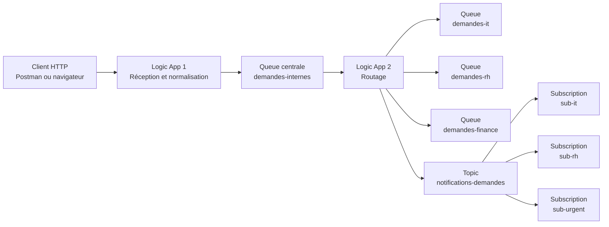
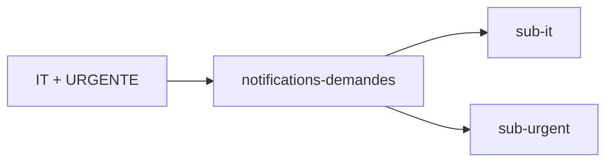
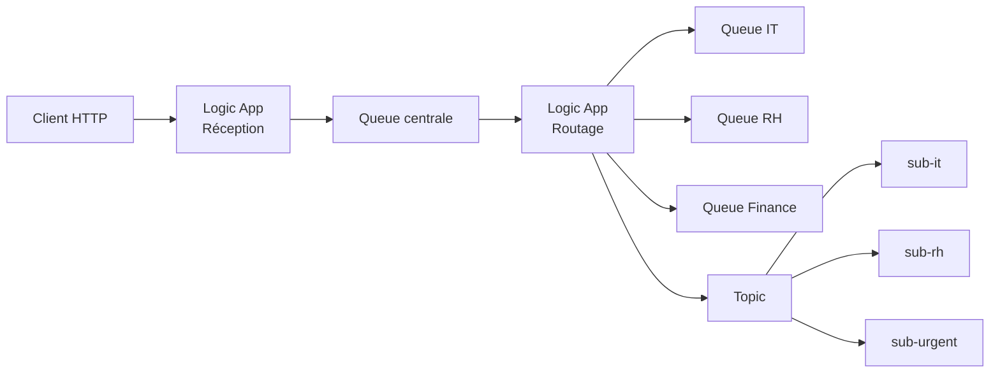

# Exercice noté - Flux de données avec Azure Logic Apps et Service Bus - EPSI

## Durée : 2 heures - Note sur 20

**Rendu obligatoire :** un **rapport au format Markdown `.md` ou `pdf`** contenant les réponses, explications, diagrammes Mermaid et captures d’écran demandées.

**Niveau :** *intermédiaire*  

**Travail :** *individuel sauf indication contraire de l’enseignant*  

**Services autorisés :** **Azure Logic Apps** et **Azure Service Bus**  

**Portail Azure :** méthode principale  

**Azure CLI :** *facultative*  

> Cet exercice porte **uniquement sur les notions des TP1, TP2 et TP3 Azure**.

---

# 1. Périmètre de l’évaluation

L’exercice couvre uniquement :

## TP1

```text
Logic App productrice
Service Bus Queue
Logic App consommatrice
Flux simple de données
```

## TP2

```text
Transformation
Normalisation
Routage
Plusieurs queues
Conditions
```

## TP3

```text
Service Bus Topic
Subscriptions
Filtres
Publish/Subscribe
Fan-out
```

---

# 2. Ce qui n’est pas évalué

Vous ne devez pas utiliser ni traiter :

- Peek-Lock avancé ;
- Complete ;
- Abandon ;
- Dead-letter ;
- DLQ ;
- idempotence ;
- Table Storage ;
- concurrence avancée ;
- Saga ;
- Sessions ;
- retry différé ;
- Step Functions ;

---

# 3. Contexte métier

Une entreprise dispose d’un **système de gestion des demandes internes**.

Les collaborateurs peuvent déclarer plusieurs types de demandes :

```text
IT
RH
FINANCE
```

Chaque demande est reçue par une première Logic App.

Cette Logic App doit :

1. recevoir la demande via HTTP ;
2. vérifier les informations ;
3. normaliser les données ;
4. envoyer la demande dans une queue Service Bus centrale.

Une deuxième Logic App doit ensuite :

1. lire les demandes ;
2. analyser leur type ;
3. les router vers une queue spécialisée.

Enfin, une troisième partie doit publier un événement dans un **Topic Service Bus** afin de diffuser certaines informations à plusieurs consommateurs grâce à des **Subscriptions** et des **filtres**.

---

# 4. Architecture cible



---

# 5. Données d’entrée

La Logic App d’entrée doit recevoir un JSON de cette forme :

```json
{
  "demandeId": "DEM-1001",
  "employe": "Alice Martin",
  "service": "IT",
  "priorite": "URGENTE",
  "description": "Impossible de se connecter au VPN."
}
```

---

# 6. Valeurs autorisées

Pour :

```text
service
```

les valeurs attendues sont :

```text
IT
RH
FINANCE
```

Pour :

```text
priorite
```

les valeurs attendues sont :

```text
NORMALE
URGENTE
```

---

# 7. Travail demandé

Vous devez construire le flux demandé en utilisant le **Portail Azure**.

Vous êtes libres dans l’organisation interne de vos Logic Apps tant que le comportement demandé est respecté.

---

# 8. Partie A - Réception HTTP et normalisation

Créez une première Logic App :

```text
la-exam-reception
```

Elle doit commencer par :

```text
When a HTTP request is received
```

---

# 9. Schéma attendu

Vous devez définir un schéma JSON adapté au payload fourni.

Le workflow doit pouvoir récupérer au minimum :

```text
demandeId
employe
service
priorite
description
```

---

# 10. Normalisation

Avant l’envoi dans Service Bus, normalisez les données.

Vous devez obtenir un objet contenant au minimum :

```json
{
  "demandeId": "...",
  "employe": "...",
  "service": "...",
  "priorite": "...",
  "description": "...",
  "source": "PORTAIL_INTERNE"
}
```

---

# 11. Contraintes de normalisation

Vous devez :

- supprimer les espaces inutiles avec une fonction adaptée ;
- convertir `service` en majuscules ;
- convertir `priorite` en majuscules ;
- ajouter :

```text
source = PORTAIL_INTERNE
```

---

# 12. Exemple

Entrée :

```json
{
  "demandeId": "DEM-1002",
  "employe": "Bob Durand",
  "service": " it ",
  "priorite": " urgente ",
  "description": "Probleme d'acces au VPN."
}
```

Sortie normalisée attendue :

```json
{
  "demandeId": "DEM-1002",
  "employe": "Bob Durand",
  "service": "IT",
  "priorite": "URGENTE",
  "description": "Probleme d'acces au VPN.",
  "source": "PORTAIL_INTERNE"
}
```

---

# 13. Queue centrale

Créez une queue Service Bus :

```text
demandes-internes
```

La première Logic App doit y envoyer le message normalisé.

---

# 14. Réponse HTTP

La Logic App doit retourner une réponse HTTP claire.

Exemple :

```json
{
  "status": "ACCEPTED",
  "demandeId": "DEM-1001"
}
```

avec un code adapté.

---

# 15. Preuves demandées pour la partie A

Dans votre rapport, ajoutez :

1. une capture du trigger HTTP ;
2. une capture de l’étape de normalisation ;
3. une capture de l’action Service Bus ;
4. une capture d’un test HTTP réussi.

---

# 16. Partie B - Routage vers plusieurs queues

Créez une deuxième Logic App :

```text
la-exam-routage
```

Elle doit consommer les messages provenant de :

```text
demandes-internes
```

---

# 17. Queues spécialisées

Créez :

```text
demandes-it
demandes-rh
demandes-finance
```

---

# 18. Règle de routage

La deuxième Logic App doit router les demandes selon la propriété :

```text
service
```

Règles :

```text
IT
vers
demandes-it
```

```text
RH
vers
demandes-rh
```

```text
FINANCE
vers
demandes-finance
```

---

# 19. Construction du routage

Vous pouvez utiliser :

```text
Switch
```

ou une autre construction adaptée.

Vous devez expliquer votre choix dans le rapport.

---

# 20. Cas invalide

Si le service ne correspond pas à :

```text
IT
RH
FINANCE
```

le workflow ne doit pas envoyer le message dans une queue spécialisée.

Vous devez prévoir un traitement clair.

Exemple :

```text
branche Default
```

avec un Compose indiquant :

```text
SERVICE_INCONNU
```

---

# 21. Transformation supplémentaire

Avant l’envoi dans la queue spécialisée, ajoutez :

```text
routedAt
```

avec la date et l’heure courantes.

Le message doit donc contenir au minimum :

```text
demandeId
employe
service
priorite
description
source
routedAt
```

---

# 22. Preuves demandées pour la partie B

Dans votre rapport, ajoutez :

1. une capture du workflow de routage ;
2. une capture de la structure Switch ou équivalent ;
3. une preuve d’un message IT ;
4. une preuve d’un message RH ;
5. une preuve d’un message FINANCE.

---

# 23. Partie C - Publication dans un Topic

Créez un Topic Service Bus :

```text
notifications-demandes
```

---

# 24. Subscriptions

Créez exactement :

```text
sub-it
sub-rh
sub-urgent
```

---

# 25. Publication

Après le routage vers la queue spécialisée, la Logic App doit également publier un message dans :

```text
notifications-demandes
```

---

# 26. Message publié

Le message publié doit contenir au minimum :

```text
demandeId
service
priorite
description
```

---

# 27. Propriétés du message

Ajoutez des propriétés permettant le filtrage :

```text
service
priorite
```

---

# 28. Filtres à créer

## sub-it

La subscription doit recevoir uniquement les messages pour :

```text
service = IT
```

---

## sub-rh

La subscription doit recevoir uniquement les messages pour :

```text
service = RH
```

---

## sub-urgent

La subscription doit recevoir uniquement les messages pour :

```text
priorite = URGENTE
```

---

# 29. Attention

Le filtre doit porter sur les **propriétés du message**.

Vous devez expliquer dans votre rapport :

> Pourquoi le filtre ne travaille-t-il pas directement sur le contenu JSON du body ?

---

# 30. Fan-out attendu

Une demande :

```text
service = IT
priorite = URGENTE
```

doit pouvoir être reçue par :

```text
sub-it
```

et :

```text
sub-urgent
```

---

# 31. Exemple de fan-out



---

# 32. Test obligatoire 1

Envoyez :

```json
{
  "demandeId": "DEM-IT-URG",
  "employe": "Alice Martin",
  "service": "IT",
  "priorite": "URGENTE",
  "description": "VPN indisponible."
}
```

---

# 33. Résultat attendu

Le message doit arriver dans :

```text
demandes-it
```

et être publié vers le Topic.

Il doit être disponible dans :

```text
sub-it
sub-urgent
```

mais pas dans :

```text
sub-rh
```

---

# 34. Test obligatoire 2

Envoyez :

```json
{
  "demandeId": "DEM-RH-NORM",
  "employe": "Claire Petit",
  "service": "RH",
  "priorite": "NORMALE",
  "description": "Demande de document RH."
}
```

---

# 35. Résultat attendu

Queue :

```text
demandes-rh
```

Subscriptions :

```text
sub-rh
```

mais pas :

```text
sub-it
sub-urgent
```

---

# 36. Test obligatoire 3

Envoyez :

```json
{
  "demandeId": "DEM-FIN-URG",
  "employe": "David Robert",
  "service": "FINANCE",
  "priorite": "URGENTE",
  "description": "Blocage d'une validation de paiement."
}
```

---

# 37. Résultat attendu

Queue :

```text
demandes-finance
```

Topic :

```text
notifications-demandes
```

Subscription :

```text
sub-urgent
```

---

# 38. Partie D - Analyse du flux

Répondez aux questions suivantes dans votre rapport.

---

## Question 1

Quelle est la différence entre :

```text
Queue
```

et :

```text
Topic + Subscriptions
```

Réponse attendue :

```text
5 à 8 lignes
```

---

## Question 2

Pourquoi utilise-t-on une queue centrale :

```text
demandes-internes
```

avant le routage ?

Réponse attendue :

```text
4 à 6 lignes
```

---

## Question 3

Quel est l’intérêt de normaliser :

```text
" it "
```

en :

```text
"IT"
```

avant le routage ?

Réponse attendue :

```text
3 à 5 lignes
```

---

## Question 4

Expliquez la notion de :

```text
fan-out
```

avec l’exemple :

```text
IT + URGENTE
```

Réponse attendue :

```text
4 à 6 lignes
```

---

## Question 5

Quelle est la différence entre :

```text
sub-it
```

et :

```text
demandes-it
```

même si les deux peuvent contenir des demandes IT ?

Réponse attendue :

```text
5 à 8 lignes
```

---

## Question 6

Pourquoi un filtre sur :

```text
service = IT
```

doit-il être appliqué au niveau de la Subscription plutôt que recréer une Logic App spécifique pour chaque type de consommateur ?

Réponse attendue :

```text
5 à 8 lignes
```

---

# 39. Partie E - Diagnostic

Un étudiant constate le comportement suivant :

```text
Le message est publié dans le Topic.
sub-it reçoit le message.
sub-urgent ne reçoit rien.
```

Le message envoyé contient :

```json
{
  "service": "IT",
  "priorite": "URGENTE"
}
```

---

# 40. Question de diagnostic

Donnez **au moins trois vérifications** à effectuer.

Votre réponse doit mentionner des éléments techniques précis.

---

# 41. Deuxième diagnostic

Le message :

```json
{
  "service": " it "
}
```

arrive dans la queue centrale mais n’est jamais routé vers :

```text
demandes-it
```

Expliquez la cause probable et la correction.

---

# 42. Diagramme obligatoire du rapport

Vous devez produire votre propre diagramme Mermaid de l’architecture réalisée.

Il doit montrer au minimum :

```text
HTTP
Logic App réception
Queue centrale
Logic App routage
3 queues spécialisées
Topic
3 subscriptions
```

---

# 43. Tableau de synthèse obligatoire

Complétez dans votre rapport :

| Type de demande | Queue spécialisée | sub-it | sub-rh | sub-urgent |
|---|---|---|---|---|
| IT / NORMALE | ? | ? | ? | ? |
| IT / URGENTE | ? | ? | ? | ? |
| RH / NORMALE | ? | ? | ? | ? |
| RH / URGENTE | ? | ? | ? | ? |
| FINANCE / NORMALE | ? | ? | ? | ? |
| FINANCE / URGENTE | ? | ? | ? | ? |

---

# 44. Structure obligatoire du rapport

Votre fichier doit s’appeler :

```text
NOM_PRENOM_EXERCICE_NOTE_AZURE.md
```

---

# 45. Sections obligatoires

```markdown
# Exercice noté Azure Logic Apps et Service Bus

## 1. Informations
Nom :
Prénom :
Classe :

## 2. Architecture
Diagramme Mermaid + explication.

## 3. Réception HTTP et normalisation
Explication + captures.

## 4. Queue centrale
Configuration et rôle.

## 5. Routage
Explication du Switch ou mécanisme choisi.

## 6. Queues spécialisées
Résultats des tests IT, RH et FINANCE.

## 7. Topic et Subscriptions
Configuration du Topic et des 3 subscriptions.

## 8. Filtres
Explication des filtres utilisés.

## 9. Tests
Résultats des 3 scénarios obligatoires.

## 10. Fan-out
Explication + preuve.

## 11. Questions d'analyse
Réponses aux 6 questions.

## 12. Diagnostic
Réponses aux 2 cas de diagnostic.

## 13. Tableau de synthèse
Tableau complété.

## 14. Conclusion
5 à 10 lignes maximum.
```

---

# 46. Captures obligatoires

Le rapport doit contenir au minimum :

1. trigger HTTP ;
2. normalisation ;
3. queue centrale ;
4. workflow de routage ;
5. branche IT ;
6. branche RH ;
7. branche FINANCE ;
8. Topic ;
9. liste des Subscriptions ;
10. filtre de `sub-it` ;
11. filtre de `sub-rh` ;
12. filtre de `sub-urgent` ;
13. preuve du fan-out IT + URGENTE.

---

# 47. Arborescence recommandée

```text
NOM_PRENOM_EXERCICE_NOTE_AZURE/
|
|-- NOM_PRENOM_EXERCICE_NOTE_AZURE.md
|
`-- images/
    |-- 01-http-trigger.png
    |-- 02-normalisation.png
    |-- 03-queue-centrale.png
    |-- 04-routage.png
    |-- 05-topic.png
    |-- 06-subscriptions.png
    |-- 07-filter-it.png
    |-- 08-filter-rh.png
    |-- 09-filter-urgent.png
    `-- 10-fanout.png
```

---

# 48. Barème - 20 points

| Partie | Points |
|---|---:|
| Réception HTTP + schéma + réponse | **2 pts** |
| Normalisation correcte des données | **2 pts** |
| Queue centrale et envoi Service Bus | **2 pts** |
| Routage vers 3 queues | **4 pts** |
| Topic + publication | **2 pts** |
| 3 Subscriptions + filtres corrects | **3 pts** |
| Fan-out démontré | **1 pt** |
| Questions d’analyse + diagnostic | **2 pts** |
| Rapport Markdown + Mermaid + captures | **2 pts** |
| **Total** | **20 pts** |

---

# 49. Détail - Réception HTTP / 2 pts

## 2/2

- trigger HTTP correct ;
- schéma adapté ;
- test fonctionnel ;
- réponse cohérente.

## 1/2

Flux partiellement fonctionnel ou schéma incomplet.

## 0/2

Aucun flux exploitable.

---

# 50. Détail - Normalisation / 2 pts

## 2/2

L’étudiant applique correctement :

```text
trim
uppercase
source
```

et explique l’intérêt.

## 1/2

Normalisation partielle.

## 0/2

Aucune normalisation.

---

# 51. Détail - Queue centrale / 2 pts

## 2/2

- queue créée ;
- message correctement envoyé ;
- contenu normalisé.

## 1/2

Queue fonctionnelle mais message incomplet.

## 0/2

Queue non fonctionnelle.

---

# 52. Détail - Routage / 4 pts

## 4/4

Les trois services sont correctement routés :

```text
IT
RH
FINANCE
```

et le cas Default est géré.

## 3/4

Trois routes fonctionnelles mais gestion Default absente ou faible.

## 2/4

Deux routes seulement fonctionnelles.

## 1/4

Routage très partiel.

## 0/4

Pas de routage.

---

# 53. Détail - Topic / 2 pts

## 2/2

Le message est correctement publié dans :

```text
notifications-demandes
```

avec les propriétés nécessaires.

## 1/2

Publication fonctionnelle mais propriétés incomplètes.

## 0/2

Topic non fonctionnel.

---

# 54. Détail - Subscriptions et filtres / 3 pts

## 3/3

Les trois subscriptions et leurs filtres fonctionnent :

```text
sub-it
sub-rh
sub-urgent
```

## 2/3

Une configuration est incorrecte.

## 1/3

Une seule subscription fonctionne correctement.

## 0/3

Filtres non fonctionnels.

---

# 55. Détail - Fan-out / 1 pt

## 1/1

L’étudiant démontre qu’un message :

```text
IT + URGENTE
```

arrive dans :

```text
sub-it
```

et :

```text
sub-urgent
```

---

# 56. Détail - Analyse / 2 pts

Les réponses doivent montrer une compréhension de :

- queue ;
- topic ;
- subscription ;
- filtre ;
- transformation ;
- routage ;
- fan-out.

---

# 57. Détail - Rapport / 2 pts

## 2/2

Rapport :

- structuré ;
- clair ;
- captures lisibles ;
- explications personnelles ;
- diagramme Mermaid correct ;
- tableau complété.

## 1/2

Rapport exploitable mais incomplet.

## 0/2

Rapport absent ou inexploitable.

---

# 58. Pénalités possibles

| Problème | Pénalité indicative |
|---|---:|
| Aucun rapport `.md` | rendu non conforme |
| Aucun Mermaid | **-0,5 pt** |
| Captures illisibles ou non commentées | jusqu’à **-1 pt** |
| Utilisation d’éléments hors périmètre sans justification | jusqu’à **-0,5 pt** |
| Rapport sans réponses d’analyse | points correspondants non attribués |

---

# 59. Gestion du temps conseillée

## 0 à 25 minutes

Créez :

```text
namespace Service Bus
queue centrale
3 queues spécialisées
topic
3 subscriptions
```

---

## 25 à 50 minutes

Créez :

```text
Logic App réception
trigger HTTP
normalisation
envoi queue centrale
```

---

## 50 à 85 minutes

Créez :

```text
Logic App routage
Switch
3 routes
publication Topic
```

---

## 85 à 105 minutes

Configurez :

```text
subscriptions
filtres
tests
fan-out
```

---

## 105 à 120 minutes

Finalisez :

```text
captures
questions
tableau
conclusion
rapport Markdown
```

---

# 60. Ce qui est évalué

L’objectif n’est pas uniquement d’obtenir :

```text
des workflows verts
```

Vous devez démontrer que vous comprenez :

```text
pourquoi les données circulent ainsi
```

---

# 61. Critères de réussite

Votre rapport doit permettre de comprendre :

1. comment la demande entre dans le SI ;
2. comment elle est normalisée ;
3. pourquoi une queue centrale est utilisée ;
4. comment le routage fonctionne ;
5. pourquoi un Topic est utilisé ;
6. comment les subscriptions sélectionnent les messages ;
7. comment un même événement peut être diffusé à plusieurs consommateurs.

---

# 62. Nettoyage en fin d’exercice

Après les captures :

- arrêtez ou supprimez les Logic Apps si nécessaire ;
- supprimez les messages de test ;
- supprimez les ressources créées si l’abonnement vous appartient ;
- ne supprimez jamais une ressource mutualisée fournie par EPSI.

---

# 63. Question finale

En **5 à 8 lignes maximum**, répondez :

> **Pourquoi une architecture utilisant à la fois des queues et un Topic peut-elle être plus adaptée qu’une architecture reposant uniquement sur des appels HTTP directs entre applications ?**

---

# 64. Livrable final

Vous devez rendre :

```text
NOM_PRENOM_EXERCICE_NOTE_AZURE.md
```

avec le dossier :

```text
images/
```

Le rapport doit permettre de vérifier :

```text
architecture
normalisation
routage
publish/subscribe
filtres
fan-out
compréhension
```

---

# 65. Résumé de l’exercice



> **Le point essentiel de cet exercice est de démontrer votre capacité à construire un flux de données Azure combinant réception HTTP, normalisation, queue Service Bus, routage vers plusieurs destinations et diffusion Publish/Subscribe avec filtres.**


