# TP 1 - Flux de données entre composants d'un SI avec Azure Logic Apps et Azure Service Bus

> **Objectif :** construire de zéro une chaîne complète :
>
> `portail étudiant simulé -> Logic App productrice -> Azure Service Bus -> Logic App consommatrice`
>
> Toutes les créations et manipulations Azure sont réalisées avec **Azure CLI** et `az rest`. Vous n'avez pas besoin du portail Azure.

**Niveau :** débutant -> intermédiaire  
**Durée indicative :** 3 à 5 heures selon votre aisance  
**Mode Azure :** Service Bus **Basic** + Logic Apps **Consumption** + identités managées  
**Livrable demandé dans cette version :** **aucun rapport PDF**. Vous réalisez les manipulations, observez les résultats et répondez aux questions directement dans le TP.

---

# 1. Situation professionnelle

Une université reçoit des demandes d'activation de semestre. Le portail étudiant doit pouvoir accepter une demande même lorsque le composant de traitement est momentanément indisponible.

Le SI doit donc :

1. recevoir une demande HTTP ;
2. vérifier son format ;
3. construire un événement métier ;
4. placer cet événement dans une file Azure Service Bus ;
5. répondre au portail sans attendre le traitement final ;
6. laisser une seconde Logic App récupérer les messages plus tard.

Le JSON envoyé par le portail ressemble à ceci :

```json
{
  "studentId": "ETU-001",
  "firstName": "Lina",
  "lastName": "Martin",
  "formation": "M2 MIAGE",
  "campus": "Nanterre",
  "priority": "normal"
}
```

## 1.1 Architecture


### Vue logique : synchrone à l'entrée, asynchrone au milieu

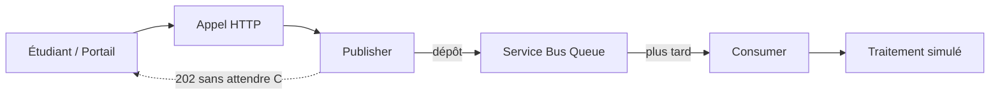

Ce diagramme insiste sur le point le plus important du TP :

```text
la réponse au portail
```

et :

```text
le traitement par le consumer
```

n'ont pas lieu au même moment.

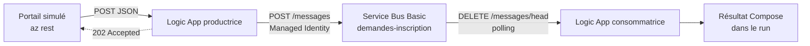

## 1.2 Ce que vous allez apprendre

Vous allez manipuler concrètement :

- le **plan de gestion Azure** : création des ressources avec `az` ;
- le **plan de données Service Bus** : envoi et réception de messages ;
- une **Managed Identity** ;
- les rôles RBAC **Data Sender** et **Data Receiver** ;
- une Logic App HTTP productrice ;
- une Logic App périodique consommatrice ;
- un backlog de messages ;
- un test de contrat JSON invalide ;
- les codes HTTP `201`, `202`, `200`, `204`, `401/403` et `502` ;
- la limite de **Receive-and-Delete**.

> Dans ce TP1, le consumer utilise volontairement `Receive-and-Delete`. Cela permet de comprendre le principe de base, mais ce mode peut perdre un message si le traitement plante après la réception. Peek-Lock sera l'amélioration naturelle dans un TP plus avancé.

---

# 2. Prérequis

Vous devez disposer de :

- un abonnement Azure ;
- Azure CLI **2.55.0 ou plus récent** ;
- Python 3 ;
- le droit de créer des Resource Groups, Service Bus et Logic Apps ;
- le droit de créer des attributions RBAC, ou l'aide de l'enseignant pour cette étape.

## 2.1 Vérification Linux/macOS

```bash
az version
python3 --version

az login
az account list -o table
az account set --subscription "<VOTRE_ID_ABONNEMENT>"
az account show --query '{nom:name,id:id,tenant:tenantId}' -o json

az extension add --name logic --upgrade
az logic workflow create --help

az provider show --namespace Microsoft.Logic \
  --query registrationState -o tsv

az provider show --namespace Microsoft.ServiceBus \
  --query registrationState -o tsv
```

Si un provider n'est pas `Registered` et si vous avez le droit :

```bash
az provider register --namespace Microsoft.Logic --wait
az provider register --namespace Microsoft.ServiceBus --wait
```

## 2.2 Vérification Windows PowerShell

```powershell
az version
python --version

az login
az account list -o table
az account set --subscription "<VOTRE_ID_ABONNEMENT>"
az account show --query '{nom:name,id:id,tenant:tenantId}' -o json

az extension add --name logic --upgrade
az logic workflow create --help

az provider show --namespace Microsoft.Logic --query registrationState -o tsv
az provider show --namespace Microsoft.ServiceBus --query registrationState -o tsv
```

Si nécessaire et autorisé :

```powershell
az provider register --namespace Microsoft.Logic --wait
az provider register --namespace Microsoft.ServiceBus --wait
```

> Si vous ne pouvez pas enregistrer un provider ou créer une attribution RBAC, ne remplacez pas cette sécurité par une clé administrateur. Demandez à l'enseignant ou à l'administrateur de l'abonnement.

---


# 2.3 Méthode de travail et méthode de debug

Dans ce TP, ne cherchez pas à « tout lancer puis voir si ça marche ». Travaillez **couche par couche**.

À chaque étape, appliquez ce cycle :

```text
1. Créer / modifier
2. Vérifier immédiatement
3. Comprendre la sortie
4. Continuer seulement si l'étape est correcte
```

Quand une commande échoue, posez-vous toujours les quatre questions suivantes :

1. **Est-ce une erreur locale ?**  
   Exemple : fichier absent, JSON invalide, mauvais répertoire.

2. **Est-ce une erreur de plan de gestion Azure ?**  
   Exemple : provider non enregistré, ressource inexistante, mauvais abonnement.

3. **Est-ce une erreur d'identité / RBAC ?**  
   Exemple : `401`, rôle `Data Sender` absent, propagation RBAC.

4. **Est-ce une erreur du workflow au runtime ?**  
   Exemple : une action `Http` échoue alors que la Logic App elle-même existe bien.


### Diagramme - ordre de diagnostic

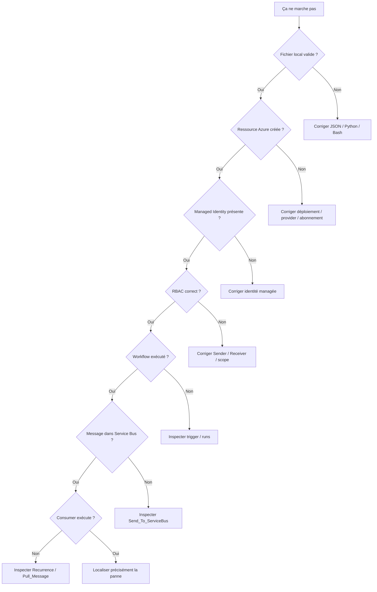

L'objectif est d'éviter le réflexe :

```text
modifier plusieurs choses au hasard
```

Vous remontez la chaîne une étape à la fois.

## Commandes universelles de diagnostic

### Vérifier le compte actif

```bash
az account show \
  --query '{subscription:name,id:id,tenant:tenantId,user:user.name}' \
  -o json
```

Si le mauvais abonnement est sélectionné :

```bash
az account set --subscription "<ID_OU_NOM>"
```

### Afficher davantage de détails Azure CLI

Presque toutes les commandes `az` acceptent :

```bash
--verbose
```

ou, pour un diagnostic beaucoup plus détaillé :

```bash
--debug
```

Exemple :

```bash
az logic workflow show \
  -g "$RG" \
  -n "$PUB" \
  --debug
```

> `--debug` produit beaucoup de sortie. Utilisez-le lorsqu'une commande échoue, pas systématiquement.

### Vérifier qu'une ressource existe avant de poursuivre

```bash
az resource list -g "$RG" -o table
```

### Vérifier l'état des providers

```bash
az provider show \
  --namespace Microsoft.Logic \
  --query registrationState \
  -o tsv

az provider show \
  --namespace Microsoft.ServiceBus \
  --query registrationState \
  -o tsv
```

### Vérifier le dernier code de retour sous Bash

```bash
echo $?
```

`0` signifie généralement que la commande précédente s'est terminée correctement.

### Vérifier le code de retour sous PowerShell

```powershell
$LASTEXITCODE
```

Pour Azure CLI :

```text
0  -> commande terminée correctement
!=0 -> erreur Azure CLI / commande externe
```

## Lire une erreur Azure correctement

Une erreur comme :

```text
AuthorizationFailed
```

n'est pas la même chose qu'une erreur :

```text
ResourceNotFound
```

ou :

```text
InvalidTemplate
```

Retenez cette méthode :

```text
Code d'erreur
|
v
Ressource concernée
|
v
Opération refusée
|
v
Identité utilisée
|
v
Commande de vérification adaptée
```

Ne changez pas plusieurs choses à la fois pendant un debug. Sinon vous ne saurez pas quelle correction a réellement résolu le problème.

# 3. Créer le projet local de zéro

Nous allons d'abord créer **tous les répertoires**, puis **chaque fichier un par un**.

L'arborescence finale sera :

```text
TP1_Azure_CLI_DE_ZERO/
├── scripts/
│   ├── 01-deploy.sh
│   ├── 01-deploy.ps1
│   ├── 02-cleanup.sh
│   ├── 02-cleanup.ps1
│   ├── 03-experiments.sh
│   ├── 03-experiments.ps1
│   └── render.py
├── workflows/
│   ├── publisher.template.json
│   └── consumer.template.json
├── samples/
│   ├── normal.json
│   ├── urgent.json
│   └── invalid.json
└── outputs/
```

Le dossier `outputs/` est vide au départ. Il sera rempli automatiquement par `render.py` et `01-deploy`.

## 3.1 Linux/macOS

```bash
mkdir -p TP1_Azure_CLI_DE_ZERO/{scripts,workflows,samples,outputs}
cd TP1_Azure_CLI_DE_ZERO

pwd
find . -maxdepth 2 -type d | sort
```

## 3.2 Windows PowerShell

```powershell
$Root = "TP1_Azure_CLI_DE_ZERO"

New-Item -ItemType Directory -Force -Path $Root | Out-Null

@("scripts","workflows","samples","outputs") | ForEach-Object {
    New-Item -ItemType Directory -Force -Path (Join-Path $Root $_) | Out-Null
}

Set-Location $Root

Get-ChildItem -Directory
```

---


## 3.3 Diagramme - rôle de chaque répertoire

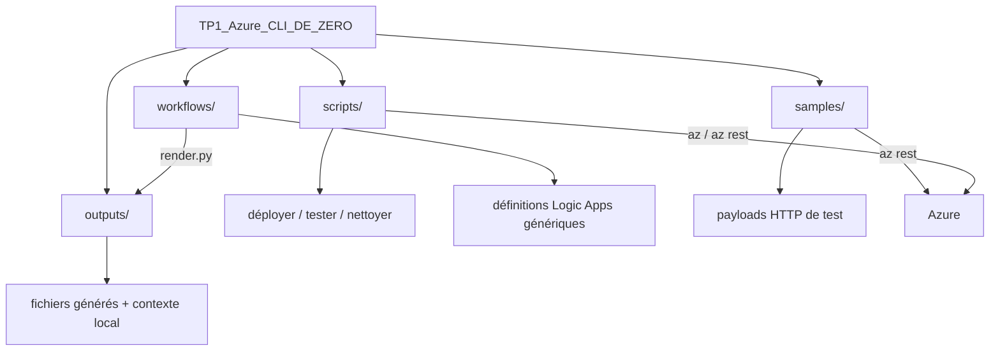

Vous devez distinguer :

- `workflows/` : **sources** ;
- `outputs/` : **artefacts générés** ;
- `samples/` : **données de test** ;
- `scripts/` : **automatisation**.

# 4. Créer chaque fichier

L'ordre ci-dessous est volontaire : nous créons d'abord les **workflows**, ensuite le petit outil de rendu, puis les **données de test**, puis les scripts de déploiement et d'expérience.


### Création de `workflows/publisher.template.json`

**Linux/macOS :**
```bash
touch workflows/publisher.template.json
```

**Windows PowerShell :**
```powershell
New-Item -ItemType File -Force -Path 'workflows/publisher.template.json' | Out-Null
```

Copiez ensuite **exactement** le contenu suivant dans `workflows/publisher.template.json` :

```json
{
  "$schema": "https://schema.management.azure.com/providers/Microsoft.Logic/schemas/2016-06-01/workflowdefinition.json",
  "contentVersion": "1.0.0.0",
  "parameters": {
    "sbNamespace": {
      "type": "String",
      "defaultValue": "__SB_NAMESPACE__"
    }
  },
  "triggers": {
    "Request_Inscription": {
      "type": "Request",
      "kind": "Http",
      "inputs": {
        "method": "POST",
        "schema": {
          "type": "object",
          "properties": {
            "studentId": {
              "type": "string",
              "minLength": 1
            },
            "firstName": {
              "type": "string",
              "minLength": 1
            },
            "lastName": {
              "type": "string",
              "minLength": 1
            },
            "formation": {
              "type": "string",
              "minLength": 1
            },
            "campus": {
              "type": "string",
              "minLength": 1
            },
            "priority": {
              "type": "string",
              "enum": [
                "normal",
                "urgent"
              ]
            }
          },
          "required": [
            "studentId",
            "firstName",
            "lastName",
            "formation",
            "campus",
            "priority"
          ],
          "additionalProperties": false
        }
      },
      "operationOptions": "EnableSchemaValidation"
    }
  },
  "actions": {
    "Build_Event": {
      "type": "Compose",
      "inputs": {
        "eventType": "StudentSemesterActivationRequested",
        "schemaVersion": 1,
        "messageId": "@guid()",
        "source": "student-portal",
        "requestedAt": "@utcNow()",
        "data": {
          "studentId": "@triggerBody()?['studentId']",
          "firstName": "@triggerBody()?['firstName']",
          "lastName": "@triggerBody()?['lastName']",
          "formation": "@triggerBody()?['formation']",
          "campus": "@triggerBody()?['campus']",
          "priority": "@triggerBody()?['priority']"
        }
      },
      "runAfter": {}
    },
    "Send_To_ServiceBus": {
      "type": "Http",
      "inputs": {
        "method": "POST",
        "uri": "@concat('https://', parameters('sbNamespace'), '.servicebus.windows.net/demandes-inscription/messages')",
        "headers": {
          "Content-Type": "application/json",
          "BrokerProperties": "@concat('{\"MessageId\":\"', outputs('Build_Event')?['messageId'], '\"}')"
        },
        "body": "@outputs('Build_Event')",
        "authentication": {
          "type": "ManagedServiceIdentity",
          "audience": "https://servicebus.azure.net"
        },
        "retryPolicy": {
          "type": "none"
        }
      },
      "runAfter": {
        "Build_Event": [
          "Succeeded"
        ]
      }
    },
    "Response_Accepted": {
      "type": "Response",
      "kind": "Http",
      "inputs": {
        "statusCode": 202,
        "headers": {
          "Content-Type": "application/json"
        },
        "body": {
          "status": "ACCEPTED",
          "messageId": "@outputs('Build_Event')?['messageId']",
          "studentId": "@triggerBody()?['studentId']",
          "notice": "Dépôt en queue effectué ; traitement aval non confirmé."
        }
      },
      "runAfter": {
        "Send_To_ServiceBus": [
          "Succeeded"
        ]
      }
    },
    "Response_Broker_Error": {
      "type": "Response",
      "kind": "Http",
      "inputs": {
        "statusCode": 502,
        "headers": {
          "Content-Type": "application/json"
        },
        "body": {
          "status": "NOT_ACCEPTED",
          "reason": "L’envoi dans Service Bus a échoué. Ne pas annoncer un traitement réussi."
        }
      },
      "runAfter": {
        "Send_To_ServiceBus": [
          "Failed",
          "TimedOut"
        ]
      }
    }
  },
  "outputs": {}
}
```


## 4.1 Comprendre `publisher.template.json`

Cette Logic App possède quatre éléments importants :

### `Request_Inscription`

Le trigger attend un `POST` JSON. Les six champs sont obligatoires :

- `studentId`
- `firstName`
- `lastName`
- `formation`
- `campus`
- `priority`

La ligne :

```json
"operationOptions": "EnableSchemaValidation"
```

active explicitement la validation du schéma. Si `campus` manque, la requête doit être rejetée avant la publication Service Bus.

### `Build_Event`

Cette action sépare le **contrat externe** du portail du **contrat interne** utilisé dans le SI.

Elle ajoute :

- `eventType`
- `schemaVersion`
- `messageId`
- `source`
- `requestedAt`

### `Send_To_ServiceBus`

Cette action appelle directement l'API REST Service Bus avec :

```text
Managed Identity
+
Azure Service Bus Data Sender
```

Aucune clé SAS n'est enregistrée dans le workflow.

### `Response_Accepted`

La Logic App renvoie `202` uniquement après le succès de l'envoi Service Bus.

### `Response_Broker_Error`

Si le broker refuse le dépôt ou si l'appel expire, la Logic App retourne `502`.


## 4.1.1 Diagramme interne de la productrice

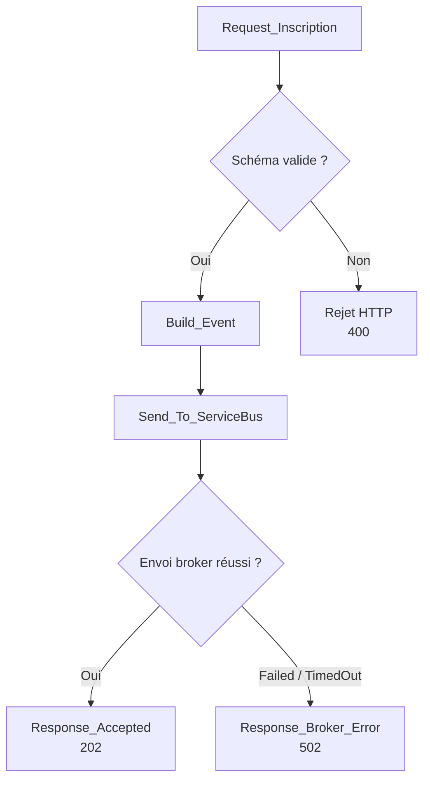

Le trigger gère le **contrat entrant**.  
`Build_Event` gère la **transformation**.  
`Send_To_ServiceBus` gère l'**intégration**.  
Les réponses HTTP traduisent le résultat vu par le client.

## 4.2 Lecture détaillée de `publisher.template.json`

Le fichier est une **définition de workflow Logic Apps**, pas un template ARM complet. La commande :

```bash
az logic workflow create --definition @outputs/publisher.json
```

envoie cette définition à Azure.

### `$schema`

```json
"$schema": "https://schema.management.azure.com/providers/Microsoft.Logic/schemas/2016-06-01/workflowdefinition.json"
```

Cette valeur indique la famille de schéma utilisée pour décrire les actions et triggers Logic Apps.

Elle ne crée aucune ressource à elle seule.

### `contentVersion`

```json
"contentVersion": "1.0.0.0"
```

Il s'agit de la version logique de votre définition. Ce n'est pas la version d'Azure Logic Apps.

### `parameters.sbNamespace`

```json
"parameters": {
  "sbNamespace": {
    "type": "String",
    "defaultValue": "__SB_NAMESPACE__"
  }
}
```

Pourquoi ne pas écrire directement :

```text
sb-mon-nom-123.servicebus.windows.net
```

dans toutes les actions ?

Parce que le namespace est une **valeur d'environnement**.

Le template reste générique :

```text
__SB_NAMESPACE__
```

et `render.py` injecte le vrai namespace.

Cela évite de modifier manuellement plusieurs lignes.

### `Request_Inscription`

Le trigger :

```json
"type": "Request",
"kind": "Http"
```

transforme la Logic App en endpoint HTTP.

Le workflow ne connaît pas encore son URL publique au moment où vous écrivez le JSON. Azure crée le trigger puis l'API `listCallbackUrl` permet de récupérer l'URL signée.

### Le JSON Schema

Exemple :

```json
"studentId": {
  "type": "string",
  "minLength": 1
}
```

Cela signifie :

```text
le champ doit exister
+
sa valeur doit être une chaîne
+
elle ne doit pas être vide
```

La liste :

```json
"required": [...]
```

indique quels champs sont obligatoires.

La propriété :

```json
"additionalProperties": false
```

signifie qu'un champ non déclaré dans `properties` n'est pas accepté par le contrat.

Exemple à éviter :

```json
{
  "studentId": "ETU-001",
  "...": "...",
  "champInvente": "test"
}
```


### Diagramme - validation du contrat

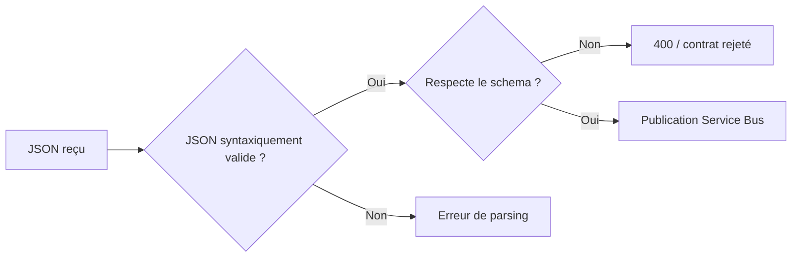

Un fichier peut donc être :

```text
JSON valide
```

mais :

```text
invalide pour l'API
```

C'est exactement le cas de `samples/invalid.json`.

### `EnableSchemaValidation`

```json
"operationOptions": "EnableSchemaValidation"
```

Le but est de faire respecter le contrat **au niveau du trigger**.

L'intérêt est architectural :

```text
mauvaise donnée
|
v
rejetée à l'entrée
|
v
pas de message inutile dans Service Bus
```

### Expressions Logic Apps

Une chaîne qui commence par `@` n'est pas du texte ordinaire.

Exemple :

```json
"messageId": "@guid()"
```

Azure interprète `guid()` au runtime.

Même principe :

```json
"requestedAt": "@utcNow()"
```

et :

```json
"studentId": "@triggerBody()?['studentId']"
```

`triggerBody()` désigne le JSON reçu.

Le `?` rend la navigation plus sûre si une propriété est nulle ou absente.

### Pourquoi créer `Build_Event` ?

Le portail envoie :

```json
{
  "studentId": "...",
  "firstName": "...",
  "priority": "..."
}
```

mais le SI interne veut transporter quelque chose de plus riche :

```json
{
  "eventType": "...",
  "schemaVersion": 1,
  "messageId": "...",
  "source": "...",
  "requestedAt": "...",
  "data": {
    "...": "..."
  }
}
```

C'est une pratique importante :

```text
contrat API entrant
≠
contrat événement interne
```


### Diagramme - contrat externe vers événement interne

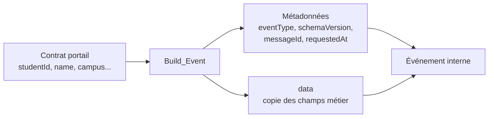

Cette séparation permet plus tard de faire évoluer :

```text
l'API du portail
```

sans forcément casser :

```text
le contrat interne entre composants du SI
```

### `BrokerProperties`

```json
"BrokerProperties": "@concat('{\"MessageId\":\"', outputs('Build_Event')?['messageId'], '\"}')"
```

Le message possède donc :

1. un `messageId` dans son body JSON ;
2. un `MessageId` au niveau du broker.

Cela facilite le diagnostic et prépare les notions d'idempotence.

### Authentification

```json
"authentication": {
  "type": "ManagedServiceIdentity",
  "audience": "https://servicebus.azure.net"
}
```

Cela signifie :

```text
Logic App
|
v
demande un jeton Microsoft Entra pour Service Bus
|
v
Service Bus vérifie le jeton
|
v
RBAC décide si cette identité peut envoyer
```

La Managed Identity authentifie l'appel.  
Le rôle `Azure Service Bus Data Sender` autorise l'opération d'envoi.

Ce sont deux responsabilités différentes.


### Diagramme - authentification et autorisation

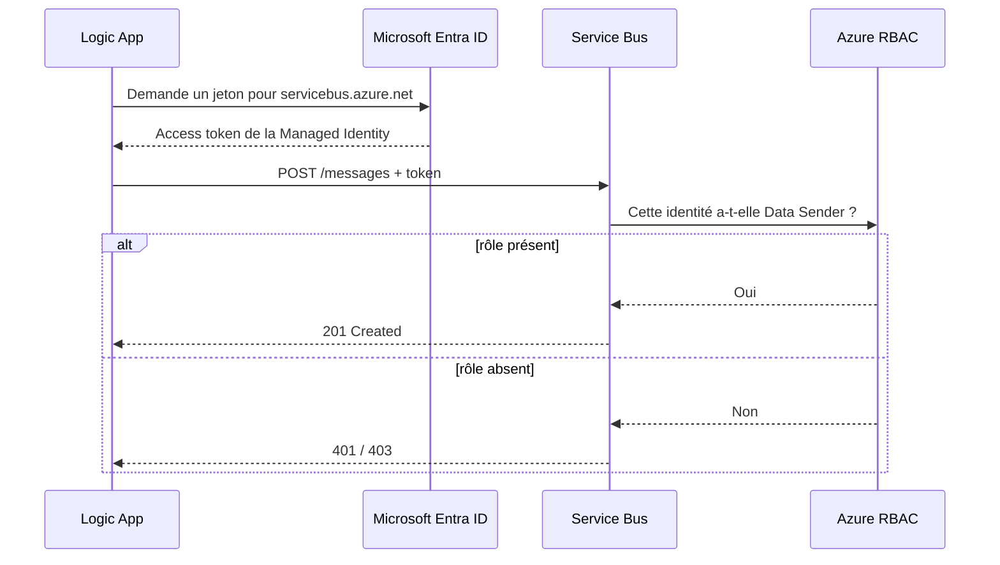

À retenir :

```text
Managed Identity = qui suis-je ?
RBAC = qu'ai-je le droit de faire ?
```

### `retryPolicy: none`

Dans un système réel, des retries peuvent être utiles.

Dans ce TP, ils sont désactivés volontairement pour rendre chaque tentative visible.

Cela facilite le raisonnement :

```text
1 appel HTTP du portail
-> 1 tentative d'envoi observée
```

### `runAfter`

```json
"runAfter": {
  "Build_Event": [
    "Succeeded"
  ]
}
```

Cela impose l'ordre :

```text
Build_Event réussi
|
v
Send_To_ServiceBus
```

Puis :

```text
Send_To_ServiceBus réussi
|
v
Response_Accepted
```

Alors que :

```text
Send_To_ServiceBus Failed ou TimedOut
|
v
Response_Broker_Error
```

Le `runAfter` est donc une partie essentielle de la logique du workflow.


### Diagramme - dépendances `runAfter`

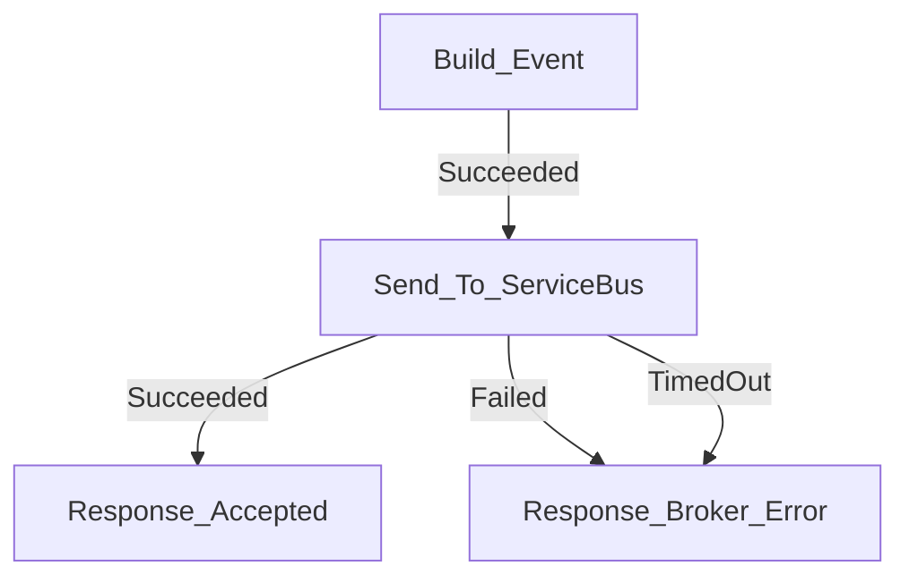

`runAfter` transforme une simple liste d'actions JSON en **graphe d'exécution**.

## 4.3 Vérifier et debugger `publisher.template.json` AVANT Azure

### Vérifier le JSON

```bash
python3 -m json.tool workflows/publisher.template.json >/dev/null
```

Si la commande ne produit rien et retourne `0`, le JSON est syntaxiquement valide.

### Rechercher le placeholder

```bash
grep -n "__SB_NAMESPACE__" workflows/publisher.template.json
```

Avant `render.py`, vous devez le voir.

Après le rendu :

```bash
grep -n "__SB_NAMESPACE__" outputs/publisher.json
```

ne doit plus retourner de ligne.

### Vérifier les actions principales

```bash
python3 - <<'PY'
import json
p=json.load(open("workflows/publisher.template.json", encoding="utf-8"))
print("Triggers :", list(p["triggers"]))
print("Actions  :", list(p["actions"]))
print("Schema validation :", p["triggers"]["Request_Inscription"].get("operationOptions"))
PY
```

Résultat attendu :

```text
Triggers : ['Request_Inscription']
Actions  : ['Build_Event', 'Send_To_ServiceBus', 'Response_Accepted', 'Response_Broker_Error']
Schema validation : EnableSchemaValidation
```

## 4.4 Debug du producteur APRÈS déploiement

### La Logic App existe-t-elle ?

```bash
az logic workflow show \
  -g "$RG" \
  -n "$PUB" \
  --query '{name:name,state:state,identity:identity.type}' \
  -o json
```

Attendu :

```text
state = Enabled
identity = SystemAssigned
```

### Son identité possède-t-elle un principalId ?

```bash
az logic workflow show \
  -g "$RG" \
  -n "$PUB" \
  --query identity.principalId \
  -o tsv
```

Une sortie vide indique un problème d'identité ou une création non achevée.

### Le rôle Sender existe-t-il ?

```bash
PUB_OID=$(az logic workflow show \
  -g "$RG" -n "$PUB" \
  --query identity.principalId -o tsv)

QUEUE_ID=$(az servicebus queue show \
  -g "$RG" \
  --namespace-name "$NS" \
  -n "$QUEUE" \
  --query id -o tsv)

az role assignment list \
  --assignee-object-id "$PUB_OID" \
  --scope "$QUEUE_ID" \
  --query '[].roleDefinitionName' \
  -o table
```

Vous devez retrouver :

```text
Azure Service Bus Data Sender
```

### Voir les runs du producteur

```bash
az rest \
  --method get \
  --uri "https://management.azure.com$WF_ID/runs?api-version=2019-05-01" \
  --query 'value[].{run:name,status:properties.status,start:properties.startTime,end:properties.endTime}' \
  -o table
```

### Voir les actions d'un run précis

```bash
RUN_ID=$(az rest \
  --method get \
  --uri "https://management.azure.com$WF_ID/runs?api-version=2019-05-01" \
  --query 'value[0].name' -o tsv)

az rest \
  --method get \
  --uri "https://management.azure.com$WF_ID/runs/$RUN_ID/actions?api-version=2019-05-01" \
  --query 'value[].{action:name,status:properties.status,start:properties.startTime,end:properties.endTime}' \
  -o table
```

Vous pouvez alors savoir si l'échec se situe dans :

```text
Build_Event
Send_To_ServiceBus
Response_Accepted
Response_Broker_Error
```

### Cas : `Send_To_ServiceBus = Failed`

Vérifiez dans cet ordre :

```text
1. namespace correct ?
2. queue correcte ?
3. Managed Identity présente ?
4. rôle Data Sender présent ?
5. rôle attribué au bon scope ?
6. propagation RBAC terminée ?
```

Commandes :

```bash
az servicebus namespace show -g "$RG" -n "$NS" -o table

az servicebus queue show \
  -g "$RG" \
  --namespace-name "$NS" \
  -n "$QUEUE" \
  -o table

az role assignment list \
  --scope "$QUEUE_ID" \
  -o table
```

Si vous venez juste de créer le rôle et recevez `401/403`, attendez la propagation RBAC puis retestez avant de modifier l'architecture.

### Questions B

**Question B1. Pourquoi `202 Accepted` ne prouve-t-il pas que l'activation du semestre est terminée ?**


> **Réponse - B1 :** Parce que `202` confirme seulement que la Logic App productrice a accepté la demande et a réussi à déposer l'événement dans la file. La consommatrice peut être arrêtée ou traiter le message plus tard. Le traitement métier final n'est donc pas encore confirmé.


**Question B2. Quel composant décide du `messageId` ?**


> **Réponse - B2 :** La Logic App productrice le génère dans `Build_Event` avec `@guid()`. Ce même identifiant est ensuite recopié dans `BrokerProperties` comme `MessageId` du message Service Bus.


**Question B3. Que se passe-t-il si Service Bus refuse le dépôt ?**


> **Réponse - B3 :** L'action `Send_To_ServiceBus` échoue ou expire. `Response_Accepted` ne s'exécute pas ; `Response_Broker_Error` renvoie `502`. Le portail ne doit donc pas annoncer que la demande a été acceptée dans la file.


---

# 5. Créer la Logic App consommatrice


### Création de `workflows/consumer.template.json`

**Linux/macOS :**
```bash
touch workflows/consumer.template.json
```

**Windows PowerShell :**
```powershell
New-Item -ItemType File -Force -Path 'workflows/consumer.template.json' | Out-Null
```

Copiez ensuite **exactement** le contenu suivant dans `workflows/consumer.template.json` :

```json
{
  "$schema": "https://schema.management.azure.com/providers/Microsoft.Logic/schemas/2016-06-01/workflowdefinition.json",
  "contentVersion": "1.0.0.0",
  "parameters": {
    "sbNamespace": {
      "type": "String",
      "defaultValue": "__SB_NAMESPACE__"
    }
  },
  "triggers": {
    "Every_Minute": {
      "type": "Recurrence",
      "recurrence": {
        "frequency": "Minute",
        "interval": 1
      },
      "runtimeConfiguration": {
        "concurrency": {
          "runs": 1
        }
      }
    }
  },
  "actions": {
    "Pull_Message": {
      "type": "Http",
      "inputs": {
        "method": "DELETE",
        "uri": "@concat('https://', parameters('sbNamespace'), '.servicebus.windows.net/demandes-inscription/messages/head?timeout=5')",
        "authentication": {
          "type": "ManagedServiceIdentity",
          "audience": "https://servicebus.azure.net"
        },
        "retryPolicy": {
          "type": "none"
        }
      },
      "runAfter": {}
    },
    "If_Has_Message": {
      "type": "If",
      "expression": "@equals(outputs('Pull_Message')?['statusCode'], 200)",
      "actions": {
        "Log_Consumed_Message": {
          "type": "Compose",
          "inputs": {
            "status": "RECEIVED_AND_DELETED",
            "message": "@body('Pull_Message')",
            "brokerProperties": "@outputs('Pull_Message')?['headers']?['BrokerProperties']",
            "processedAt": "@utcNow()"
          },
          "runAfter": {}
        }
      },
      "else": {
        "actions": {
          "No_Message": {
            "type": "Compose",
            "inputs": {
              "status": "QUEUE_EMPTY",
              "description": "HTTP 204 : aucune donnée disponible pendant le délai de réception."
            },
            "runAfter": {}
          }
        }
      },
      "runAfter": {
        "Pull_Message": [
          "Succeeded"
        ]
      }
    }
  },
  "outputs": {}
}
```


## 5.1 Comprendre `consumer.template.json`

### `Every_Minute`

Le workflow est déclenché une fois par minute.

Il s'agit de **polling** :

```text
la Logic App interroge la queue
```

et non :

```text
Service Bus pousse directement vers la Logic App
```

### `Pull_Message`

La consommatrice appelle :

```text
DELETE /demandes-inscription/messages/head?timeout=5
```

Avec l'API REST Service Bus, ce `DELETE` réalise une lecture **Receive-and-Delete**.

### `If_Has_Message`

- `200` : un message a été reçu et supprimé ;
- `204` : aucun message n'était disponible.

### Pourquoi `retryPolicy: none` ?

Parce qu'un retry automatique après une lecture destructive pourrait retirer un **autre** message de la file.

### Limite importante

Le message est déjà supprimé de Service Bus quand `Log_Consumed_Message` s'exécute.

Si la Logic App plante entre les deux :

```text
message retiré de la queue
+
traitement non terminé
=
risque de perte
```

C'est précisément la limite que Peek-Lock corrigera plus tard.


---


## 5.1.1 Diagramme interne de la consommatrice

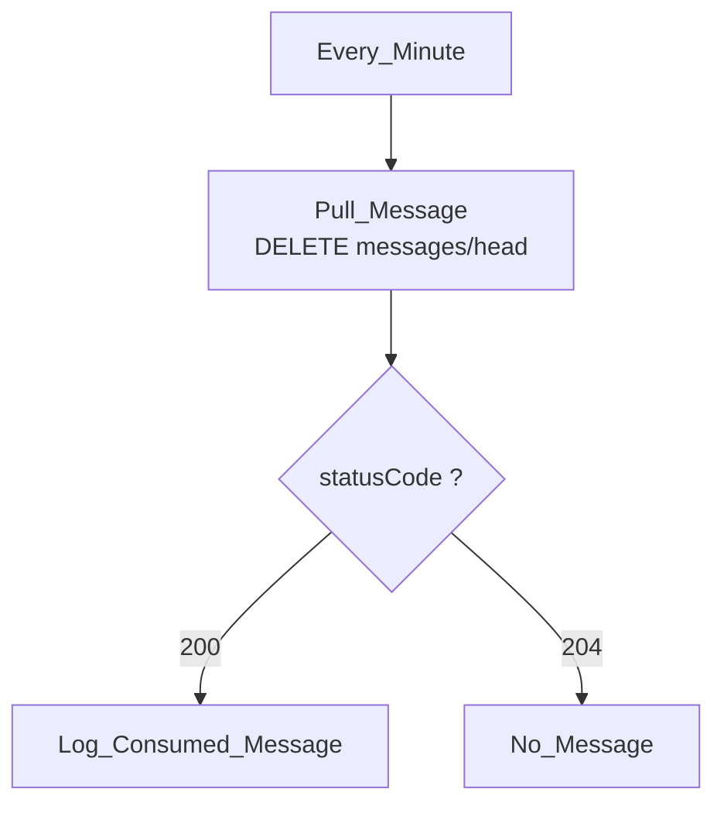

Ce workflow n'attend pas un événement « push ».

Il se réveille périodiquement puis interroge Service Bus.

## 5.2 Lecture détaillée de `consumer.template.json`

### Pourquoi un trigger `Recurrence` ?

Service Bus ne déclenche pas directement ce workflow dans cette version.

La Logic App démarre :

```text
toutes les 1 minute
```

puis demande :

```text
y a-t-il un message ?
```

C'est un modèle de **polling**.


### Diagramme - polling dans le temps

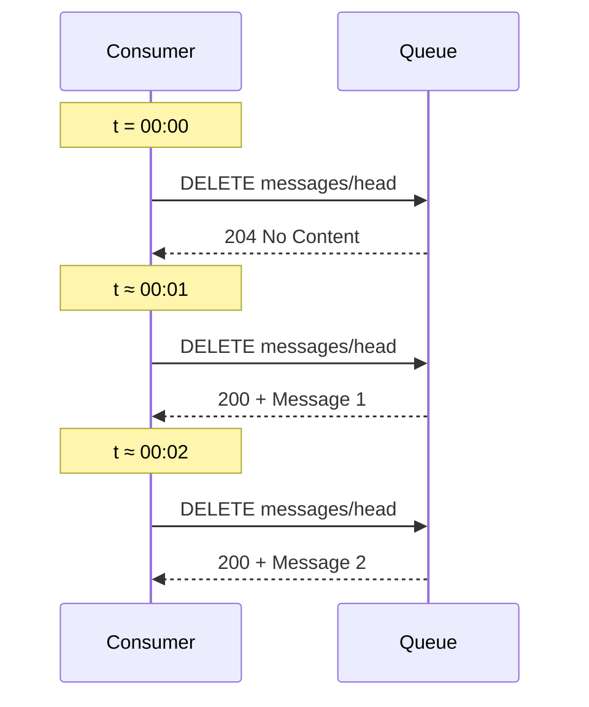

La fréquence du trigger et le `timeout=5` de la requête de réception sont deux notions différentes.

### La concurrence du trigger

```json
"runtimeConfiguration": {
  "concurrency": {
    "runs": 1
  }
}
```

Cela limite le nombre de runs simultanés du trigger.

Dans ce TP, c'est utile pour garder un comportement facile à observer :

```text
un run
|
v
une tentative de réception
|
v
un message maximum
```

### URI de réception

```text
/messages/head?timeout=5
```

Le `timeout=5` signifie que la requête de réception peut attendre quelques secondes qu'un message soit disponible.

Cela ne signifie pas que le workflow tourne toutes les cinq secondes.

La fréquence du workflow reste :

```text
1 minute
```

### Pourquoi `DELETE` ?

Dans l'API REST utilisée ici :

```text
DELETE messages/head
```

correspond à un mode de réception destructif.

L'opération reçoit et supprime le message.

### Pourquoi tester le `statusCode` ?

```json
"@equals(outputs('Pull_Message')?['statusCode'], 200)"
```

On ne teste pas simplement :

```text
action succeeded
```

car une requête HTTP `204` peut être techniquement réussie tout en signifiant :

```text
aucun message
```

Il faut donc distinguer :

```text
succès HTTP de l'action
```

et :

```text
présence fonctionnelle d'un message
```

### `Log_Consumed_Message`

Ce `Compose` ne représente pas une vraie base de données.

Il sert uniquement à rendre visible :

- le body du message ;
- les BrokerProperties ;
- l'heure de traitement.

Ne concluez jamais :

```text
"l'étudiant est inscrit"
```

Vous pouvez seulement conclure :

```text
"le message a été reçu et l'action de simulation s'est exécutée"
```


### Diagramme - risque de Receive-and-Delete

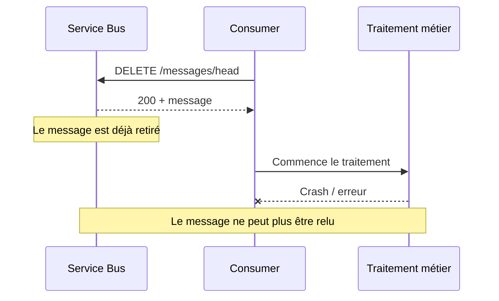

C'est la faiblesse volontairement étudiée dans ce TP1.

## 5.3 Vérifier et debugger le consumer localement

```bash
python3 -m json.tool workflows/consumer.template.json >/dev/null
```

Puis :

```bash
python3 - <<'PY'
import json
c=json.load(open("workflows/consumer.template.json", encoding="utf-8"))
print("Trigger:", list(c["triggers"]))
print("Actions:", list(c["actions"]))
print("Fréquence:", c["triggers"]["Every_Minute"]["recurrence"])
print("Concurrence:", c["triggers"]["Every_Minute"]["runtimeConfiguration"]["concurrency"])
PY
```

## 5.4 Debug du consumer après déploiement

### Vérifier son état

```bash
az logic workflow show \
  -g "$RG" \
  -n "$CON" \
  --query '{name:name,state:state,principalId:identity.principalId}' \
  -o json
```

Au tout début du TP :

```text
state = Disabled
```

Après activation :

```text
state = Enabled
```

### Vérifier le rôle Receiver

```bash
CON_OID=$(az logic workflow show \
  -g "$RG" -n "$CON" \
  --query identity.principalId -o tsv)

az role assignment list \
  --assignee-object-id "$CON_OID" \
  --scope "$QUEUE_ID" \
  --query '[].roleDefinitionName' \
  -o table
```

Attendu :

```text
Azure Service Bus Data Receiver
```

### Consumer activé mais aucun run

Vérifiez d'abord :

```bash
az logic workflow show \
  -g "$RG" -n "$CON" \
  --query state -o tsv
```

Puis consultez les runs :

```bash
az rest \
  --method get \
  --uri "https://management.azure.com$CON_ID/runs?api-version=2019-05-01" \
  --query 'value[].{name:name,status:properties.status,start:properties.startTime}' \
  -o table
```

N'oubliez pas :

```text
Recurrence = 1 minute
```

Une activation ne provoque pas forcément une consommation dans la seconde.

### `Pull_Message` échoue en 401/403

Vérifiez :

```text
Managed Identity
Data Receiver
scope de la queue
propagation RBAC
audience Service Bus
```

### `Pull_Message` retourne 204

Ce n'est pas une panne.

Cela signifie :

```text
aucun message disponible
```

### Le backlog baisse trop lentement

Dans cette version :

```text
1 run de polling
-> 1 tentative de réception
-> au maximum 1 message retiré
```

Un backlog de 5 messages peut donc prendre plusieurs cycles.

C'est volontaire : cela rend le phénomène observable.

# 6. Créer le générateur local des workflows


### Création de `scripts/render.py`

**Linux/macOS :**
```bash
touch scripts/render.py
```

**Windows PowerShell :**
```powershell
New-Item -ItemType File -Force -Path 'scripts/render.py' | Out-Null
```

Copiez ensuite **exactement** le contenu suivant dans `scripts/render.py` :

```python
#!/usr/bin/env python3
"""Prépare les définitions JSON localement. Aucune opération cloud ici.
Les créations, mises à jour et manipulations Azure passent exclusivement par `az`.
"""
import json
import pathlib
import sys

if len(sys.argv) != 2:
    raise SystemExit('Utilisation : python scripts/render.py <nom-namespace>')
ns = sys.argv[1]
if not ns or not ns.replace('-', '').isalnum():
    raise SystemExit('Nom de namespace incorrect.')
base = pathlib.Path(__file__).resolve().parent.parent
out = base / 'outputs'
out.mkdir(exist_ok=True)
for kind in ('publisher', 'consumer'):
    template = json.loads((base / 'workflows' / f'{kind}.template.json').read_text(encoding='utf8'))
    template['parameters']['sbNamespace']['defaultValue'] = ns
    path = out / f'{kind}.json'
    path.write_text(json.dumps(template, ensure_ascii=False, indent=2)+'\n', encoding='utf8')
    print('Définition JSON valide :', path)
```


## 6.1 Pourquoi avons-nous besoin de `render.py` ?

Les templates contiennent un paramètre :

```text
sbNamespace
```

Le namespace Service Bus doit être unique pour chaque étudiant.

`render.py` :

1. lit les deux templates JSON ;
2. place le vrai namespace dans `defaultValue` ;
3. génère :
   - `outputs/publisher.json`
   - `outputs/consumer.json`

Il ne crée aucune ressource Azure. C'est uniquement une transformation de fichiers locaux.


---


## 6.1.1 Diagramme - génération des définitions

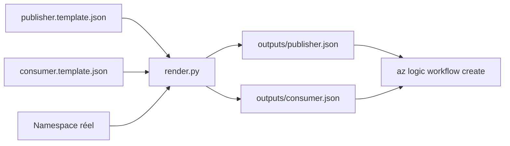

Les templates restent réutilisables ; les fichiers `outputs/` deviennent spécifiques à votre environnement.

## 6.2 Lecture détaillée de `render.py`

Ce script est volontairement petit.

Il évite un piège courant :

```text
modifier à la main les JSON pour chaque étudiant
```

Le principe est :

```text
template générique
+
namespace réel
=
fichier déployable
```

### Entrée du script

Le script reçoit le namespace :

```bash
python3 scripts/render.py "$NS"
```

`sys.argv[1]` contient donc par exemple :

```text
sb-tp1-12345-67890
```

### Fichiers lus

```text
workflows/publisher.template.json
workflows/consumer.template.json
```

### Fichiers produits

```text
outputs/publisher.json
outputs/consumer.json
```

### Ce qui est remplacé

Le script ne fait pas un remplacement texte aveugle de tout le fichier.

Il charge le JSON puis modifie :

```python
data["parameters"]["sbNamespace"]["defaultValue"]
```

C'est plus robuste qu'un simple `sed`.

## 6.3 Debug de `render.py`

### Cas 1 - `IndexError` ou message d'usage

Vous avez probablement oublié le namespace.

Mauvais :

```bash
python3 scripts/render.py
```

Correct :

```bash
python3 scripts/render.py "$NS"
```

### Cas 2 - fichier template introuvable

Vérifiez votre répertoire :

```bash
pwd
ls
ls workflows
ls scripts
```

Vous devez être à la racine :

```text
TP1_Azure_CLI_DE_ZERO/
```

et non dans :

```text
TP1_Azure_CLI_DE_ZERO/scripts/
```

### Cas 3 - JSONDecodeError

Un template JSON a été mal recopié.

Test :

```bash
python3 -m json.tool workflows/publisher.template.json
python3 -m json.tool workflows/consumer.template.json
```

### Cas 4 - le namespace n'a pas été injecté

```bash
python3 scripts/render.py "$NS"

python3 - <<'PY'
import json
for f in ("outputs/publisher.json","outputs/consumer.json"):
    d=json.load(open(f, encoding="utf-8"))
    print(f, "->", d["parameters"]["sbNamespace"]["defaultValue"])
PY
```

Les deux lignes doivent afficher le même namespace réel.

### Cas 5 - `outputs/` absent

```bash
mkdir -p outputs
```

Le script de cette version crée normalement le dossier, mais savoir diagnostiquer ce cas reste utile.

# 7. Créer les fichiers de test


### Création de `samples/normal.json`

**Linux/macOS :**
```bash
touch samples/normal.json
```

**Windows PowerShell :**
```powershell
New-Item -ItemType File -Force -Path 'samples/normal.json' | Out-Null
```

Copiez ensuite **exactement** le contenu suivant dans `samples/normal.json` :

```json
{
  "studentId": "ETU-001",
  "firstName": "Lina",
  "lastName": "Martin",
  "formation": "M2 MIAGE",
  "campus": "Nanterre",
  "priority": "normal"
}
```


### Création de `samples/urgent.json`

**Linux/macOS :**
```bash
touch samples/urgent.json
```

**Windows PowerShell :**
```powershell
New-Item -ItemType File -Force -Path 'samples/urgent.json' | Out-Null
```

Copiez ensuite **exactement** le contenu suivant dans `samples/urgent.json` :

```json
{
  "studentId": "ETU-002",
  "firstName": "Nora",
  "lastName": "Martin",
  "formation": "M2 MIAGE",
  "campus": "Nanterre",
  "priority": "urgent"
}
```


### Création de `samples/invalid.json`

**Linux/macOS :**
```bash
touch samples/invalid.json
```

**Windows PowerShell :**
```powershell
New-Item -ItemType File -Force -Path 'samples/invalid.json' | Out-Null
```

Copiez ensuite **exactement** le contenu suivant dans `samples/invalid.json` :

```json
{
  "studentId": "ETU-001",
  "firstName": "Lina",
  "lastName": "Martin",
  "formation": "M2 MIAGE",
  "priority": "normal"
}
```


## 7.1 Rôle des trois payloads

### `normal.json`

Demande valide de priorité normale.

### `urgent.json`

Deuxième demande valide, avec une priorité différente. Elle permet de vérifier que plusieurs événements sont indépendants.

### `invalid.json`

Le champ `campus` est volontairement absent. Il sert à tester la validation du contrat HTTP.


---


## 7.2 Comment tester les fichiers `samples/` avant Azure

Vérifiez les trois fichiers :

```bash
for f in samples/*.json; do
  echo "=== $f ==="
  python3 -m json.tool "$f"
done
```

Attention :

```text
JSON syntaxiquement valide
```

ne signifie pas forcément :

```text
JSON valide selon le contrat du trigger
```

Par exemple `invalid.json` est un **JSON parfaitement valide**, mais il viole le contrat métier/technique car `campus` manque.

### Debug d'un test qui renvoie 400 alors que vous pensiez le payload valide

Comparez le fichier au schéma :

```text
champ manquant ?
champ supplémentaire ?
priority = normal ou urgent ?
chaîne vide ?
mauvais nom de propriété ?
```

Exemple :

```json
"Priority": "normal"
```

est différent de :

```json
"priority": "normal"
```

Les noms de propriétés sont sensibles à la casse dans le contrat que vous avez écrit.

### Vérifier rapidement les clés d'un sample

```bash
python3 - <<'PY'
import json
from pathlib import Path
for p in Path("samples").glob("*.json"):
    d=json.loads(p.read_text(encoding="utf-8"))
    print(p.name, "->", sorted(d.keys()))
PY
```


## 7.3 Diagramme - comportement attendu des samples

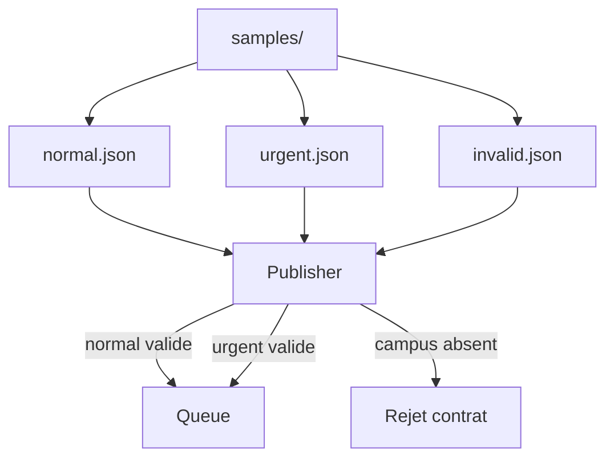

`priority` change une donnée métier, mais les deux payloads valides empruntent le même pipeline.

# 8. Créer les scripts de déploiement


### Création de `scripts/01-deploy.sh`

**Linux/macOS :**
```bash
touch scripts/01-deploy.sh
```

**Windows PowerShell :**
```powershell
New-Item -ItemType File -Force -Path 'scripts/01-deploy.sh' | Out-Null
```

Copiez ensuite **exactement** le contenu suivant dans `scripts/01-deploy.sh` :

```bash
#!/usr/bin/env bash
# Déploiement du TP 1 : aucune création manuelle dans le portail.
# Prérequis : az, Python 3, abonnement autorisant Microsoft.Logic,
# Microsoft.ServiceBus et les attributions RBAC Service Bus.
set -euo pipefail
cd "$(dirname "$0")/.."

# Surcharge possible : RG=... LOCATION=... NS=... bash scripts/01-deploy.sh
RG="${RG:-rg-si-flux-tp1-cli}"
LOCATION="${LOCATION:-westeurope}"
NS="${NS:-sb-tp1-$RANDOM-$RANDOM}"
PUB='la-tp1-reception-cli'
CON='la-tp1-traitement-cli'
QUEUE='demandes-inscription'

command -v az >/dev/null || { echo 'Azure CLI absent'; exit 1; }
command -v python3 >/dev/null || { echo 'Python 3 absent'; exit 1; }

# La documentation actuelle de l'extension Logic Apps exige Azure CLI >= 2.55.0.
AZ_CLI_VERSION="$(az version --query '"azure-cli"' -o tsv)"
python3 - "$AZ_CLI_VERSION" <<'PYVERSION'
import re, sys
raw = sys.argv[1]
parts = [int(x) for x in re.findall(r'\d+', raw)[:3]]
parts += [0] * (3 - len(parts))
if tuple(parts[:3]) < (2, 55, 0):
    raise SystemExit(
        f"Azure CLI {raw} détecté. Ce TP demande Azure CLI >= 2.55.0."
    )
PYVERSION

# L'utilisateur doit déjà avoir exécuté az login ; ne jamais automatiser la connexion.
az account show --output none || { echo 'Connectez-vous : az login'; exit 1; }
SUB="$(az account show --query id --output tsv)"
echo "Compte : $SUB ; Resource Group : $RG ; Namespace : $NS"

# Vérifier / enregistrer les Resource Providers nécessaires.
ensure_provider() {
  local provider="$1"
  local state
  state="$(az provider show --namespace "$provider" --query registrationState -o tsv 2>/dev/null || true)"
  if [[ "$state" != "Registered" ]]; then
    echo "Provider $provider non enregistré (état: ${state:-inconnu}). Tentative d'enregistrement..."
    az provider register --namespace "$provider" --wait --only-show-errors >/dev/null || {
      echo "Impossible d'enregistrer $provider."
      echo "Demandez à l'enseignant / administrateur de l'abonnement si vous n'avez pas ce droit."
      exit 1
    }
  fi
  echo "Provider $provider : Registered"
}

ensure_provider Microsoft.Logic
ensure_provider Microsoft.ServiceBus

# Groupe de ressources : contient les ressources de l'exercice.
az group create --name "$RG" --location "$LOCATION" --tags exercice=tp1-azure-cli --output none

# Basic suffit pour UNE queue ; TP 3 (topics) exigera au moins Standard.
az servicebus namespace create --resource-group "$RG" --name "$NS" \
  --location "$LOCATION" --sku Basic --output none

# Durée de vie 1 jour : un message abandonné n'est pas conservé éternellement.
az servicebus queue create --resource-group "$RG" --namespace-name "$NS" \
  --name "$QUEUE" --default-message-time-to-live P1D --output none

# Génération de définitions JSON locales ; les opérations cloud utilisent az.
python3 scripts/render.py "$NS"

# L'extension Logic Apps porte la commande az logic workflow.
az extension add --name logic --upgrade --only-show-errors >/dev/null

# Activer l'identité gérée évite les clés SAS et les connexions manuelles.
az logic workflow create -g "$RG" -n "$PUB" -l "$LOCATION" \
  --definition @outputs/publisher.json --mi-system-assigned true --state Enabled \
  --only-show-errors --output none

# Consommateur initialement INACTIF : nécessaire pour observer le backlog.
az logic workflow create -g "$RG" -n "$CON" -l "$LOCATION" \
  --definition @outputs/consumer.json --mi-system-assigned true --state Disabled \
  --only-show-errors --output none

# Identités : objectId/principalId (et PAS resourceId) pour RBAC.
PUB_OID="$(az logic workflow show -g "$RG" -n "$PUB" --query identity.principalId -o tsv)"
CON_OID="$(az logic workflow show -g "$RG" -n "$CON" --query identity.principalId -o tsv)"
QUEUE_ID="$(az servicebus queue show -g "$RG" --namespace-name "$NS" -n "$QUEUE" --query id -o tsv)"
[[ -n "$PUB_OID" && -n "$CON_OID" && -n "$QUEUE_ID" ]] || { echo 'Identité/queue introuvable'; exit 1; }

# Permissions les plus réduites possibles : Send et Receive SUR LA QUEUE.
az role assignment create --assignee-object-id "$PUB_OID" \
  --assignee-principal-type ServicePrincipal --role 'Azure Service Bus Data Sender' \
  --scope "$QUEUE_ID" --output none
az role assignment create --assignee-object-id "$CON_OID" \
  --assignee-principal-type ServicePrincipal --role 'Azure Service Bus Data Receiver' \
  --scope "$QUEUE_ID" --output none

# Conserver uniquement noms non secrets (pas de callback URL signée).
python3 - "$RG" "$LOCATION" "$NS" "$PUB" "$CON" "$QUEUE" "$SUB" <<'PYCODE'
import json,sys,pathlib
rg,loc,ns,pub,con,queue,sub=sys.argv[1:]
pathlib.Path('outputs/context.json').write_text(json.dumps({
  'resourceGroup':rg,'location':loc,'namespace':ns,'publisher':pub,
  'consumer':con,'queue':queue,'subscriptionId':sub},indent=2)+'\n')
PYCODE

echo 'OK : Resource Group, Basic namespace, queue et deux Logic Apps créés via az.'
echo 'La propagation RBAC peut prendre plusieurs minutes si le premier test donne 401/403.'
echo 'Consommateur = Disabled. Exécutez ensuite les commandes du README.'
```


## 8.1 Explication de `01-deploy.sh`

Le script réalise, dans l'ordre :

1. vérification d'Azure CLI et Python ;
2. vérification d'Azure CLI `>= 2.55.0` ;
3. vérification de la session Azure ;
4. vérification des providers `Microsoft.Logic` et `Microsoft.ServiceBus` ;
5. création du Resource Group ;
6. création du namespace Service Bus Basic ;
7. création de la queue `demandes-inscription` ;
8. génération des JSON avec `render.py` ;
9. création de la Logic App productrice ;
10. création de la Logic App consommatrice **désactivée** ;
11. récupération des Managed Identities ;
12. attribution de `Data Sender` et `Data Receiver` au niveau de la queue ;
13. création de `outputs/context.json`.

> La consommatrice est volontairement `Disabled` au départ afin que vous puissiez observer le backlog.


## 8.1.0 Diagramme - plan de gestion vs plan de données

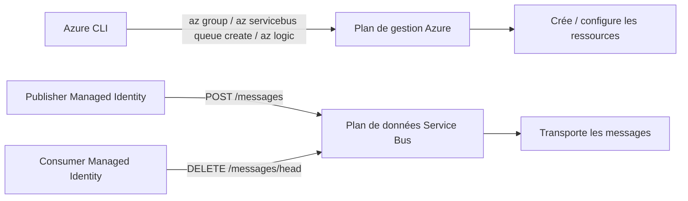

Ne confondez pas :

```text
avoir le droit de créer la queue
```

avec :

```text
avoir le droit d'envoyer dans la queue
```.

## 8.1.1 Carte mentale du déploiement

Le déploiement suit cette chaîne de dépendances :

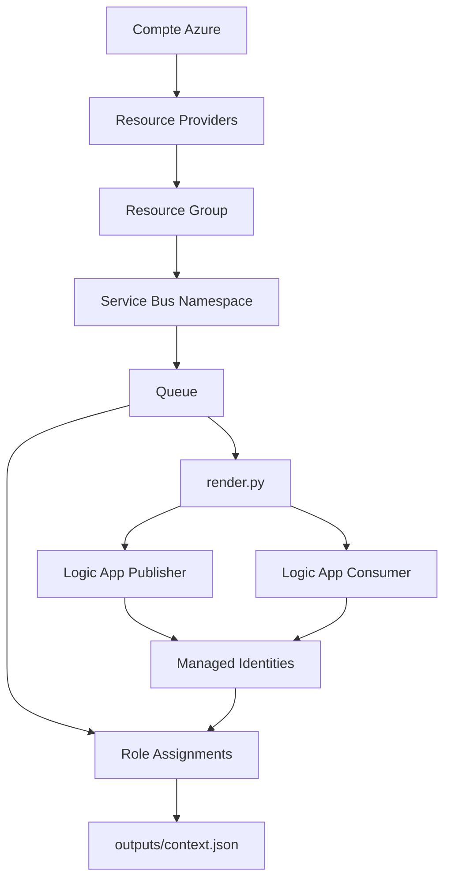

Une erreur au début peut donc provoquer plusieurs erreurs secondaires.

Exemple :

```text
queue non créée
|
v
QUEUE_ID vide
|
v
role assignment impossible
```

Corrigez toujours **la première erreur**.


### Diagramme - dépendances du déploiement

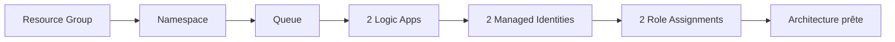

Une ressource en aval dépend souvent de l'identifiant créé par une ressource en amont.

## 8.1.2 Exécuter le Bash en mode trace

Pour voir chaque commande juste avant son exécution :

```bash
bash -x scripts/01-deploy.sh
```

Ou :

```bash
set -x
bash scripts/01-deploy.sh
set +x
```

> Attention : le mode trace peut afficher beaucoup de valeurs. N'utilisez pas ce principe plus tard avec des secrets.

## 8.1.3 Debug étape par étape du déploiement

### Étape A - vérifier le Resource Group

```bash
az group exists -n "$RG"
```

Attendu :

```text
true
```

Détails :

```bash
az group show -n "$RG" -o jsonc
```

### Étape B - vérifier le namespace

```bash
az servicebus namespace show \
  -g "$RG" \
  -n "$NS" \
  --query '{name:name,sku:sku.name,status:status,location:location}' \
  -o json
```

Attendu :

```text
sku = Basic
```

### Étape C - vérifier la queue

```bash
az servicebus queue show \
  -g "$RG" \
  --namespace-name "$NS" \
  -n "$QUEUE" \
  --query '{name:name,status:status,ttl:defaultMessageTimeToLive,count:countDetails}' \
  -o json
```

### Étape D - vérifier les fichiers générés

```bash
ls -lh outputs/
python3 -m json.tool outputs/publisher.json >/dev/null
python3 -m json.tool outputs/consumer.json >/dev/null
```

### Étape E - vérifier la productrice

```bash
az logic workflow show \
  -g "$RG" -n "$PUB" \
  --query '{state:state,identity:identity}' \
  -o json
```

### Étape F - vérifier la consommatrice

```bash
az logic workflow show \
  -g "$RG" -n "$CON" \
  --query '{state:state,identity:identity}' \
  -o json
```

Attendu au départ :

```text
Disabled
```

### Étape G - vérifier les deux principalId

```bash
PUB_OID=$(az logic workflow show -g "$RG" -n "$PUB" --query identity.principalId -o tsv)
CON_OID=$(az logic workflow show -g "$RG" -n "$CON" --query identity.principalId -o tsv)

printf "Publisher OID: %s\nConsumer OID: %s\n" "$PUB_OID" "$CON_OID"
```

Ils doivent être non vides et différents.

### Étape H - vérifier les rôles

```bash
az role assignment list \
  --scope "$QUEUE_ID" \
  --query '[].{role:roleDefinitionName,principalId:principalId}' \
  -o table
```


### Diagramme - principe du moindre privilège

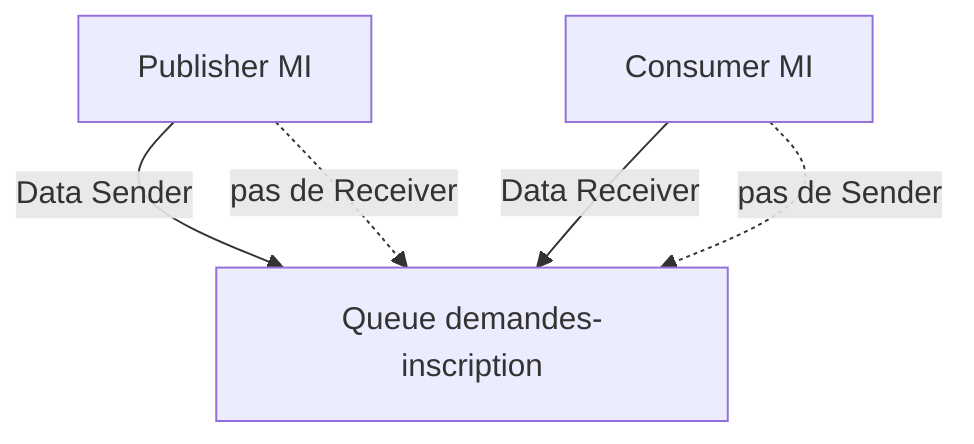

L'objectif n'est pas de donner « beaucoup de droits pour que ça marche », mais seulement les droits nécessaires.

## 8.1.4 Erreurs fréquentes du script de déploiement

### `Namespace already exists`

Les namespaces Service Bus ont un nom globalement unique.

Générez un autre nom :

```bash
export NS="sb-tp1-$RANDOM-$RANDOM"
```

puis utilisez un Resource Group propre ou supprimez la tentative précédente si nécessaire.

### `MissingSubscriptionRegistration`

Le Resource Provider n'est pas enregistré.

```bash
az provider register --namespace Microsoft.Logic --wait
az provider register --namespace Microsoft.ServiceBus --wait
```

### `AuthorizationFailed` sur `roleAssignments/write`

Votre compte n'a pas le droit d'attribuer des rôles.

Ce n'est pas un problème Service Bus.

Il faut un droit Azure permettant :

```text
Microsoft.Authorization/roleAssignments/write
```

Demandez à l'enseignant / administrateur.

### `InvalidTemplate` ou erreur de définition Logic Apps

Vérifiez d'abord le JSON local :

```bash
python3 -m json.tool outputs/publisher.json
python3 -m json.tool outputs/consumer.json
```

Puis relancez seulement la commande concernée avec :

```bash
--debug
```

Exemple :

```bash
az logic workflow create \
  -g "$RG" \
  -n "$PUB" \
  -l "$LOCATION" \
  --definition @outputs/publisher.json \
  --mi-system-assigned true \
  --state Enabled \
  --debug
```

### Le script s'arrête au milieu

Le Bash utilise :

```bash
set -euo pipefail
```

Cela signifie qu'il s'arrête volontairement dès qu'une erreur importante apparaît.

Ne supprimez pas cette ligne pour « forcer » le déploiement.

Diagnostiquez l'étape qui a échoué, puis relancez proprement.

### Questions A

**Question A1. Pourquoi ne faut-il pas donner `Azure Service Bus Data Sender` automatiquement à la consommatrice ?**


> **Réponse - A1 :** La consommatrice n'a besoin que de lire les messages. Lui donner le droit d'envoyer violerait le principe du moindre privilège : on accorderait une permission inutile qui augmente la surface d'erreur ou d'abus.


**Question A2. Quelle différence existe entre le droit de créer une queue et celui d'envoyer un message dans cette queue ?**


> **Réponse - A2 :** Créer ou configurer une queue appartient au **plan de gestion Azure**. Envoyer ou recevoir un message appartient au **plan de données Service Bus**. Un rôle de gestion comme Contributor ne remplace donc pas automatiquement les rôles `Azure Service Bus Data Sender` ou `Data Receiver`.


### Création de `scripts/01-deploy.ps1`

**Linux/macOS :**
```bash
touch scripts/01-deploy.ps1
```

**Windows PowerShell :**
```powershell
New-Item -ItemType File -Force -Path 'scripts/01-deploy.ps1' | Out-Null
```

Copiez ensuite **exactement** le contenu suivant dans `scripts/01-deploy.ps1` :

```powershell
<# Déploiement Azure CLI sous Windows PowerShell 7 (ou 5.1).
   Aucune création via l'interface graphique ; tous les changements cloud utilisent az.
#>
param(
  [string]$ResourceGroup = 'rg-si-flux-tp1-cli',
  [string]$Location = 'westeurope',
  [string]$Namespace = ('sb-tp1-' + (Get-Random -Minimum 100000 -Maximum 999999))
)
$ErrorActionPreference = 'Stop'
Set-Location (Resolve-Path (Join-Path $PSScriptRoot '..'))
if (-not (Get-Command az -ErrorAction SilentlyContinue)) { throw 'Installez Azure CLI.' }
if (-not (Get-Command python -ErrorAction SilentlyContinue)) { throw 'Installez Python 3.' }

# Les exécutables externes ne déclenchent pas tous automatiquement une exception.
function Invoke-AzChecked {
  & az @args
  if ($LASTEXITCODE -ne 0) { throw "Échec Azure CLI : az $($args -join ' ')" }
}
$Subscription = (az account show --query id -o tsv).Trim()
if ($LASTEXITCODE -ne 0 -or -not $Subscription) { throw 'Exécutez az login et az account set avant le TP.' }

# L'extension Logic Apps utilisée par le TP requiert Azure CLI >= 2.55.0.
$AzCliVersion = (az version --query '"azure-cli"' -o tsv).Trim()
if (-not $AzCliVersion) { throw 'Impossible de déterminer la version Azure CLI.' }
if ([version]$AzCliVersion -lt [version]'2.55.0') {
  throw "Azure CLI $AzCliVersion détecté. Ce TP demande Azure CLI >= 2.55.0."
}

# Vérifier les Resource Providers nécessaires.
function Ensure-Provider([string]$Namespace) {
  $state = (az provider show --namespace $Namespace --query registrationState -o tsv 2>$null).Trim()
  if ($state -ne 'Registered') {
    Write-Host "Provider $Namespace non enregistré (état: $state). Tentative d'enregistrement..."
    az provider register --namespace $Namespace --wait --only-show-errors | Out-Null
    if ($LASTEXITCODE -ne 0) {
      throw "Impossible d'enregistrer $Namespace. Demandez à l'enseignant / administrateur."
    }
  }
  Write-Host "Provider $Namespace : Registered"
}

Ensure-Provider 'Microsoft.Logic'
Ensure-Provider 'Microsoft.ServiceBus'

$Pub='la-tp1-reception-cli'
$Con='la-tp1-traitement-cli'
$Queue='demandes-inscription'
Write-Host "Abonnement : $Subscription | RG : $ResourceGroup | Namespace : $Namespace"

Invoke-AzChecked group create -g $ResourceGroup -l $Location --tags exercice=tp1-azure-cli -o none
Invoke-AzChecked servicebus namespace create -g $ResourceGroup -n $Namespace -l $Location --sku Basic -o none
Invoke-AzChecked servicebus queue create -g $ResourceGroup --namespace-name $Namespace -n $Queue --default-message-time-to-live P1D -o none
& python scripts/render.py $Namespace
if ($LASTEXITCODE -ne 0) { throw 'render.py a échoué' }
Invoke-AzChecked extension add --name logic --upgrade --only-show-errors
Invoke-AzChecked logic workflow create -g $ResourceGroup -n $Pub -l $Location --definition '@outputs/publisher.json' --mi-system-assigned true --state Enabled -o none
Invoke-AzChecked logic workflow create -g $ResourceGroup -n $Con -l $Location --definition '@outputs/consumer.json' --mi-system-assigned true --state Disabled -o none
$PubObjectId = (az logic workflow show -g $ResourceGroup -n $Pub --query identity.principalId -o tsv).Trim()
$ConObjectId = (az logic workflow show -g $ResourceGroup -n $Con --query identity.principalId -o tsv).Trim()
$QueueId = (az servicebus queue show -g $ResourceGroup --namespace-name $Namespace -n $Queue --query id -o tsv).Trim()
if (-not $PubObjectId -or -not $ConObjectId -or -not $QueueId) { throw 'Identités ou queue introuvables.' }
Invoke-AzChecked role assignment create --assignee-object-id $PubObjectId --assignee-principal-type ServicePrincipal --role 'Azure Service Bus Data Sender' --scope $QueueId -o none
Invoke-AzChecked role assignment create --assignee-object-id $ConObjectId --assignee-principal-type ServicePrincipal --role 'Azure Service Bus Data Receiver' --scope $QueueId -o none
$Context = @{ resourceGroup=$ResourceGroup; location=$Location; namespace=$Namespace; publisher=$Pub; consumer=$Con; queue=$Queue; subscriptionId=$Subscription }
$Context | ConvertTo-Json | Set-Content -Encoding UTF8 'outputs/context.json'
Write-Host 'OK : déploiement terminé via az. Le consommateur est Disabled.'
Write-Host 'Les rôles RBAC peuvent nécessiter un délai de propagation.'
```


## 8.2 Version Windows

`01-deploy.ps1` effectue le même déploiement que la version Bash :

- mêmes ressources ;
- mêmes rôles ;
- même consumer initialement désactivé ;
- même génération de `outputs/context.json`.

Vous utilisez **soit** la version Bash, **soit** PowerShell. Ne lancez pas les deux pour créer deux namespaces différents.


---


## 8.3 Comprendre la version PowerShell et la debugger

La version PowerShell effectue les mêmes opérations, mais elle doit gérer une différence importante :

```text
une commande externe comme az
```

ne provoque pas toujours automatiquement une exception PowerShell.

C'est pourquoi le script vérifie régulièrement :

```powershell
$LASTEXITCODE
```

### Mode diagnostic PowerShell

Vous pouvez afficher les commandes PowerShell exécutées avec :

```powershell
Set-PSDebug -Trace 1
./scripts/01-deploy.ps1
Set-PSDebug -Off
```

Pour une commande Azure précise :

```powershell
az logic workflow show `
  -g $RG `
  -n $PUB `
  --debug
```

### Tester séparément une étape

N'hésitez pas à copier une commande du script et à l'exécuter seule.

Exemple :

```powershell
az servicebus queue show `
  -g $RG `
  --namespace-name $NS `
  -n $QUEUE `
  -o jsonc
```

C'est souvent plus simple que de relancer tout le script pour comprendre une seule erreur.

# 9. Créer les scripts d'expérience backlog/reprise


### Création de `scripts/03-experiments.sh`

**Linux/macOS :**
```bash
touch scripts/03-experiments.sh
```

**Windows PowerShell :**
```powershell
New-Item -ItemType File -Force -Path 'scripts/03-experiments.sh' | Out-Null
```

Copiez ensuite **exactement** le contenu suivant dans `scripts/03-experiments.sh` :

```bash
#!/usr/bin/env bash
# Expérience CLI reproductible :
# désactivation du consommateur -> publication -> backlog -> reprise.
# Aucun appel Azure ne passe par le portail ; les appels HTTP utilisent az rest.
set -euo pipefail
cd "$(dirname "$0")/.."

[[ -f outputs/context.json ]] || {
  echo "Lancez scripts/01-deploy.sh avant scripts/03-experiments.sh."
  exit 1
}

# Python est déjà un prérequis du TP : on l'utilise pour lire le contexte
# afin d'éviter d'imposer jq en plus.
readarray -t CTX < <(python3 - <<'PY'
import json
from pathlib import Path
ctx=json.loads(Path("outputs/context.json").read_text(encoding="utf-8"))
for key in ("resourceGroup","namespace","publisher","consumer","queue"):
    print(ctx[key])
PY
)

RG="${CTX[0]}"
NS="${CTX[1]}"
PUB="${CTX[2]}"
CON="${CTX[3]}"
QUEUE="${CTX[4]}"

SUB="$(az account show --query id -o tsv)"
WF_ID="/subscriptions/$SUB/resourceGroups/$RG/providers/Microsoft.Logic/workflows/$PUB"
CON_ID="/subscriptions/$SUB/resourceGroups/$RG/providers/Microsoft.Logic/workflows/$CON"

# L'URL signée doit rester en mémoire et ne doit jamais être affichée.
CALLBACK="$(az rest --method post \
  --uri "https://management.azure.com$WF_ID/triggers/Request_Inscription/listCallbackUrl?api-version=2019-05-01" \
  --body '{}' --query value -o tsv)"

[[ -n "$CALLBACK" ]] || {
  echo "Callback URL absente."
  exit 1
}

# Désactiver uniquement la consommatrice.
az logic workflow update -g "$RG" -n "$CON" --state Disabled --output none

BEFORE="$(az servicebus queue show -g "$RG" --namespace-name "$NS" -n "$QUEUE" \
  --query countDetails.activeMessageCount -o tsv)"
echo "Messages actifs AVANT publication : $BEFORE"

# Générer cinq payloads distincts localement puis les publier via az rest.
for i in 1 2 3 4 5; do
  python3 - "$i" <<'PY'
import json, pathlib, sys
n=int(sys.argv[1])
p=pathlib.Path("outputs") / f"experiment-{n}.json"
p.write_text(
    json.dumps({
        "studentId": f"ETU-CLI-{n:03d}",
        "firstName": "Test",
        "lastName": f"Personne{n}",
        "formation": "MIAGE",
        "campus": "Nanterre",
        "priority": "urgent" if n == 1 else "normal"
    }, ensure_ascii=False) + "\n",
    encoding="utf-8"
)
PY

  echo "Publication du dossier n°$i :"
  az rest --method post \
    --url "$CALLBACK" \
    --skip-authorization-header \
    --headers Content-Type=application/json \
    --body "@outputs/experiment-$i.json" \
    --query '{status:status,messageId:messageId,studentId:studentId}' \
    -o json
done

AFTER="$(az servicebus queue show -g "$RG" --namespace-name "$NS" -n "$QUEUE" \
  --query countDetails.activeMessageCount -o tsv)"
echo "Messages actifs APRÈS publication : $AFTER"

read -r -p "Activer la consommatrice pour observer la reprise ? Tapez OUI : " answer

if [[ "$answer" == OUI ]]; then
  az logic workflow update -g "$RG" -n "$CON" --state Enabled --output none
  echo "Consommatrice activée."
  echo
  echo "Commandes de vérification :"
  echo "az servicebus queue show -g '$RG' --namespace-name '$NS' -n '$QUEUE' --query countDetails.activeMessageCount -o tsv"
  echo "az rest --method get --uri 'https://management.azure.com$CON_ID/runs?api-version=2019-05-01' --query 'value[].{nom:name,statut:properties.status}' -o table"
else
  echo "Consommatrice maintenue désactivée ; le backlog reste en attente."
fi
```


### Création de `scripts/03-experiments.ps1`

**Linux/macOS :**
```bash
touch scripts/03-experiments.ps1
```

**Windows PowerShell :**
```powershell
New-Item -ItemType File -Force -Path 'scripts/03-experiments.ps1' | Out-Null
```

Copiez ensuite **exactement** le contenu suivant dans `scripts/03-experiments.ps1` :

```powershell
# Expérience CLI reproductible sous Windows : aucune manipulation Azure Portal.
$ErrorActionPreference='Stop'
Set-Location (Resolve-Path (Join-Path $PSScriptRoot '..'))
$ctx=Get-Content -Raw outputs/context.json | ConvertFrom-Json
$rg=$ctx.resourceGroup; $ns=$ctx.namespace; $pub=$ctx.publisher
$con=$ctx.consumer; $queue=$ctx.queue
$sub=(az account show --query id -o tsv).Trim()
$wfId="/subscriptions/$sub/resourceGroups/$rg/providers/Microsoft.Logic/workflows/$pub"
# La callback est secrète : garder la variable en mémoire et ne pas l'imprimer.
$callback=(az rest --method post --uri "https://management.azure.com$wfId/triggers/Request_Inscription/listCallbackUrl?api-version=2019-05-01" --body '{}' --query value -o tsv).Trim()
if ($LASTEXITCODE -ne 0) { throw 'Impossible de récupérer la callback' }
az logic workflow update -g $rg -n $con --state Disabled -o none
if ($LASTEXITCODE -ne 0) { throw 'Impossible de désactiver la consommatrice' }
Write-Host 'Messages actifs AVANT publication :'
az servicebus queue show -g $rg --namespace-name $ns -n $queue --query countDetails.activeMessageCount -o tsv
for ($i=1; $i -le 5; $i++) {
  # Génération locale d'un exemple : la publication passe par az rest.
  $payload=@{
    studentId=('ETU-CLI-{0:D3}' -f $i); firstName='Test';
    lastName="Personne$i"; formation='MIAGE'; campus='Nanterre';
    priority= $(if ($i -eq 1) {'urgent'} else {'normal'})
  } | ConvertTo-Json
  $f=Join-Path (Resolve-Path 'outputs') "experiment-$i.json"
  [IO.File]::WriteAllText($f, $payload, (New-Object System.Text.UTF8Encoding $false))
  az rest --method post --url $callback --skip-authorization-header `
      --headers 'Content-Type=application/json' --body "@$f" `
      --query '{status:status,messageId:messageId,studentId:studentId}' -o json
  if ($LASTEXITCODE -ne 0) { throw "Échec de la publication n°$i" }
}
Write-Host 'Messages actifs APRÈS publication :'
az servicebus queue show -g $rg --namespace-name $ns -n $queue --query countDetails.activeMessageCount -o tsv
$ok=Read-Host 'Activer la consommatrice ? Tapez OUI'
if ($ok -eq 'OUI') {
 az logic workflow update -g $rg -n $con --state Enabled -o none
 Write-Host "Vérifier : az servicebus queue show -g '$rg' --namespace-name '$ns' -n '$queue' --query countDetails.activeMessageCount -o tsv"
} else { Write-Host 'Backlog laissé en attente.' }
```


## 9.1 Ce que fait l'expérience

Le scénario est :

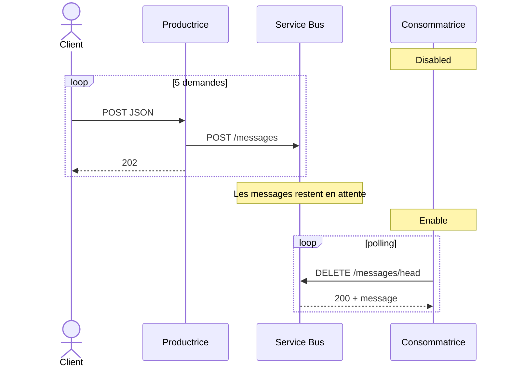

Le script crée cinq payloads distincts dans `outputs/`, les publie avec `az rest`, puis affiche le nombre de messages actifs avant et après.


### Diagramme - évolution du backlog

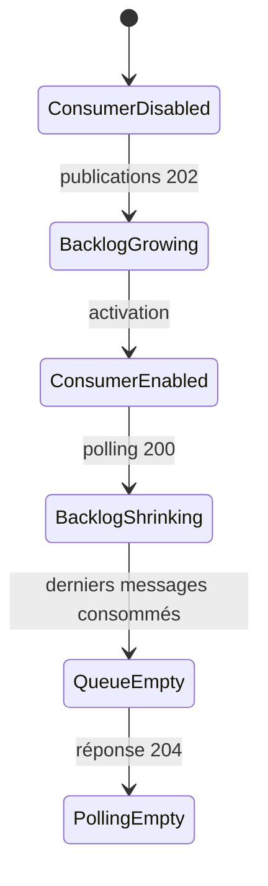

Le TP vous fait observer volontairement chaque état.

## 9.2 Comprendre précisément `03-experiments`

Le script ne crée pas de nouvelle architecture.

Il utilise les ressources existantes pour créer une expérience contrôlée.

### Étape 1 - lire `context.json`

Il récupère :

```text
Resource Group
namespace
nom producteur
nom consumer
nom queue
```

### Étape 2 - récupérer la callback URL

Cette URL est nécessaire pour simuler le portail.

Elle est gardée en mémoire et **n'est pas imprimée**.

### Étape 3 - désactiver seulement le consumer

```text
Producteur = continue
Queue = continue
Consumer = arrêté
```

C'est ce qui permet de démontrer le découplage.

### Étape 4 - mesurer `BEFORE`

Le compteur est lu avant de publier.

### Étape 5 - générer cinq demandes

Les `studentId` sont différents pour éviter de confondre les messages.

### Étape 6 - publier avec `az rest`

Chaque appel doit normalement produire :

```text
status = ACCEPTED
```

### Étape 7 - mesurer `AFTER`

Si cinq publications réussissent et qu'aucun consumer ne tourne :

```text
AFTER ≈ BEFORE + 5
```

Le symbole `≈` est volontaire : dans un système distribué, il faut toujours vérifier les conditions réelles au moment de la mesure.

## 9.3 Debug de l'expérience

### `outputs/context.json` absent

```bash
ls -l outputs/context.json
```

S'il est absent :

```text
le déploiement n'est pas allé jusqu'au bout
```

### Callback introuvable

Vérifiez le nom du trigger :

```bash
az rest \
  --method get \
  --uri "https://management.azure.com$WF_ID/triggers?api-version=2019-05-01" \
  --query 'value[].name' \
  -o table
```

Vous devez voir :

```text
Request_Inscription
```

### Les publications retournent 401/403

Deux authentifications différentes existent dans le TP :

```text
Client -> Logic App
```

utilise la callback URL signée.

Alors que :

```text
Logic App -> Service Bus
```

utilise la Managed Identity.

Si l'appel client déclenche le workflow mais `Send_To_ServiceBus` échoue en `401/403`, le problème est côté **Managed Identity / RBAC Service Bus**, pas côté callback URL.

### `AFTER` n'augmente pas

Vérifiez immédiatement les runs du publisher.

```bash
az rest \
  --method get \
  --uri "https://management.azure.com$WF_ID/runs?api-version=2019-05-01" \
  --query 'value[0:10].{run:name,status:properties.status,start:properties.startTime}' \
  -o table
```

Puis inspectez les actions du run le plus récent.

### Le consumer est censé être Disabled mais le backlog baisse

Vérifiez :

```bash
az logic workflow show \
  -g "$RG" \
  -n "$CON" \
  --query state \
  -o tsv
```

### Après réactivation, le backlog reste identique

Causes possibles :

```text
trigger pas encore exécuté
RBAC Receiver pas propagé
Pull_Message en erreur
consumer désactivé par erreur
mauvais namespace/queue dans la définition
```

Commencez par :

```bash
az rest \
  --method get \
  --uri "https://management.azure.com$CON_ID/runs?api-version=2019-05-01" \
  --query 'value[0:10].{run:name,status:properties.status,start:properties.startTime}' \
  -o table
```

### Questions E

**Question E1. Qu'apporte la file lorsque la consommatrice est indisponible ?**


> **Réponse - E1 :** La queue stocke temporairement les demandes déjà acceptées. La productrice peut continuer à déposer des messages même si la consommatrice est arrêtée. On obtient donc un découplage temporel entre réception et traitement.


**Question E2. Que se passe-t-il si Service Bus lui-même est indisponible au moment du dépôt ?**


> **Réponse - E2 :** La productrice ne peut pas confirmer le stockage. `Send_To_ServiceBus` échoue ou expire et le workflow doit répondre `502`, pas `202`. La file protège contre l'indisponibilité du consommateur, pas contre l'indisponibilité du broker au moment précis de la publication.


**Question E3. Pourquoi le nombre de messages n'est-il pas forcément immédiatement égal à zéro après réactivation ?**


> **Réponse - E3 :** La consommatrice fonctionne par polling périodique, ici une fois par minute, et chaque run ne retire qu'un message. Il faut donc plusieurs exécutions pour vider un backlog. Les compteurs Azure peuvent aussi présenter un léger délai de mise à jour.


---

# 10. Créer les scripts de nettoyage


### Création de `scripts/02-cleanup.sh`

**Linux/macOS :**
```bash
touch scripts/02-cleanup.sh
```

**Windows PowerShell :**
```powershell
New-Item -ItemType File -Force -Path 'scripts/02-cleanup.sh' | Out-Null
```

Copiez ensuite **exactement** le contenu suivant dans `scripts/02-cleanup.sh` :

```bash
#!/usr/bin/env bash
# Supprime EN ENTIER le Resource Group dédié au TP.
# Ne jamais lancer ce script avec un Resource Group partagé.
set -euo pipefail
cd "$(dirname "$0")/.."

[[ -f outputs/context.json ]] || {
  echo "outputs/context.json introuvable. Lancez d'abord scripts/01-deploy.sh."
  exit 1
}

RG="$(python3 - <<'PY'
import json
from pathlib import Path
ctx=json.loads(Path("outputs/context.json").read_text(encoding="utf-8"))
print(ctx["resourceGroup"])
PY
)"

[[ "$RG" == 'rg-si-flux-tp1-cli' || "$RG" == tp1-* || "$RG" == *-tp1-* ]] || {
  echo "Nom de Resource Group atypique : $RG"
  echo "Arrêt de sécurité."
  exit 1
}

echo "Ressources présentes dans $RG :"
az resource list -g "$RG" -o table

read -r -p "Supprimer TOUT le groupe $RG ? Tapez OUI : " confirm
[[ "$confirm" == OUI ]] || {
  echo "Suppression annulée."
  exit 0
}

az group delete --name "$RG" --yes
echo "Suppression demandée pour $RG."
```


### Création de `scripts/02-cleanup.ps1`

**Linux/macOS :**
```bash
touch scripts/02-cleanup.ps1
```

**Windows PowerShell :**
```powershell
New-Item -ItemType File -Force -Path 'scripts/02-cleanup.ps1' | Out-Null
```

Copiez ensuite **exactement** le contenu suivant dans `scripts/02-cleanup.ps1` :

```powershell
# Attention : ce script efface TOUT le Resource Group indiqué.
$ErrorActionPreference='Stop'
Set-Location (Resolve-Path (Join-Path $PSScriptRoot '..'))
$ctx=Get-Content -Raw outputs/context.json | ConvertFrom-Json
$rg=$ctx.resourceGroup
if ($rg -notmatch '(^tp1-|[-]tp1[-]|^rg-si-flux-tp1-cli$)') { throw "RG atypique : $rg" }
az resource list -g $rg -o table
$confirm=Read-Host "Supprimer TOUT le groupe $rg ? Tapez OUI"
if ($confirm -ne 'OUI') { Write-Host 'Annulé'; exit }
az group delete -g $rg --yes
```


## 10.1 Pourquoi le nettoyage est sécurisé

Le script :

1. lit le Resource Group depuis `outputs/context.json` ;
2. refuse un nom de groupe inhabituel ;
3. affiche les ressources présentes ;
4. demande de taper `OUI` ;
5. supprime ensuite le Resource Group entier.

> N'utilisez jamais ce script avec un Resource Group partagé avec d'autres TPs ou d'autres étudiants.

---


### Diagramme - décision avant suppression

```mermaid
flowchart TD
    START["Demande de nettoyage"]
    CTX{"context.json présent ?"}
    NAME{"Nom RG ressemble au TP ?"}
    LIST["Lister les ressources"]
    SAFE{"Seulement ressources du TP ?"}
    CONF{"Utilisateur tape OUI ?"}
    DEL["az group delete"]
    STOP["Arrêt de sécurité"]

    START --> CTX
    CTX -->|"Non"| STOP
    CTX -->|"Oui"| NAME
    NAME -->|"Non"| STOP
    NAME -->|"Oui"| LIST --> SAFE
    SAFE -->|"Non"| STOP
    SAFE -->|"Oui"| CONF
    CONF -->|"Non"| STOP
    CONF -->|"Oui"| DEL
```

Le nettoyage est une opération destructive : le TP vous apprend aussi à la sécuriser.

## 10.2 Debug et sécurité du nettoyage

### Le script dit que `context.json` est absent

Ne devinez pas le Resource Group.

Listez vos groupes :

```bash
az group list \
  --query '[].{name:name,location:location}' \
  -o table
```

Puis vérifiez lequel correspond réellement au TP.

### Le groupe contient des ressources inattendues

Arrêtez-vous.

```bash
az resource list -g "$RG" -o table
```

Si vous voyez des ressources qui ne concernent pas ce TP, **ne supprimez pas le groupe**.

### Vérifier que la suppression est terminée

Après :

```bash
az group delete --name "$RG" --yes
```

vous pouvez vérifier :

```bash
az group exists --name "$RG"
```

Lorsque Azure a terminé :

```text
false
```

# 11. Vérifier les fichiers AVANT tout déploiement Azure

## 11.1 Linux/macOS

```bash
# Depuis TP1_Azure_CLI_DE_ZERO
chmod +x scripts/*.sh scripts/render.py

# Vérifier la syntaxe Bash
bash -n scripts/01-deploy.sh
bash -n scripts/02-cleanup.sh
bash -n scripts/03-experiments.sh

# Vérifier Python
python3 -m py_compile scripts/render.py

# Vérifier tous les JSON
for f in workflows/*.json samples/*.json; do
  echo "Vérification $f"
  python3 -m json.tool "$f" >/dev/null
done
```

Si aucune erreur n'est affichée, la syntaxe locale est correcte.

## 11.2 Windows PowerShell

```powershell
python -m py_compile scripts/render.py

Get-ChildItem workflows,samples -Filter *.json | ForEach-Object {
    Write-Host "Vérification $($_.FullName)"
    python -m json.tool $_.FullName | Out-Null
    if ($LASTEXITCODE -ne 0) {
        throw "JSON invalide : $($_.FullName)"
    }
}
```

---


### Diagramme - validation en couches

```mermaid
flowchart LR
    B["Bash / PowerShell"]
    PY["Python"]
    JSON["JSON"]
    R["Rendu outputs"]
    AZ["Azure"]
    RUN["Runtime"]

    B --> PY --> JSON --> R --> AZ --> RUN
```

Une erreur doit être corrigée dans la couche où elle apparaît.

Exemple :

```text
JSON invalide
```

ne doit jamais être diagnostiqué comme :

```text
problème RBAC
```.

## 11.3 Pourquoi ces validations locales sont importantes

Il faut distinguer :

```text
erreur de fichier local
```

de :

```text
erreur Azure
```

Si un JSON est invalide localement, Azure ne pourra pas le réparer.

Si `render.py` ne compile pas, inutile de chercher un problème RBAC.

L'ordre recommandé est donc :

```text
Bash/PowerShell
|
v
Python
|
v
JSON
|
v
rendu outputs/
|
v
Azure
```

### Test complet du rendu sans créer Azure

Vous pouvez utiliser un faux namespace local :

```bash
python3 scripts/render.py "sb-test-local"

python3 -m json.tool outputs/publisher.json >/dev/null
python3 -m json.tool outputs/consumer.json >/dev/null

grep -n "sb-test-local" outputs/publisher.json
grep -n "sb-test-local" outputs/consumer.json
```

Ensuite, lors du vrai déploiement, `render.py` sera relancé avec le vrai namespace.

### Vérifier que les placeholders ont disparu

```bash
grep -R "__SB_NAMESPACE__" outputs/ && \
  echo "ERREUR : placeholder restant" || \
  echo "OK : aucun placeholder dans outputs/"
```

# 12. Déployer le TP

Choisissez **une seule** méthode selon votre système.

## 12.1 Linux/macOS

```bash
export RG="rg-si-flux-tp1-cli"
export LOCATION="westeurope"
export NS="sb-tp1-$RANDOM-$RANDOM"

bash scripts/01-deploy.sh
```

### À quoi servent ces variables ?

- `RG` : nom du Resource Group ;
- `LOCATION` : région Azure ;
- `NS` : nom unique du namespace Service Bus.

Le namespace Service Bus doit être globalement unique.

## 12.2 Windows PowerShell

```powershell
./scripts/01-deploy.ps1 `
  -ResourceGroup "rg-si-flux-tp1-cli" `
  -Location "westeurope" `
  -Namespace ("sb-tp1-" + (Get-Random -Minimum 100000 -Maximum 999999))
```

---


## 12.3 Que devez-vous voir pendant le déploiement ?

Le script peut être relativement silencieux car plusieurs commandes utilisent :

```text
--output none
```

C'est volontaire : la sortie utile est réduite.

Vous devez surtout voir :

```text
Compte ...
Provider Microsoft.Logic : Registered
Provider Microsoft.ServiceBus : Registered
OK : Resource Group, Basic namespace, queue et deux Logic Apps créés via az.
Consommateur = Disabled.
```

## 12.4 Si le déploiement échoue : ne recommencez pas immédiatement de zéro

Commencez par voir ce qui existe déjà :

```bash
az resource list -g "$RG" -o table
```

Puis identifiez la dernière étape réussie.

### Seulement le Resource Group existe

Recherchez une erreur de création Service Bus.

### Namespace présent, queue absente

```bash
az servicebus queue list \
  -g "$RG" \
  --namespace-name "$NS" \
  -o table
```

### Queue présente, Logic Apps absentes

Vérifiez :

```bash
ls -l outputs/publisher.json outputs/consumer.json
python3 -m json.tool outputs/publisher.json >/dev/null
```

Puis retestez la création d'un workflow avec `--debug`.

### Logic Apps présentes, mais rôles absents

Le problème se situe probablement dans :

```text
role assignment create
```

Vérifiez vos droits et les `principalId`.


### Diagramme - retrouver la dernière étape réussie

```mermaid
flowchart TD
    F["Déploiement interrompu"]
    RG{"RG existe ?"}
    NS{"Namespace existe ?"}
    Q{"Queue existe ?"}
    LA{"Logic Apps existent ?"}
    RB{"RBAC existe ?"}
    FIX1["Debug création RG"]
    FIX2["Debug Service Bus namespace"]
    FIX3["Debug queue"]
    FIX4["Debug définition Logic Apps"]
    FIX5["Debug role assignment"]
    DONE["Déploiement complet"]

    F --> RG
    RG -->|"Non"| FIX1
    RG -->|"Oui"| NS
    NS -->|"Non"| FIX2
    NS -->|"Oui"| Q
    Q -->|"Non"| FIX3
    Q -->|"Oui"| LA
    LA -->|"Non"| FIX4
    LA -->|"Oui"| RB
    RB -->|"Non"| FIX5
    RB -->|"Oui"| DONE
```

Ne supprimez pas automatiquement tout dès la première erreur : commencez par comprendre où le déploiement s'est arrêté.

## 12.5 Idempotence du script de déploiement : attention

Ce script est pédagogique.

Ne supposez pas qu'il est parfaitement idempotent.

Relancer un déploiement partiellement créé peut produire :

```text
ressource déjà existante
role assignment déjà existant
namespace différent
```

Pour un TP :

- soit vous reprenez l'étape qui a échoué ;
- soit vous nettoyez le Resource Group dédié puis redéployez.

Ne supprimez jamais un groupe sans vérifier son contenu.

# 13. Recharger les variables après déploiement

Le déploiement génère :

```text
outputs/context.json
```

Il ne contient pas de secret.

## 13.1 Linux/macOS

```bash
RG=$(python3 -c 'import json;print(json.load(open("outputs/context.json"))["resourceGroup"])')
NS=$(python3 -c 'import json;print(json.load(open("outputs/context.json"))["namespace"])')
PUB=$(python3 -c 'import json;print(json.load(open("outputs/context.json"))["publisher"])')
CON=$(python3 -c 'import json;print(json.load(open("outputs/context.json"))["consumer"])')
QUEUE=$(python3 -c 'import json;print(json.load(open("outputs/context.json"))["queue"])')
SUB=$(az account show --query id -o tsv)

printf "RG=%s\nNS=%s\nPUB=%s\nCON=%s\nQUEUE=%s\n" "$RG" "$NS" "$PUB" "$CON" "$QUEUE"
```

## 13.2 Windows PowerShell

```powershell
$ctx = Get-Content -Raw outputs/context.json | ConvertFrom-Json

$RG = $ctx.resourceGroup
$NS = $ctx.namespace
$PUB = $ctx.publisher
$CON = $ctx.consumer
$QUEUE = $ctx.queue
$SUB = (az account show --query id -o tsv).Trim()

$ctx
```

---


## 13.3 Debug de `outputs/context.json`

Afficher le fichier :

```bash
python3 -m json.tool outputs/context.json
```

Il doit contenir des noms et identifiants comme :

```text
resourceGroup
location
namespace
publisher
consumer
queue
subscriptionId
```

Il ne doit pas contenir :

```text
callback URL
token
SAS key
connection string
```

### Si une variable shell est vide

Exemple :

```bash
echo "RG=<$RG>"
```

Si vous voyez :

```text
RG=<>
```

rechargez la valeur depuis `context.json`.

### Vérifier que le contexte correspond à l'abonnement courant

```bash
CURRENT_SUB=$(az account show --query id -o tsv)
FILE_SUB=$(python3 -c 'import json;print(json.load(open("outputs/context.json"))["subscriptionId"])')

printf "Azure CLI : %s\ncontext.json : %s\n" "$CURRENT_SUB" "$FILE_SUB"
```

Les deux doivent correspondre.

# 14. Vérifier les ressources créées

## Linux/macOS

```bash
az resource list -g "$RG" -o table

az servicebus namespace show \
  -g "$RG" -n "$NS" \
  --query '{name:name,sku:sku.name,status:status}' \
  -o json

az servicebus queue show \
  -g "$RG" \
  --namespace-name "$NS" \
  -n "$QUEUE" \
  --query '{name:name,active:countDetails.activeMessageCount,ttl:defaultMessageTimeToLive}' \
  -o json

az logic workflow list \
  -g "$RG" \
  --query '[].{nom:name,etat:state}' \
  -o table
```

Vous devez observer approximativement :

```text
Productrice     Enabled
Consommatrice   Disabled
Queue           activeMessageCount = 0
Service Bus     Basic
```

## Vérifier les rôles

```bash
QUEUE_ID=$(az servicebus queue show \
  -g "$RG" \
  --namespace-name "$NS" \
  -n "$QUEUE" \
  --query id -o tsv)

az role assignment list \
  --scope "$QUEUE_ID" \
  --query '[].{role:roleDefinitionName,principalId:principalId}' \
  -o table
```

Vous devez retrouver :

```text
Azure Service Bus Data Sender
Azure Service Bus Data Receiver
```

---


## 14.1 Interpréter les vérifications

Si vous obtenez :

```text
Service Bus Basic
Queue active = 0
Publisher Enabled
Consumer Disabled
```

l'état initial est correct.

### Si le consumer est déjà `Enabled`

Désactivez-le avant les premiers tests :

```bash
az logic workflow update \
  -g "$RG" \
  -n "$CON" \
  --state Disabled
```

Sinon les messages peuvent disparaître de la queue pendant que vous essayez de mesurer le backlog.

### Si le namespace n'est pas `Basic`

Ce TP utilise uniquement une queue, donc Basic suffit.

Ne changez pas de tier simplement pour résoudre une erreur sans comprendre l'erreur.

### Vérifier le TTL

```bash
az servicebus queue show \
  -g "$RG" \
  --namespace-name "$NS" \
  -n "$QUEUE" \
  --query defaultMessageTimeToLive \
  -o tsv
```

Attendu :

```text
P1D
```

# 15. Récupérer l'URL HTTP de la productrice

La callback URL est signée. Elle doit rester secrète.

## Linux/macOS

```bash
WF_ID="/subscriptions/$SUB/resourceGroups/$RG/providers/Microsoft.Logic/workflows/$PUB"

CALLBACK=$(az rest \
  --method post \
  --uri "https://management.azure.com$WF_ID/triggers/Request_Inscription/listCallbackUrl?api-version=2019-05-01" \
  --body '{}' \
  --query value \
  -o tsv)
```

## Windows PowerShell

```powershell
$WF_ID="/subscriptions/$SUB/resourceGroups/$RG/providers/Microsoft.Logic/workflows/$PUB"

$CALLBACK=(az rest `
  --method post `
  --uri "https://management.azure.com$WF_ID/triggers/Request_Inscription/listCallbackUrl?api-version=2019-05-01" `
  --body '{}' `
  --query value `
  -o tsv).Trim()
```

**Ne faites pas :**

```bash
echo "$CALLBACK"
```

et ne placez jamais cette URL dans Git.

---


## 15.1 Pourquoi `listCallbackUrl` ?

Le trigger `Request` possède une URL d'appel générée par Azure.

Cette URL n'est pas codée dans votre JSON.

Vous demandez à Azure :

```text
donne-moi l'URL permettant d'appeler ce trigger
```

avec :

```text
listCallbackUrl
```


### Diagramme - récupération puis utilisation de la callback

```mermaid
sequenceDiagram
    participant CLI as Azure CLI
    participant ARM as Azure Management API
    participant TR as Request Trigger

    CLI->>ARM: listCallbackUrl
    ARM-->>CLI: URL signée
    Note over CLI: Gardée uniquement en variable
    CLI->>TR: POST normal.json
    TR-->>CLI: 202 / 400 / 502
```

La callback URL sert à **déclencher** la Logic App. Elle n'est pas utilisée pour s'authentifier auprès de Service Bus.

## 15.2 Debug de la callback URL sans l'afficher

Vérifier seulement qu'elle n'est pas vide :

```bash
if [[ -n "$CALLBACK" ]]; then
  echo "Callback récupérée : OK"
else
  echo "Callback vide : ERREUR"
fi
```

Vous pouvez aussi afficher uniquement la longueur :

```bash
echo "${#CALLBACK}"
```

sans révéler sa valeur.

### Si `listCallbackUrl` échoue

Vérifiez :

```bash
az logic workflow show \
  -g "$RG" \
  -n "$PUB" \
  -o table
```

Puis vérifiez le trigger :

```bash
az rest \
  --method get \
  --uri "https://management.azure.com$WF_ID/triggers?api-version=2019-05-01" \
  --query 'value[].{name:name,state:properties.state}' \
  -o table
```

Le trigger attendu est :

```text
Request_Inscription
```

### Sécurité

Considérez la callback URL comme un secret de déclenchement.

Ne faites pas :

```bash
echo "$CALLBACK"
```

dans un terminal partagé, un README public ou un dépôt Git.

# 16. Publier les deux premières demandes

La consommatrice est encore désactivée.

## 16.1 Linux/macOS

```bash
az rest \
  --method post \
  --url "$CALLBACK" \
  --skip-authorization-header \
  --headers Content-Type=application/json \
  --body @samples/normal.json

az rest \
  --method post \
  --url "$CALLBACK" \
  --skip-authorization-header \
  --headers Content-Type=application/json \
  --body @samples/urgent.json
```

## 16.2 Windows PowerShell

```powershell
az rest --method post --url $CALLBACK --skip-authorization-header `
  --headers 'Content-Type=application/json' `
  --body '@samples/normal.json'

az rest --method post --url $CALLBACK --skip-authorization-header `
  --headers 'Content-Type=application/json' `
  --body '@samples/urgent.json'
```

Résultat attendu pour chaque appel :

```json
{
  "status": "ACCEPTED",
  "messageId": "...",
  "studentId": "...",
  "notice": "Dépôt en queue effectué ; traitement aval non confirmé."
}
```

## 16.3 Vérifier le backlog

```bash
az servicebus queue show \
  -g "$RG" \
  --namespace-name "$NS" \
  -n "$QUEUE" \
  --query '{active:countDetails.activeMessageCount,dead:countDetails.deadLetterMessageCount}' \
  -o json
```

Comme la consommatrice est désactivée, vous devez normalement voir environ deux messages actifs.


### Diagramme - 201 interne puis 202 externe

```mermaid
sequenceDiagram
    actor Client
    participant P as Publisher
    participant SB as Service Bus

    Client->>P: POST demande
    P->>SB: POST /messages
    alt Service Bus accepte
        SB-->>P: 201 Created
        P-->>Client: 202 Accepted
    else Service Bus échoue
        SB-->>P: 401 / 403 / 5xx / timeout
        P-->>Client: 502
    end
```

Le `201` n'est pas renvoyé directement au portail.  
Il est utilisé par la Logic App pour décider si elle peut répondre `202`.

## 16.4 Debug de publication pas à pas

### Étape 1 - vérifier que le consumer est toujours Disabled

```bash
az logic workflow show \
  -g "$RG" \
  -n "$CON" \
  --query state \
  -o tsv
```

### Étape 2 - relever le compteur avant

```bash
az servicebus queue show \
  -g "$RG" \
  --namespace-name "$NS" \
  -n "$QUEUE" \
  --query countDetails.activeMessageCount \
  -o tsv
```

### Étape 3 - publier un seul message

Commencez par `normal.json`.

Si cela fonctionne, publiez ensuite `urgent.json`.

Ne lancez pas dix tests avant d'avoir compris le premier.

### Étape 4 - si `az rest` renvoie une erreur

Il existe deux niveaux possibles :

#### Niveau 1 - le trigger n'est même pas appelé

Exemples :

```text
URL invalide
signature invalide
mauvais appel HTTP
```

#### Niveau 2 - le trigger est appelé, mais le workflow échoue

Exemple :

```text
Send_To_ServiceBus = 401/403
```

Dans ce cas, inspectez les runs du publisher.

### Étape 5 - confirmer que le message est réellement dans la queue

Ne vous contentez pas de voir :

```text
202
```

Vérifiez également :

```bash
az servicebus queue show \
  -g "$RG" \
  --namespace-name "$NS" \
  -n "$QUEUE" \
  --query countDetails.activeMessageCount \
  -o tsv
```

C'est une habitude importante en intégration :

```text
réponse API
+
état du broker
+
historique du workflow
```

doivent être cohérents.

## 16.5 Diagnostic d'un 502 côté producteur

Un `502` dans ce TP signifie :

```text
la Logic App a été déclenchée
mais elle n'a pas réussi à confirmer le dépôt Service Bus
```

Inspectez le dernier run :

```bash
RUN_ID=$(az rest \
  --method get \
  --uri "https://management.azure.com$WF_ID/runs?api-version=2019-05-01" \
  --query 'value[0].name' -o tsv)

az rest \
  --method get \
  --uri "https://management.azure.com$WF_ID/runs/$RUN_ID/actions?api-version=2019-05-01" \
  --query 'value[].{action:name,status:properties.status,code:properties.code}' \
  -o table
```

Si `Send_To_ServiceBus` est la seule action en erreur, concentrez le debug sur Service Bus / RBAC.

### Question C1

**La valeur `activeMessageCount` est-elle toujours exactement égale au nombre de requêtes HTTP envoyées ? Donnez au moins deux raisons pour lesquelles elle pourrait être différente.**


> **Réponse - C1 :** Non. Première raison : si la consommatrice est active, elle peut retirer des messages pendant que vous mesurez le compteur. Deuxième raison : une requête HTTP peut être rejetée avant le dépôt (schéma invalide, erreur RBAC, broker indisponible). Dans un environnement plus long, le TTL ou d'autres mécanismes de cycle de vie peuvent également modifier le nombre de messages actifs.


---

# 17. Observer les runs de la productrice

```bash
az rest \
  --method get \
  --uri "https://management.azure.com$WF_ID/runs?api-version=2019-05-01" \
  --query 'value[].{nom:name,statut:properties.status,debut:properties.startTime}' \
  -o table
```

Vous devez voir les exécutions déclenchées par `normal.json` et `urgent.json`.

---


## 17.1 Lire un run comme une chaîne causale

Supposons :

```text
Build_Event        Succeeded
Send_To_ServiceBus Failed
Response_Accepted  Skipped
Response_Broker_Error Succeeded
```

Interprétation :

```text
le JSON d'entrée a été accepté
|
v
l'événement a été construit
|
v
le dépôt broker a échoué
|
v
la réponse 202 n'a pas été envoyée
|
v
la réponse 502 a été utilisée
```

C'est plus précis que de dire simplement :

```text
"la Logic App ne marche pas"
```


### Diagramme - lecture d'un run producteur

```mermaid
flowchart LR
    B["Build_Event"]
    S["Send_To_ServiceBus"]
    A["Response_Accepted"]
    E["Response_Broker_Error"]

    B -->|"Succeeded"| S
    S -->|"Succeeded"| A
    S -->|"Failed / TimedOut"| E

    B -.->|"Failed"| X["Le reste est Skipped"]
```

Quand une action est `Skipped`, cherchez d'abord **l'action précédente dont dépend son `runAfter`**.

## 17.2 Afficher le détail d'une action

```bash
ACTION="Send_To_ServiceBus"

az rest \
  --method get \
  --uri "https://management.azure.com$WF_ID/runs/$RUN_ID/actions/$ACTION?api-version=2019-05-01" \
  -o jsonc
```

Cherchez notamment :

```text
status
code
startTime
endTime
error
```

> Certaines sorties contiennent des liens temporaires vers les inputs/outputs. Ne partagez pas publiquement ces URLs.

# 18. Activer la consommatrice

## Linux/macOS

```bash
az logic workflow update \
  -g "$RG" \
  -n "$CON" \
  --state Enabled \
  --query '{nom:name,etat:state}' \
  -o json
```

## Windows PowerShell

```powershell
az logic workflow update -g $RG -n $CON --state Enabled
```

La consommation n'est pas instantanée : le trigger `Every_Minute` s'exécute périodiquement.

---


## 18.1 Vérifier immédiatement l'activation

```bash
az logic workflow show \
  -g "$RG" \
  -n "$CON" \
  --query state \
  -o tsv
```

Attendu :

```text
Enabled
```

## 18.2 Pourquoi aucune consommation n'est visible tout de suite ?

Parce que :

```text
Enabled
```

signifie :

```text
le workflow peut désormais être déclenché
```

et non :

```text
un run démarre obligatoirement dans la milliseconde
```

Le trigger est une récurrence d'une minute.

## 18.3 Si vous voulez observer précisément le temps

```bash
date -u
```

puis :

```bash
az rest \
  --method get \
  --uri "https://management.azure.com$CON_ID/runs?api-version=2019-05-01" \
  --query 'value[0:5].{start:properties.startTime,status:properties.status,name:name}' \
  -o table
```

# 19. Observer la diminution du backlog

```bash
az servicebus queue show \
  -g "$RG" \
  --namespace-name "$NS" \
  -n "$QUEUE" \
  --query countDetails.activeMessageCount \
  -o tsv
```

Rejouez cette commande après plusieurs exécutions.

---


## 19.1 Suivre le backlog dans une petite boucle

Linux/macOS :

```bash
for i in 1 2 3 4 5 6; do
  printf "%s  active=" "$(date -u +%H:%M:%S)"
  az servicebus queue show \
    -g "$RG" \
    --namespace-name "$NS" \
    -n "$QUEUE" \
    --query countDetails.activeMessageCount \
    -o tsv
  sleep 30
done
```

Cela vous permet d'observer la tendance.

> Ce n'est pas un outil de monitoring de production. C'est uniquement une expérience pédagogique.

## 19.2 Si le compteur ne bouge pas

Regardez les runs consumer.

- aucun run : problème de trigger / état ;
- runs Failed : inspectez `Pull_Message` ;
- runs Succeeded + `No_Message` : la queue observée est probablement vide ;
- runs Succeeded + `Log_Consumed_Message` : la consommation fonctionne.


### Diagramme - queue et consumer après activation

```mermaid
flowchart LR
    Q5["Queue : 5 messages"]
    C1["Run 1"] --> Q4["4 messages"]
    C2["Run 2"] --> Q3["3 messages"]
    C3["Run 3"] --> Q2["2 messages"]
    C4["Run 4"] --> Q1["1 message"]
    C5["Run 5"] --> Q0["0 message"]
    C6["Run suivant"] --> EMPTY["204 No Content"]

    Q5 --> C1
    Q4 --> C2
    Q3 --> C3
    Q2 --> C4
    Q1 --> C5
    Q0 --> C6
```

C'est une représentation simplifiée du comportement attendu avec un message maximum par cycle.

# 20. Inspecter les runs de la consommatrice

```bash
CON_ID="/subscriptions/$SUB/resourceGroups/$RG/providers/Microsoft.Logic/workflows/$CON"

az rest \
  --method get \
  --uri "https://management.azure.com$CON_ID/runs?api-version=2019-05-01" \
  --query 'value[].{nom:name,statut:properties.status,debut:properties.startTime}' \
  -o table
```

Récupérer le run le plus récent :

```bash
RUN_ID=$(az rest \
  --method get \
  --uri "https://management.azure.com$CON_ID/runs?api-version=2019-05-01" \
  --query 'value[0].name' \
  -o tsv)
```

Lister ses actions :

```bash
az rest \
  --method get \
  --uri "https://management.azure.com$CON_ID/runs/$RUN_ID/actions?api-version=2019-05-01" \
  --query 'value[].{action:name,statut:properties.status}' \
  -o table
```

Selon le run :

- `Log_Consumed_Message` s'exécute si un message a été reçu ;
- `No_Message` s'exécute si Service Bus a retourné `204`.

---


## 20.1 Choisir un run qui a réellement consommé

Le run le plus récent peut correspondre à une queue vide.

Pour analyser plusieurs runs :

```bash
az rest \
  --method get \
  --uri "https://management.azure.com$CON_ID/runs?api-version=2019-05-01" \
  --query 'value[0:10].{name:name,status:properties.status,start:properties.startTime}' \
  -o table
```

Choisissez ensuite un `RUN_ID` et inspectez ses actions.

### Profil d'un run avec message

Vous devez retrouver quelque chose proche de :

```text
Pull_Message          Succeeded
If_Has_Message        Succeeded
Log_Consumed_Message  Succeeded
```

### Profil d'un run sans message

```text
Pull_Message    Succeeded
If_Has_Message  Succeeded
No_Message      Succeeded
```

L'action HTTP elle-même peut être `Succeeded` dans les deux cas. C'est le `statusCode` HTTP qui détermine la branche fonctionnelle.

# 21. Expérience complète backlog / reprise

Vous pouvez maintenant utiliser le script préparé.

## Linux/macOS

```bash
bash scripts/03-experiments.sh
```

## Windows

```powershell
./scripts/03-experiments.ps1
```

Le script :

1. désactive la consommatrice ;
2. relève le backlog initial ;
3. fabrique cinq JSON uniques ;
4. publie cinq demandes via `az rest` ;
5. relève le backlog final ;
6. vous propose de réactiver la consommatrice.

Le comportement important à comprendre est :

```text
consommateur arrêté
≠
producteur arrêté
```

La queue sert de tampon entre les deux.

---

# 22. Tester un JSON invalide

Avant le test, relever le nombre de messages.

```bash
BEFORE=$(az servicebus queue show \
  -g "$RG" \
  --namespace-name "$NS" \
  -n "$QUEUE" \
  --query countDetails.activeMessageCount \
  -o tsv)

echo "Avant = $BEFORE"
```

Envoyer :

```bash
az rest \
  --method post \
  --url "$CALLBACK" \
  --skip-authorization-header \
  --headers Content-Type=application/json \
  --body @samples/invalid.json
```

Puis :

```bash
AFTER=$(az servicebus queue show \
  -g "$RG" \
  --namespace-name "$NS" \
  -n "$QUEUE" \
  --query countDetails.activeMessageCount \
  -o tsv)

echo "Après = $AFTER"
```

Résultat attendu :

```text
HTTP 400 environ
AFTER = BEFORE
```

La preuve importante est qu'un message invalide **n'est pas déposé dans la queue**.

---


### Diagramme - pourquoi le backlog ne doit pas bouger

```mermaid
sequenceDiagram
    actor Client
    participant T as Request Trigger
    participant P as Publisher Actions
    participant Q as Service Bus

    Client->>T: POST invalid.json
    T->>T: Validation du schema
    T-->>Client: 400 Bad Request
    Note over P,Q: Build_Event et publication ne doivent pas produire de message
```

Le compteur :

```text
BEFORE
```

et :

```text
AFTER
```

doivent donc rester égaux.

## 22.1 Debug du test `invalid.json`

Avant de conclure, vérifiez que le fichier est bien syntaxiquement valide :

```bash
python3 -m json.tool samples/invalid.json
```

Il doit être valide en tant que JSON.

Puis vérifiez qu'il manque réellement `campus` :

```bash
python3 - <<'PY'
import json
d=json.load(open("samples/invalid.json", encoding="utf-8"))
print("campus présent ?", "campus" in d)
print("clés :", sorted(d))
PY
```

Attendu :

```text
campus présent ? False
```

### Si le message invalide entre quand même dans la queue

Vérifiez la définition déployée.

```bash
az logic workflow show \
  -g "$RG" \
  -n "$PUB" \
  --query definition.triggers.Request_Inscription.operationOptions \
  -o tsv
```

Attendu :

```text
EnableSchemaValidation
```

Puis vérifiez le schéma déployé :

```bash
az logic workflow show \
  -g "$RG" \
  -n "$PUB" \
  --query definition.triggers.Request_Inscription.inputs.schema.required \
  -o json
```

`campus` doit apparaître dans la liste.

Si ce n'est pas le cas, vous avez probablement déployé une ancienne version de `outputs/publisher.json`.

Régénérez :

```bash
python3 scripts/render.py "$NS"
```

puis mettez à jour la définition :

```bash
az logic workflow update \
  -g "$RG" \
  -n "$PUB" \
  --definition @outputs/publisher.json
```

# 23. Comprendre les codes HTTP

| Code | Où ? | Signification dans ce TP |
|---:|---|---|
| `201` | Service Bus lors du `POST /messages` | Message créé dans la queue |
| `202` | réponse de la Logic App productrice | dépôt confirmé, traitement aval pas encore confirmé |
| `200` | réception consumer | un message a été reçu et supprimé |
| `204` | réception consumer | aucun message disponible |
| `400` | trigger HTTP | contrat JSON invalide |
| `401/403` | Service Bus | identité / audience / RBAC à vérifier |
| `502` | réponse productrice | dépôt Service Bus non confirmé |


### Diagramme - carte des codes HTTP du TP

```mermaid
flowchart TD
    REQ["Requête utilisateur"]
    V{"Contrat valide ?"}
    SEND{"Service Bus accepte ?"}
    PULL{"Consumer trouve un message ?"}

    REQ --> V
    V -->|"Non"| C400["400"]
    V -->|"Oui"| SEND
    SEND -->|"Oui : SB retourne 201"| C202["Publisher retourne 202"]
    SEND -->|"Non"| C502["Publisher retourne 502"]

    PULL -->|"Oui"| C200["200"]
    PULL -->|"Non"| C204["204"]

    AUTH["Auth/RBAC Service Bus incorrect"] --> C403["401 / 403"]
```

Ce diagramme permet de replacer chaque code dans le bon composant.

### Questions F

**Question F1. Un `202` côté portail et un échec ultérieur côté traitement peuvent-ils coexister ?**


> **Réponse - F1 :** Oui. `202` signifie que la demande a été acceptée et mise en file, pas que le traitement aval a réussi. Le consumer peut ensuite échouer.


**Question F2. Quelle est la faiblesse principale de `DELETE /messages/head` ?**


> **Réponse - F2 :** C'est une lecture destructive : le message est retiré de la queue dès la réception. Si le workflow tombe avant d'avoir terminé l'effet métier, le message n'est plus disponible pour être retraité.


**Question F3. En quoi Peek-Lock change-t-il le cycle de vie ?**


> **Réponse - F3 :** Peek-Lock verrouille d'abord le message sans le supprimer. Le consumer traite ensuite les données et exécute `Complete` seulement après succès. Si le traitement échoue ou si le lock expire, le message peut être redélivré. Cela améliore la fiabilité mais oblige à gérer l'idempotence.


---

# 24. Exercices avec réponses

## Exercice 1 - Lecture technique

**Question :** identifiez les six champs métier du JSON d'entrée et les métadonnées produites par `Build_Event`. Quelle action sépare contrat externe et contrat interne ?


> **Réponse - Exercice 1 :** Les six champs métier sont `studentId`, `firstName`, `lastName`, `formation`, `campus` et `priority`. `Build_Event` ajoute notamment `eventType`, `schemaVersion`, `messageId`, `source` et `requestedAt`. C'est précisément l'action `Build_Event` qui transforme le contrat HTTP externe en événement interne.


## Exercice 2 - Publication tracée

**Question :** pourquoi deux événements envoyés successivement possèdent-ils des `messageId` différents ?


> **Réponse - Exercice 2 :** `Build_Event` appelle `@guid()` à chaque nouvelle exécution. Chaque demande produit donc un nouvel identifiant technique de message, même si certaines données métier sont proches.


## Exercice 3 - RBAC

**Question :** pourquoi les rôles Sender et Receiver sont-ils attribués au scope de la queue et non du namespace entier ?


> **Réponse - Exercice 3 :** Le scope queue applique le principe du moindre privilège. Le producteur et le consumer n'ont besoin d'agir que sur `demandes-inscription`. Les autoriser sur tout le namespace donnerait des droits inutiles sur d'autres queues éventuelles.


## Exercice 4 - Backlog

**Question :** que devez-vous observer lorsque la consommatrice est désactivée et que cinq messages sont publiés ?


> **Réponse - Exercice 4 :** Le compteur `activeMessageCount` doit augmenter approximativement du nombre de publications réussies. La productrice continue de répondre `202`, ce qui montre que la réception des demandes est découplée du traitement.


## Exercice 5 - Reprise

**Question :** après réactivation, quels runs vous intéressent le plus et quelles actions devez-vous retrouver ?


> **Réponse - Exercice 5 :** Les runs intéressants sont ceux où `Pull_Message` a reçu `200`. Dans ces runs, la branche positive de `If_Has_Message` s'exécute et vous devez retrouver `Log_Consumed_Message`. Quand la queue est vide, la réponse est `204` et `No_Message` s'exécute.


## Exercice 6 - Erreur de contrat

**Question :** quel composant détecte le JSON invalide et un message est-il ajouté ?


> **Réponse - Exercice 6 :** Le trigger `Request_Inscription`, grâce au schéma et à `EnableSchemaValidation`, doit rejeter le payload. `Send_To_ServiceBus` ne doit donc pas publier le message. Le compteur de la queue doit rester inchangé.


## Exercice 7 - Architecture

**Question :** donnez deux avantages et deux limites du découplage observé.


> **Réponse - Exercice 7 :** Avantage 1 : le producteur reste disponible quand le consumer est arrêté. Avantage 2 : Service Bus absorbe un backlog temporaire. Limite 1 : le broker reste une dépendance nécessaire au dépôt. Limite 2 : Receive-and-Delete ne garantit pas la durabilité du traitement après réception et peut perdre un message en cas de crash.


## Exercice 8 - Amélioration Peek-Lock

**Question :** où placer `Complete` et quel risque subsiste malgré Peek-Lock ?


> **Réponse - Exercice 8 :** `Complete` doit être exécuté seulement après la réussite du traitement métier. Si le traitement échoue, le message reste ou redevient disponible. Le risque restant est la redélivrance : un effet métier peut avoir été appliqué avant un échec de `Complete`, d'où la nécessité d'une logique idempotente.


Diagramme attendu :

```mermaid
flowchart TD
    R["Receive Peek-Lock"]
    T["Traitement métier"]
    D{"Traitement réussi ?"}
    C["Complete"]
    A["Abandon / expiration du lock"]
    RED["Redelivery possible"]

    R --> T --> D
    D -->|"Oui"| C
    D -->|"Non"| A --> RED
```

---


# 24.1 Méthode de diagnostic complète : de l'entrée jusqu'au consumer

Lorsqu'un étudiant dit :

```text
"ça ne marche pas"
```

il faut localiser le problème.

Utilisez ce parcours.

## Niveau 1 - fichiers locaux

```bash
python3 -m json.tool workflows/publisher.template.json >/dev/null
python3 -m json.tool workflows/consumer.template.json >/dev/null
python3 -m py_compile scripts/render.py
bash -n scripts/01-deploy.sh
```

Si cela échoue, le problème n'est pas Azure.

## Niveau 2 - ressources Azure

```bash
az resource list -g "$RG" -o table
```

Vérifiez :

```text
namespace
queue
2 Logic Apps
```

## Niveau 3 - état des workflows

```bash
az logic workflow list \
  -g "$RG" \
  --query '[].{name:name,state:state,principal:identity.principalId}' \
  -o table
```

## Niveau 4 - RBAC

```bash
az role assignment list \
  --scope "$QUEUE_ID" \
  --query '[].{role:roleDefinitionName,principalId:principalId}' \
  -o table
```

## Niveau 5 - trigger du publisher

```bash
az rest \
  --method get \
  --uri "https://management.azure.com$WF_ID/triggers?api-version=2019-05-01" \
  --query 'value[].{name:name,state:properties.state}' \
  -o table
```

## Niveau 6 - runs publisher

```bash
az rest \
  --method get \
  --uri "https://management.azure.com$WF_ID/runs?api-version=2019-05-01" \
  --query 'value[0:10].{run:name,status:properties.status,start:properties.startTime}' \
  -o table
```

## Niveau 7 - état de la queue

```bash
az servicebus queue show \
  -g "$RG" \
  --namespace-name "$NS" \
  -n "$QUEUE" \
  --query countDetails \
  -o json
```

## Niveau 8 - runs consumer

```bash
az rest \
  --method get \
  --uri "https://management.azure.com$CON_ID/runs?api-version=2019-05-01" \
  --query 'value[0:10].{run:name,status:properties.status,start:properties.startTime}' \
  -o table
```

Cette méthode suit exactement le flux :

```text
fichier
-> déploiement
-> identité
-> trigger
-> producteur
-> broker
-> consumer
```

Elle évite de modifier au hasard des composants qui fonctionnent déjà.


### Diagramme - chaîne de preuve complète

```mermaid
flowchart LR
    FILE["Payload local"]
    TRIGGER["Trigger"]
    RUNP["Run Publisher"]
    QUEUE["Queue"]
    RUNC["Run Consumer"]
    ACTION["Action Compose"]

    FILE -->|"POST"| TRIGGER
    TRIGGER --> RUNP
    RUNP -->|"201 broker"| QUEUE
    QUEUE -->|"200 receive"| RUNC
    RUNC --> ACTION
```

Pour prouver qu'un flux a réellement fonctionné, vous pouvez vérifier chaque maillon.

# 25. Dépannage


## 25.0 Tableau de debug rapide

| Symptôme | Première commande | Cause probable |
|---|---|---|
| `az logic` inconnu | `az extension list -o table` | extension `logic` absente |
| Provider non enregistré | `az provider show ...` | abonnement non préparé |
| Namespace déjà pris | `az servicebus namespace create ...` | nom global non unique |
| JSON rejeté au déploiement | `python3 -m json.tool ...` | syntaxe ou définition WDL |
| `principalId` vide | `az logic workflow show ... --query identity` | Managed Identity non créée |
| RBAC create interdit | relire erreur Azure | droits `roleAssignments/write` absents |
| Publication 401/403 | runs publisher + RBAC | Sender / audience / propagation |
| Publication 410 | `az servicebus queue show ...` | queue/namespace inexistant |
| 502 côté client | actions du run publisher | dépôt Service Bus non confirmé |
| Backlog reste à 0 | état consumer + runs publisher | consumer actif ou publication échouée |
| Consumer sans runs | `az logic workflow show ... --query state` | Disabled / trigger pas encore exécuté |
| Consumer runs Failed | actions du run | Receiver/RBAC/URI |
| Consumer runs 204 | queue count | queue vide |
| `invalid.json` accepté | définition trigger déployée | schema validation absente / vieille définition |

## `az logic` inconnu

```bash
az extension list -o table
az extension add --name logic --upgrade
```

## JSON invalide

```bash
python3 -m json.tool workflows/publisher.template.json
python3 -m json.tool workflows/consumer.template.json
```

## `identity.principalId` vide

```bash
az logic workflow show -g "$RG" -n "$PUB" --query identity -o json
```

Vérifiez que l'identité managée est activée.

## Erreur lors de `role assignment create`

Votre compte n'a peut-être pas le droit :

```text
Microsoft.Authorization/roleAssignments/write
```

Demandez à l'enseignant d'effectuer l'attribution.

## Service Bus renvoie 401 ou 403

Vérifiez :

1. Managed Identity ;
2. audience `https://servicebus.azure.net` ;
3. rôle Sender ou Receiver ;
4. scope de la queue ;
5. délai de propagation RBAC.

## Aucun message dans la queue

```bash
az logic workflow show -g "$RG" -n "$CON" --query state -o tsv
```

Le consumer est peut-être déjà actif et consomme les messages.

## Consumer actif mais `204`

Cela signifie généralement :

```text
queue vide
```

et non une erreur.

## Une donnée semble perdue

Regardez la définition :

```text
DELETE /messages/head
```

Le TP utilise Receive-and-Delete, donc un crash après réception peut faire perdre le traitement aval.

---

# 26. Nettoyer les ressources

Avant de supprimer, vérifiez toujours :

```bash
az resource list -g "$RG" -o table
```

## Linux/macOS

```bash
bash scripts/02-cleanup.sh
```

## Windows PowerShell

```powershell
./scripts/02-cleanup.ps1
```

Ne supprimez pas un Resource Group partagé.

---


## 26.1 Dernier debug avant suppression

Avant de nettoyer, conservez mentalement les réponses à ces questions :

```text
Le publisher a-t-il publié ?
La queue a-t-elle accumulé ?
Le consumer a-t-il repris ?
Le JSON invalide a-t-il été rejeté ?
Ai-je compris les erreurs rencontrées ?
```

Puis vérifiez que le groupe correspond bien au TP :

```bash
az resource list \
  -g "$RG" \
  --query '[].{name:name,type:type}' \
  -o table
```

Ce contrôle fait partie du TP : savoir supprimer proprement une architecture fait partie du cycle de vie d'une ressource cloud.

# 27. Checklist finale

À la fin du TP, vous devez pouvoir expliquer et vérifier :

- [ ] les dossiers et fichiers ont été créés manuellement ;
- [ ] les deux templates JSON sont valides ;
- [ ] `render.py` génère les deux définitions déployables ;
- [ ] Azure CLI est connecté au bon abonnement ;
- [ ] `Microsoft.Logic` et `Microsoft.ServiceBus` sont `Registered` ;
- [ ] Service Bus est en tier Basic ;
- [ ] la queue `demandes-inscription` existe ;
- [ ] la productrice possède une Managed Identity ;
- [ ] la consommatrice possède une Managed Identity ;
- [ ] le producteur a `Data Sender` ;
- [ ] le consumer a `Data Receiver` ;
- [ ] le consumer démarre désactivé ;
- [ ] `normal.json` est accepté ;
- [ ] `urgent.json` est accepté ;
- [ ] les messages s'accumulent quand le consumer est arrêté ;
- [ ] le backlog diminue après réactivation ;
- [ ] vous savez expliquer `201`, `202`, `200`, `204`, `400`, `401/403` et `502` ;
- [ ] `invalid.json` ne doit pas produire de message ;
- [ ] vous savez expliquer la faiblesse de Receive-and-Delete ;
- [ ] vous savez expliquer le principe de Peek-Lock ;
- [ ] vous avez supprimé les ressources de TP lorsque vous avez terminé.

---

# 28. Résumé conceptuel

```mermaid
flowchart LR
    REQ["Requête HTTP"]
    VAL["Validation JSON"]
    EVT["Build_Event"]
    BUS["Service Bus"]
    ACK["202 Accepted"]
    POLL["Consumer polling"]
    PROC["Compose résultat"]

    REQ --> VAL --> EVT --> BUS
    BUS --> ACK
    BUS --> POLL --> PROC
```

Le point essentiel de ce TP est le suivant :

> **Accepter une demande n'est pas la même chose que terminer son traitement.**

La queue permet au producteur et au consumer de ne pas devoir fonctionner exactement au même moment. RBAC et Managed Identity permettent de réaliser ces échanges sans intégrer de secrets Service Bus dans les workflows.


---


# 28.1 Carte mentale finale du TP

```mermaid
mindmap
  root((TP1 Azure Flux SI))
    Fichiers locaux
      Templates JSON
      Samples JSON
      Scripts Bash PowerShell
      render.py
    Azure Management
      Resource Group
      Service Bus Basic
      Queue
      Logic Apps
    Sécurité
      Managed Identity
      Data Sender
      Data Receiver
      Least privilege
    Publisher
      Request trigger
      Schema validation
      Build Event
      201 vers 202
    Consumer
      Recurrence
      Polling
      200
      204
      Receive-and-Delete
    Résilience
      Backlog
      Consumer désactivé
      Reprise
    Debug
      Runs
      Actions
      RBAC
      Queue count
      HTTP codes
    Suite
      Peek-Lock
      Complete
      Redelivery
      Idempotence
```

Cette carte mentale résume toutes les notions que vous devez être capable de relier entre elles à la fin du TP.

# 29. Références techniques et points vérifiés

Les références ci-dessous couvrent les commandes et concepts du TP. Les points particulièrement importants à vérifier dans la documentation sont : `az logic workflow create/update`, le Request trigger avec schéma JSON, l'authentification Service Bus par Managed Identity/RBAC et les opérations REST `/messages` et `/messages/head`.

- Azure CLI Logic Apps : `https://learn.microsoft.com/cli/azure/logic`
- Azure CLI Logic Apps workflows : `https://learn.microsoft.com/cli/azure/logic/workflow`
- Azure Resource Providers : `https://learn.microsoft.com/cli/azure/provider`
- Azure CLI Service Bus : `https://learn.microsoft.com/cli/azure/servicebus`
- Logic Apps actions et triggers : `https://learn.microsoft.com/azure/logic-apps/logic-apps-workflow-actions-triggers`
- Managed Identity avec Logic Apps : `https://learn.microsoft.com/azure/logic-apps/authenticate-with-managed-identity`
- RBAC Service Bus : `https://learn.microsoft.com/azure/service-bus-messaging/service-bus-managed-service-identity`
- REST Service Bus Send Message : `https://learn.microsoft.com/rest/api/servicebus/send-message-to-queue`
- REST Service Bus Receive-and-Delete : `https://learn.microsoft.com/rest/api/servicebus/receive-and-delete-message-destructive-read`
- Logic Apps callback URL : `https://learn.microsoft.com/rest/api/logic/workflow-triggers/list-callback-url`
