# TP 1 - Flux de données avec Azure Logic Apps et Azure Service Bus - EPSI

**Niveau :** *débutant à intermédiaire*

**Durée indicative :** *2 h 30 à 4 h*

**Mode principal :** **Portail Azure**

**Mode secondaire :** *Azure CLI, uniquement en option et à titre de comparaison*

**Architecture :** **Logic Apps Consumption**, **Service Bus Basic** et **Managed Identity**

**Public visé :** *étudiants EPSI disposant d’un compte Azure personnel, Azure for Students ou d’un abonnement Azure fourni par l’établissement.*

---

# 1. Objectifs du TP

À la fin de ce TP, vous devez être capables de :

- créer un **Resource Group** ;
- créer un namespace **Azure Service Bus** ;
- créer une **queue** ;
- comprendre pourquoi une **queue** découple deux composants ;
- créer une Logic App **productrice** ;
- créer une Logic App **consommatrice** ;
- utiliser une **Managed Identity** ;
- attribuer les rôles **RBAC** :
  - `Azure Service Bus Data Sender`,
  - `Azure Service Bus Data Receiver` ;
- utiliser le connecteur **Azure Service Bus** dans **Logic Apps** ;
- recevoir une requête HTTP ;
- valider un JSON ;
- construire un événement ;
- envoyer l’événement dans Service Bus ;
- répondre **`202 Accepted`** au client ;
- créer volontairement un **backlog** ;
- consommer ensuite les messages ;
- observer les *runs* **Logic Apps** ;
- diagnostiquer les erreurs les plus fréquentes ;
- comprendre les différences entre :
  - API synchrone,
  - messaging asynchrone,
  - authentification,
  - autorisation,
  - file d’attente,
  - producteur,
  - consommateur.

---

# 2. Contexte métier

Une université veut découpler son portail étudiant du traitement administratif.

Lorsqu’un étudiant demande l’activation de son semestre :

```text
1. Le portail étudiant envoie la demande.
2. La demande doit être conservée même si le traitement n’est pas immédiat.
3. Le service chargé du traitement peut récupérer la demande plus tard.
```

Nous allons donc utiliser :

```text
Azure Logic Apps
+
Azure Service Bus
```

La première Logic App joue le rôle de :

```text
producteur
```

La seconde Logic App joue le rôle de :

```text
consommateur
```

---

# 3. Architecture du TP

> **À retenir :** **Service Bus** n’exécute pas le traitement métier. Il sert ici de **tampon fiable entre deux composants**. La Logic App productrice dépose un message ; la Logic App consommatrice le récupère ensuite.

> **Tip EPSI :** lorsque vous analysez une architecture de SI, identifiez toujours séparément **le producteur**, **le canal d’échange**, **le consommateur** et **le contrat de données**.

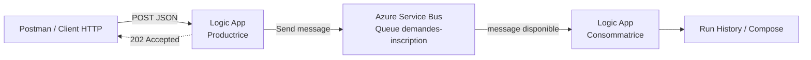

---

# 4. Ce que nous voulons démontrer

Le portail ne doit pas attendre que tout le traitement administratif soit terminé.

Nous voulons :

```text
1. POST de la demande
2. Message placé dans Service Bus
3. Réponse 202 Accepted
```

puis plus tard :

```text
1. La Logic App consommatrice récupère le message.
2. Elle effectue ensuite le traitement.
```

---

# 5. Synchrone vs asynchrone

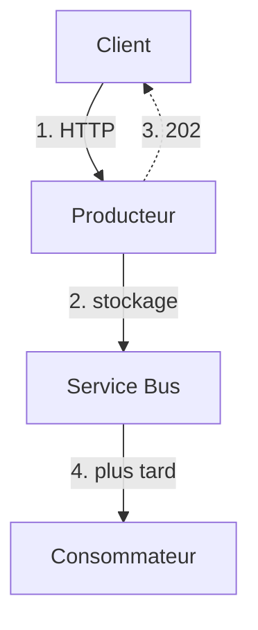

Le client peut recevoir **`202 Accepted`** même si la **Logic App consommatrice** n’a encore rien traité.

**C’est le principe central du TP.**

---

# 6. Comptes Azure étudiants, offres gratuites et abonnements école

## 6.1 Azure for Students

L’offre **Azure for Students** fournit actuellement **100 USD de crédit Azure**, valable pendant **un an**, aux étudiants éligibles, *sans carte bancaire requise*.

> **Attention :** **Azure for Students Starter** est une offre différente et plus limitée. Elle ne donne pas nécessairement accès à tous les services utilisés dans ce TP, notamment **Azure Service Bus**. Si vous ne pouvez pas créer Service Bus, vérifiez d’abord le type exact de votre abonnement avant de conclure à une erreur.

*Les offres Microsoft peuvent évoluer : vérifiez toujours les conditions affichées dans votre abonnement.*

Pour limiter la consommation de crédit pendant ce TP, nous réduisons volontairement :

- le **nombre de ressources** ;
- le **nombre de messages** ;
- le **nombre d’exécutions** ;
- la durée pendant laquelle le **consommateur Service Bus** reste activé.

---

# 7. Choix visant à limiter les coûts

> **Tip coût :** pendant un TP, évitez de laisser inutilement une Logic App consommatrice activée pendant plusieurs heures. *Les déclencheurs et opérations peuvent générer de la consommation même lorsque peu de messages sont échangés.*

> **À retenir :** le but du TP est de comprendre les flux, pas de multiplier les ressources Azure.

Nous utiliserons :

```text
Logic Apps Consumption
Service Bus Basic
une seule queue
quelques dizaines de messages maximum
```

Pourquoi **Logic Apps Consumption** ?

- *facturation à l’usage selon les déclencheurs, actions et opérations de connecteurs exécutés* ;
- pas de capacité dédiée permanente à réserver pour ce TP.

Pourquoi **Service Bus Basic** ?

- nous utilisons uniquement une **queue** ;
- ce niveau est suffisant pour le scénario du TP1.

Le niveau **Basic** prend en charge les **queues**, mais pas les **topics et subscriptions**, les **sessions** ni la **détection des doublons**. Ces fonctionnalités nécessitent un niveau supérieur et seront étudiées plus tard.

> **Important :** **Service Bus Basic n’est pas synonyme de gratuit.** Les coûts éventuels consomment le crédit ou le budget de l’abonnement. De plus, le trigger Service Bus d’une Logic App Consumption utilise du *polling* ; les opérations du connecteur peuvent donc être comptabilisées même lorsque peu de messages sont échangés. **Désactivez le consommateur lorsque l’expérience est terminée et supprimez le Resource Group en fin de TP.**

---

# 8. Cas particulier des abonnements fournis par l’école

*Certains abonnements fournis par les écoles appliquent volontairement des restrictions de permissions.*

Vous pouvez avoir le droit de :

```text
créer une Logic App
créer une queue
```

mais ne pas avoir le droit de :

```text
attribuer des rôles RBAC
```

Si l’étape :

```text
Add role assignment
```

est grisée ou renvoie `AuthorizationFailed` :

**ne contournez pas la sécurité.**

L’enseignant doit alors :

- attribuer les rôles pour vous ;
- ou fournir une queue préconfigurée ;
- ou fournir un Resource Group pédagogique avec les permissions nécessaires.

## 8.1 Deux modes de classe possibles

### Mode A - abonnement étudiant individuel

L’étudiant crée lui-même :

```text
Resource Group
Service Bus
Queue
Logic Apps
Managed Identities
RBAC
```

### Mode B - abonnement fourni par l’école

L’enseignant peut précréer :

```text
Resource Group
Service Bus Namespace
Queue
```

puis laisser les étudiants créer uniquement les Logic Apps.

Si les étudiants n’ont pas `roleAssignments/write`, l’enseignant attribue les rôles `Data Sender` et `Data Receiver` à leurs Managed Identities.

Cette organisation évite de bloquer le TP à cause des politiques IAM de l’établissement.

---

# 9. Noms utilisés dans le TP

Vous pouvez utiliser :

```text
Resource Group
rg-tp1-flux-si

Service Bus Namespace
sb-tp1-<vos-initiales>-<nombre>

Queue
demandes-inscription

Logic App productrice
la-tp1-producteur

Logic App consommatrice
la-tp1-consommateur
```

Exemple :

```text
sb-tp1-ma-4821
```

Le namespace Service Bus doit avoir un nom unique dans Azure.

---

# 10. Étape 1 - Créer le Resource Group

> **Pourquoi cette étape ?** Le **Resource Group** sert de conteneur logique pour toutes les ressources du TP. Il permettra aussi de tout supprimer proprement en fin de séance.

> **Tip :** utilisez un Resource Group dédié au TP. N’ajoutez pas dedans les ressources d’un autre projet EPSI.

## Méthode principale - Portail Azure

1. Ouvrez :

```text
https://portal.azure.com
```

2. Dans la barre de recherche, tapez :

```text
Resource groups
```

3. Ouvrez **Resource groups**.

4. Cliquez sur :

```text
Create
```

5. Renseignez :

| Paramètre | Valeur proposée |
|---|---|
| Subscription | votre abonnement étudiant / école |
| Resource group | `rg-tp1-flux-si` |
| Region | `France Central` ou `West Europe` |

6. Cliquez :

```text
Review + create
```

7. Puis :

```text
Create
```

## Vérification

Retournez dans :

```text
Resource groups
```

Vous devez voir :

```text
rg-tp1-flux-si
```

## Équivalent Azure CLI - optionnel

```bash
az group create \
  --name rg-tp1-flux-si \
  --location westeurope
```

Vérification :

```bash
az group show \
  --name rg-tp1-flux-si \
  --output table
```

---

# 11. Étape 2 - Créer Azure Service Bus

## Méthode principale - Portail Azure

1. Dans le portail Azure, cherchez :

```text
Service Bus
```

2. Ouvrez :

```text
Service Bus
```

3. Cliquez :

```text
Create
```

Vous arrivez sur :

```text
Create namespace
```

---

# 12. Configurer le namespace

> **À retenir :** le **namespace Service Bus** est le conteneur du broker. La **queue** sera créée à l’intérieur.

> **Erreur fréquente :** un nom de namespace déjà utilisé dans Azure provoque un échec de création. Ajoutez vos initiales ou quelques chiffres.

Dans l’onglet **Basics** :

| Paramètre | Valeur |
|---|---|
| Subscription | votre abonnement |
| Resource group | `rg-tp1-flux-si` |
| Namespace name | `sb-tp1-...` |
| Location | même région que le RG |
| Pricing tier | **Basic** |

Exemple :

```text
sb-tp1-ma-4821
```

Puis :

```text
Review + create
```

et :

```text
Create
```

---

# 13. Pourquoi Basic ?

Dans ce TP, nous avons seulement besoin de :

```text
Queue
```

Le niveau Basic sait gérer des queues.

Il ne sait pas gérer :

```text
Topics
Subscriptions
Duplicate Detection
Sessions avancées
```

Ces fonctionnalités ne sont pas nécessaires pour le TP1.

## Équivalent Azure CLI - optionnel

```bash
az servicebus namespace create \
  --resource-group rg-tp1-flux-si \
  --name sb-tp1-ma-4821 \
  --location westeurope \
  --sku Basic
```

---

# 14. Étape 3 - Créer la queue

> **Pourquoi une queue ?** Une queue permet un modèle **point à point** : un message est destiné à être consommé par un traitement.

> **Tip :** une **queue** n’est ni une base de données métier, ni un système de fichiers. Elle sert principalement au **transport fiable et temporaire de messages**.

## Méthode principale - Portail Azure

1. Ouvrez votre namespace Service Bus.

2. Dans le menu de gauche, ouvrez :

**Navigation :** **Entities**, puis **Queues**.

3. Cliquez :

```text
+ Queue
```

4. Nom :

```text
demandes-inscription
```

Pour le TP1, laissez les autres paramètres proches des valeurs par défaut.

5. Cliquez :

```text
Create
```

---

# 15. Vérifier la queue

Dans :

**Navigation :** **Service Bus**, puis **Queues**.

vous devez voir :

```text
demandes-inscription
```

Cliquez dessus.

Repérez les indicateurs :

```text
Active message count
Dead-letter message count
```

Au départ :

```text
Active message count ≈ 0
```

## Équivalent Azure CLI - optionnel

```bash
az servicebus queue create \
  --resource-group rg-tp1-flux-si \
  --namespace-name sb-tp1-ma-4821 \
  --name demandes-inscription
```

Vérification :

```bash
az servicebus queue show \
  --resource-group rg-tp1-flux-si \
  --namespace-name sb-tp1-ma-4821 \
  --name demandes-inscription \
  --output table
```

---

# 16. Architecture à ce stade

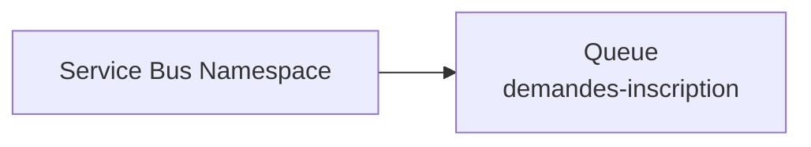

Nous n’avons encore :

```text
ni producteur
ni consommateur
```

---

# 17. Étape 4 - Créer la Logic App productrice

## Méthode principale - Portail Azure

Dans le portail, cherchez :

```text
Logic Apps
```

Puis :

```text
Add
```

ou :

```text
Create
```

---

# 18. Choisir le plan Logic Apps

Azure peut proposer plusieurs plans :

```text
Consumption
Standard
```

Choisissez :

```text
Consumption
```

Pourquoi ?

- adapté au TP ;
- multi-tenant ;
- facturation à l’usage ;
- un workflow par ressource ;
- aucune capacité dédiée à réserver.

---

# 19. Paramètres de la productrice

Renseignez :

| Paramètre | Valeur |
|---|---|
| Subscription | votre abonnement |
| Resource Group | `rg-tp1-flux-si` |
| Logic App name | `la-tp1-producteur` |
| Region | même région |
| Plan | `Consumption` |

Puis :

Cliquez sur **Review + create**, puis sur **Create**.

## Équivalent Azure CLI - optionnel

La création d’une Logic App par CLI nécessite généralement une définition de workflow JSON.

Principe :

```bash
az logic workflow create \
  --resource-group rg-tp1-flux-si \
  --location westeurope \
  --name la-tp1-producteur \
  --definition @publisher.json
```

Dans ce TP1, nous utilisons volontairement le **Designer graphique**, donc cette commande n’est pas obligatoire.

---

# 20. Étape 5 - Activer la Managed Identity de la productrice

> **À retenir :** la **Managed Identity** permet à Azure d’identifier la Logic App sans stocker de mot de passe ou de clé Service Bus dans le workflow.

> **Tip sécurité :** si une solution vous demande de copier une *connection string administrateur* dans plusieurs workflows, vérifiez d’abord si une **Managed Identity** peut être utilisée.

La Logic App devra envoyer un message vers Service Bus.

Nous ne voulons **pas stocker de secrets Service Bus** dans le workflow :

```text
username
password
SAS key
connection string secrète
```

Nous allons utiliser :

```text
Managed Identity
```

---

# 21. Activation manuelle

Ouvrez :

```text
la-tp1-producteur
```

Dans le menu de gauche :

**Navigation :** **Settings**, puis **Identity**.

Sous :

```text
System assigned
```

passez :

```text
Status : On
```

Cliquez :

```text
Save
```

Puis :

```text
Yes
```

Azure crée alors une identité Microsoft Entra pour cette Logic App.

---

# 22. Authentification vs autorisation

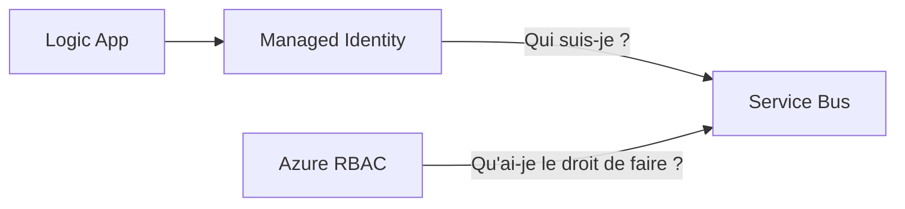

**Managed Identity** :

```text
identité
```

**RBAC** :

```text
permissions
```

**Les deux mécanismes sont complémentaires.**

---

# 23. Étape 6 - Autoriser le producteur à envoyer

> **Pourquoi cette étape ?** Avoir une identité ne suffit pas. L’identité doit également recevoir une **autorisation**.

> **Mémo :**
>
> - **Managed Identity** : *qui suis-je ?*
> - **RBAC** : *qu’ai-je le droit de faire ?*

Nous devons lui attribuer :

```text
Azure Service Bus Data Sender
```

## Méthode principale - Portail

Ouvrez :

**Navigation :** **Service Bus**, ouvrez votre namespace, puis **Queues** et **demandes-inscription**.

Puis :

```text
Access control (IAM)
```

Cliquez :

Cliquez sur **Add**, puis **Add role assignment**.

Cherchez :

```text
Azure Service Bus Data Sender
```

Sélectionnez ce rôle.

Puis :

```text
Next
```

Dans :

```text
Assign access to
```

choisissez une option permettant de sélectionner :

```text
Managed identity
```

Cliquez :

```text
Select members
```

Choisissez :

Sélectionnez **Logic app**, puis **la-tp1-producteur**.

Puis :

```text
Review + assign
```

---

# 24. Pourquoi donner le rôle sur la queue ?

Nous pourrions attribuer le rôle au niveau du namespace entier.

Mais nous préférons :

```text
scope = demandes-inscription
```

car le producteur n’a besoin que de cette queue.

C’est le principe :

```text
Least Privilege
```

## Équivalent Azure CLI - optionnel

```bash
PUB_ID=$(az resource show \
  --resource-group rg-tp1-flux-si \
  --name la-tp1-producteur \
  --resource-type Microsoft.Logic/workflows \
  --query identity.principalId \
  --output tsv)
```

```bash
QUEUE_ID=$(az servicebus queue show \
  --resource-group rg-tp1-flux-si \
  --namespace-name sb-tp1-ma-4821 \
  --name demandes-inscription \
  --query id \
  --output tsv)
```

```bash
az role assignment create \
  --assignee-object-id "$PUB_ID" \
  --assignee-principal-type ServicePrincipal \
  --role "Azure Service Bus Data Sender" \
  --scope "$QUEUE_ID"
```

---

# 25. Étape 7 - Construire le workflow producteur

Ouvrez :

```text
la-tp1-producteur
```

puis :

**Navigation :** **Development Tools**, puis **Logic app designer**.

Choisissez un workflow vide si nécessaire.

---

# 26. Ajouter le trigger HTTP

> **Tip API :** le trigger HTTP représente la **frontière d’entrée** du workflow. Toute donnée venant d’un client doit être considérée comme non fiable tant que son contrat n’a pas été validé.

Cliquez :

```text
Add a trigger
```

Recherchez :

```text
Request
```

Choisissez :

```text
When a HTTP request is received
```

---

# 27. Méthode HTTP

Si le designer propose :

```text
Method
```

sélectionnez :

```text
POST
```

---

# 28. Définir le contrat JSON

Dans :

```text
Request Body JSON Schema
```

collez :

```json
{
  "type": "object",
  "properties": {
    "studentId": {"type": "string"},
    "firstName": {"type": "string"},
    "lastName": {"type": "string"},
    "formation": {"type": "string"},
    "campus": {"type": "string"},
    "priority": {
      "type": "string",
      "enum": ["normal", "urgent"]
    }
  },
  "required": [
    "studentId",
    "firstName",
    "lastName",
    "formation",
    "campus",
    "priority"
  ],
  "additionalProperties": false
}
```

---

# 29. Pourquoi un schéma ?

> **À retenir :** un **JSON syntaxiquement valide** peut quand même être **invalide pour votre API**. Le schéma définit ce que votre workflow accepte réellement.

> **Erreur fréquente :** déclarer une propriété dans `properties` sans l’ajouter à `required`, puis croire qu’elle est obligatoire.

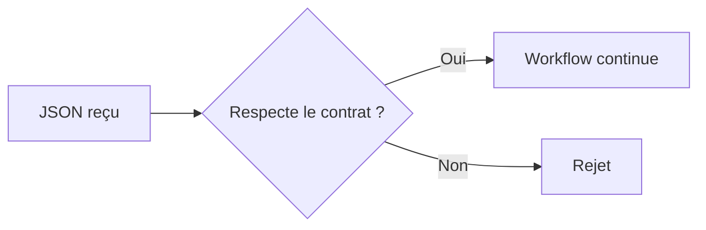

Le schéma permet aussi au designer de proposer les champs comme contenu dynamique.

## Activer explicitement Schema Validation

Pour que le trigger rejette réellement un body qui ne respecte pas le schéma :

1. Cliquez sur le trigger :

```text
When a HTTP request is received
```

2. Ouvrez l’onglet :

```text
Settings
```

3. Dépliez :

```text
Data Handling
```

4. Passez :

```text
Schema Validation : On
```

5. Enregistrez le workflow.

Avec `required`, `additionalProperties: false` et **Schema Validation = On**, un body qui ne respecte pas le contrat doit être rejeté avec un `400 Bad Request` avant l’exécution normale du workflow.

---

# 30. Payload valide

```json
{
  "studentId": "ETU-001",
  "firstName": "Alice",
  "lastName": "Martin",
  "formation": "Formation EPSI",
  "campus": "EPSI",
  "priority": "normal"
}
```

---

# 31. Étape 8 - Ajouter un Compose pour construire l’événement

> **Pourquoi utiliser Compose ?** Cela rend la transformation explicite et lisible. Vous voyez clairement ce qui vient du client et ce qui devient votre **événement interne**.

> **Tip SI :** dans un vrai SI, évitez autant que possible de propager partout le payload brut d’un client. Créez un **contrat interne maîtrisé**.

Sous le trigger :

```text
+
Add an action
```

Recherchez :

```text
Compose
```

Choisissez :

**Action à choisir :** **Data Operations**, puis **Compose**.

Renommez l’action :

```text
Build_Event
```

---

# 32. Contenu de Build_Event

Dans **Inputs**, construisez un objet contenant :

```json
{
  "eventType": "StudentRegistrationRequested",
  "schemaVersion": 1,
  "studentId": "<contenu dynamique studentId>",
  "firstName": "<contenu dynamique firstName>",
  "lastName": "<contenu dynamique lastName>",
  "formation": "<contenu dynamique formation>",
  "campus": "<contenu dynamique campus>",
  "priority": "<contenu dynamique priority>",
  "requestedAt": "<expression utcNow()>"
}
```

Utilisez le panneau **Dynamic content** pour insérer les champs du trigger.

Pour `requestedAt`, utilisez l’onglet **Expression** :

```text
utcNow()
```

---

# 33. Pourquoi transformer le JSON ?


C’est important dans un SI :

```text
contrat externe
≠
événement interne
```

---

# 34. Étape 9 - Ajouter l’action Service Bus

> **Vérification rapide :** avant de continuer, assurez-vous que :
>
> - la **Managed Identity** du producteur est activée ;
> - le rôle **Azure Service Bus Data Sender** est attribué ;
> - la queue **demandes-inscription** existe ;
> - vous travaillez dans le bon abonnement Azure.

Sous `Build_Event` :

```text
Add an action
```

Recherchez :

```text
Service Bus
```

Choisissez l’action :

```text
Send message
```

---

# 35. Créer la connexion Service Bus

Lors de la première utilisation, Azure vous demande de créer une connexion.

Choisissez de préférence :

Dans **Authentication type**, choisissez **Managed identity**.

ou selon l’interface :

```text
Logic Apps Managed Identity
```

Sélectionnez :

```text
System-assigned managed identity
```

Namespace :

```text
<nom>.servicebus.windows.net
```

Exemple :

```text
sb-tp1-ma-4821.servicebus.windows.net
```

Nom de connexion :

```text
conn-sb-producteur
```

Puis :

```text
Create
```

---

# 36. Si l’option Managed Identity n’apparaît pas

Vérifiez d’abord :

**Navigation :** **Logic App**, puis **Identity**. Vérifiez que **System assigned** est sur **On**.

Puis rechargez le Designer.

Si votre environnement scolaire bloque les connexions ou les permissions :

```text
contactez l’enseignant
```

---

# 37. Configurer Send message

Dans :

```text
Queue/Topic name
```

choisissez :

```text
demandes-inscription
```

Dans le contenu du message, utilisez la sortie de :

```text
Build_Event
```

Selon la version du connecteur, le champ peut s’appeler :

```text
Content
Message
Message content
```

Sélectionnez :

```text
Outputs de Build_Event
```

---

# 38. Paramètres avancés utiles

Si disponibles, ajoutez :

```text
Message Id
Correlation Id
Content Type
```

Pour **Message Id**, vous pouvez utiliser l’expression :

```text
guid()
```

*Dans ce TP, ce `Message Id` sert surtout à la traçabilité : le niveau Service Bus Basic ne prend pas en charge la détection automatique des doublons.*

Pour **Content Type** :

```text
application/json
```

---

# 39. Étape 10 - Retourner 202 au client

> **À retenir :** **`202 Accepted`** signifie que la demande a été acceptée pour traitement, mais que le traitement complet peut encore être en cours.

> **Erreur fréquente :** confondre *acceptation de la demande* et *fin du traitement*. Dans ce scénario asynchrone, **`202`** exprime mieux la réalité.

Ajoutez une action :

```text
Response
```

Cherchez :

Choisissez le connecteur **Request**, puis l’action **Response**.

Configurez :

```text
Status Code = 202
```

Body :

```json
{
  "status": "ACCEPTED",
  "message": "La demande a été déposée dans Service Bus."
}
```

---

# 40. Ordre du workflow producteur

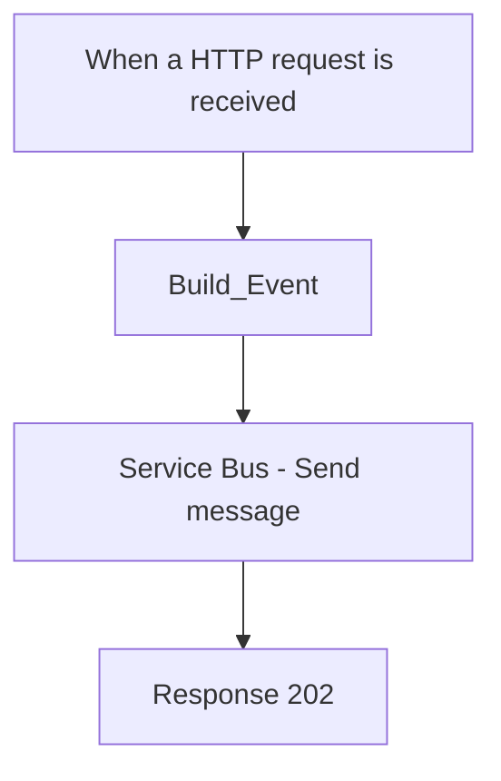

La réponse **`202 Accepted`** arrive **après** l’action **Send message**.

---

# 41. Sauvegarder

Cliquez :

```text
Save
```

Après sauvegarde, le trigger HTTP génère une URL.

**Cette URL est sensible.**

*Ne la publiez jamais dans un dépôt Git, un document public ou une capture partagée.*

---

# 42. Étape 11 - Tester le producteur avec Postman

> **Tip debug :** commencez toujours par **un seul payload valide**. Ne testez pas plusieurs variantes tant que le *happy path* ne fonctionne pas.

## Méthode principale - Postman

Dans le trigger, copiez l’URL HTTP.

Dans Postman :

```text
Method : POST
URL    : URL du trigger
```

Header :

```text
Content-Type: application/json
```

Body :

```json
{
  "studentId": "ETU-001",
  "firstName": "Alice",
  "lastName": "Martin",
  "formation": "Formation EPSI",
  "campus": "EPSI",
  "priority": "normal"
}
```

Cliquez :

```text
Send
```

---

# 43. Résultat attendu

Vous devez obtenir :

```text
202 Accepted
```

avec un body proche de :

```json
{
  "status": "ACCEPTED",
  "message": "La demande a été déposée dans Service Bus."
}
```

## Test CLI facultatif

```bash
curl -X POST "<URL_DU_TRIGGER>" \
  -H "Content-Type: application/json" \
  -d '{
    "studentId":"ETU-001",
    "firstName":"Alice",
    "lastName":"Martin",
    "formation":"Formation EPSI",
    "campus":"EPSI",
    "priority":"normal"
  }'
```

---

# 44. Étape 12 - Vérifier le message dans Service Bus

> **À retenir :** ne validez jamais un flux distribué uniquement parce que la première API répond correctement. Vérifiez aussi l’**état du composant suivant**.

> Ici, les deux preuves attendues sont :
>
> - le client reçoit **`202 Accepted`** ;
> - **Active message count** augmente dans Service Bus.

**Important :** `202` ne doit pas être votre seule preuve.

Allez dans :

**Navigation :** **Service Bus**, ouvrez votre namespace, puis **Queues** et la queue **demandes-inscription**.

Observez :

```text
Active message count
```

Il doit avoir augmenté.

---

# 45. Envoyer un deuxième message

Dans Postman :

```json
{
  "studentId": "ETU-002",
  "firstName": "Karim",
  "lastName": "Dupont",
  "formation": "Formation EPSI",
  "campus": "EPSI",
  "priority": "urgent"
}
```

Envoyez.

Vous devez maintenant avoir approximativement :

```text
2 messages actifs
```

car nous n’avons toujours pas créé de consommateur.

---

# 46. Le backlog

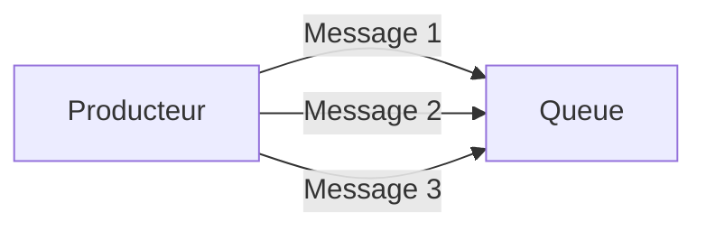

Le **backlog** désigne :

```text
messages en attente
```

---

# 47. Question 1

Pourquoi les messages restent-ils dans la queue ?

**Réponse :**

Parce qu’aucun consommateur n’existe encore pour les lire.

Service Bus joue donc bien son rôle de tampon.

---

# 48. Question 2

La Logic App productrice dépend-elle du consommateur pour répondre 202 ?

**Réponse :**

Non.

Elle dépend seulement de sa capacité à déposer le message dans Service Bus.

C’est le découplage temporel.

---

# 49. Étape 13 - Observer le run du producteur

> **Tip debug :** lorsqu’un workflow échoue, ne dites pas seulement *« la Logic App ne marche pas »*. Identifiez précisément **quelle action** a échoué et à quel moment.

Ouvrez :

**Navigation :** ouvrez **la-tp1-producteur**, puis **Overview** ou **Runs history**.

Ouvrez le dernier run.

Vous devez voir :

```text
Request trigger
Build_Event
Send message
Response
```

en succès.

---

# 50. Lecture du run

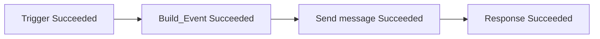

Si `Send message` échoue, le problème est probablement entre Logic Apps et Service Bus.

---

# 51. Étape 14 - Créer la Logic App consommatrice

Retournez dans :

```text
Logic Apps
```

Cliquez :

```text
Create
```

Choisissez :

```text
Consumption
```

Nom :

```text
la-tp1-consommateur
```

Resource Group :

```text
rg-tp1-flux-si
```

Même région.

Puis :

```text
Create
```

## Équivalent CLI - optionnel

```bash
az logic workflow create \
  --resource-group rg-tp1-flux-si \
  --location westeurope \
  --name la-tp1-consommateur \
  --definition @consumer.json
```

---

# 52. Étape 15 - Activer sa Managed Identity

Ouvrez :

**Navigation :** **la-tp1-consommateur**, puis **Settings** et **Identity**.

Puis :

Réglez **System assigned** sur **On**, puis cliquez sur **Save**.

---

# 53. Étape 16 - Donner Data Receiver

Retournez dans :

**Navigation :** **Service Bus**, ouvrez la queue **demandes-inscription**, puis **Access control (IAM)**.

Ajoutez :

```text
Azure Service Bus Data Receiver
```

à :

```text
la-tp1-consommateur
```

---

# 54. Séparation des rôles

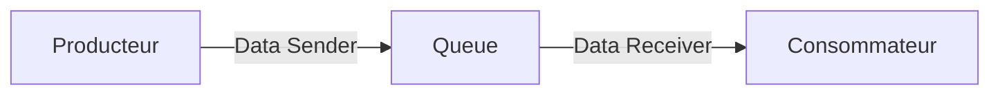

Le producteur n’a pas besoin de `Data Receiver`.

Le consommateur n’a pas besoin de `Data Sender`.

## Équivalent CLI - optionnel

```bash
CON_ID=$(az resource show \
  --resource-group rg-tp1-flux-si \
  --name la-tp1-consommateur \
  --resource-type Microsoft.Logic/workflows \
  --query identity.principalId \
  --output tsv)
```

```bash
az role assignment create \
  --assignee-object-id "$CON_ID" \
  --assignee-principal-type ServicePrincipal \
  --role "Azure Service Bus Data Receiver" \
  --scope "$QUEUE_ID"
```

---

# 55. Étape 17 - Construire le workflow consommateur

> **À retenir :** le trigger Service Bus est responsable de la **réception**. Le `Compose` sert uniquement à rendre le contenu visible dans ce TP. Dans un vrai SI, il pourrait être remplacé par un appel API, une mise à jour de base de données ou un traitement métier.

Ouvrez :

```text
Logic app designer
```

Ajoutez un trigger.

Recherchez :

```text
Service Bus
```

Choisissez :

```text
When a message is received in a queue (auto-complete)
```

Selon la version du connecteur, le nom peut être proche de :

```text
When one or more messages arrive in a queue (auto-complete)
```

---

# 56. Créer la connexion du consommateur

Choisissez :

```text
Managed Identity
```

Namespace :

```text
sb-tp1-....servicebus.windows.net
```

Identity :

```text
System-assigned managed identity
```

Nom :

```text
conn-sb-consommateur
```

---

# 57. Choisir la queue

Dans :

```text
Queue name
```

sélectionnez :

```text
demandes-inscription
```

---

# 58. Auto-complete

> **Tip fiabilité :** pour un premier TP, **auto-complete** simplifie le scénario. Dans un système critique, vous devez savoir **à quel moment un message est considéré comme traité avec succès** et ce qui se passe en cas d’erreur.

Le trigger utilise ici le mode **auto-complete**.

Pour un TP1, ce mode simplifie le scénario : le connecteur **Service Bus** gère automatiquement le règlement du message.

> **Précision importante :** *auto-complete n’est pas équivalent à Receive-and-Delete*. Le connecteur gère un verrou puis la complétion selon le comportement du trigger. Pour ce TP, **ne modifiez pas le paramètre de concurrence du trigger**.

Dans un TP plus avancé, nous gérerons explicitement :

- **Peek-Lock** ;
- **Complete** ;
- **Abandon** ;
- **Dead-letter** ;
- les redélivrances et l’**idempotence**.

---

# 59. Ajouter un Compose

Ajoutez :

**Action à choisir :** **Data Operations**, puis **Compose**.

Renommez :

```text
Afficher_Message
```

Dans les inputs, utilisez le contenu dynamique fourni par le trigger Service Bus.

Si vous ne savez pas encore quelle propriété prendre :

```text
utilisez le Body complet du trigger
```

---

# 60. Architecture finale du consumer

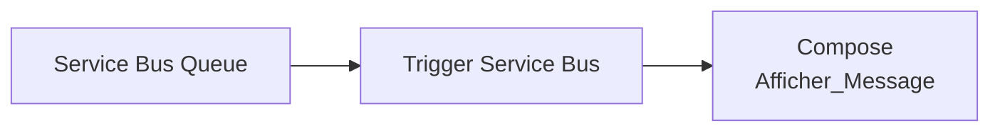

---

# 61. Sauvegarder

Cliquez :

```text
Save
```

---

# 62. Que va-t-il se passer ?

La queue contient déjà des messages.

Le connecteur Service Bus d’un workflow Consumption utilise un modèle de polling.

La Logic App va donc interroger périodiquement la queue, puis déclencher un run lorsqu’un message est disponible.

---

# 63. Observer le backlog diminuer

> **Tip observation :** les compteurs du portail Azure peuvent avoir un léger délai d’actualisation. Rechargez la page après quelques instants avant de conclure qu’aucun message n’a été consommé.

Retournez dans :

**Navigation :** **Service Bus**, puis **demandes-inscription**.

Observez :

```text
Active message count
```

Il doit diminuer.

Selon la fréquence du trigger et l’actualisation du portail, cela peut ne pas sembler instantané.

---

# 64. Observer les runs du consommateur

Dans :

**Navigation :** **la-tp1-consommateur**, puis **Overview** ou **Runs history**.

Ouvrez un run.

Vous devez voir :

```text
1. Service Bus trigger
2. Afficher_Message
```

Cliquez sur `Afficher_Message` et regardez :

```text
Inputs
Outputs
```

---

# 65. Flux complet

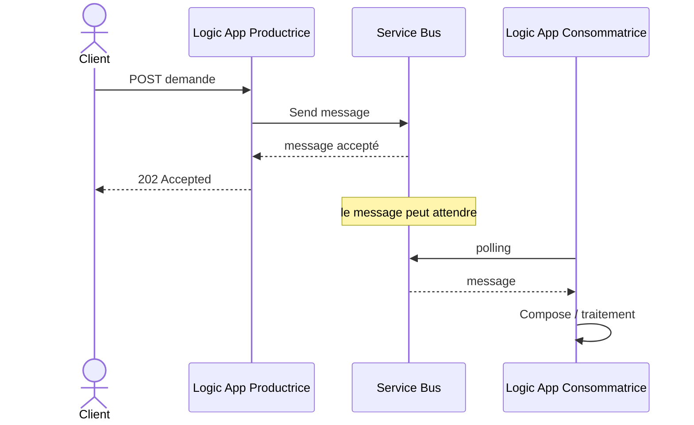

---

# 66. Question 3

Pourquoi utiliser Service Bus entre les deux Logic Apps au lieu d’appeler directement la deuxième Logic App ?

**Réponse :**

Parce que Service Bus permet :

- le découplage ;
- le stockage temporaire ;
- l’absorption d’un backlog ;
- la reprise après indisponibilité du consommateur.

---

# 67. Question 4

Que se passe-t-il si la Logic App consommatrice est indisponible pendant 10 minutes ?

**Réponse :**

Les messages restent dans la queue, sous réserve de leur TTL et des paramètres de la queue.

Lorsque le consommateur revient, il reprend les messages en attente.

---

# 68. Question 5

Que se passe-t-il si Service Bus est indisponible au moment du `Send message` ?

**Réponse :**

La productrice ne peut pas confirmer le dépôt.

Elle ne doit donc pas faire croire au client que le message a été stocké avec succès.

---

# 69. Étape 18 - Tester un JSON invalide

> **Pourquoi ce test est important ?** Un bon système ne doit pas seulement fonctionner avec de bonnes données. Il doit aussi **refuser proprement les données qui ne respectent pas le contrat**.

Dans Postman, supprimez par exemple `campus`.

```json
{
  "studentId": "ETU-INVALID",
  "firstName": "Test",
  "lastName": "Invalid",
  "formation": "Formation EPSI",
  "priority": "normal"
}
```

Envoyez.

---

# 70. Résultat attendu

Le payload ne respecte pas le contrat défini.

Avec **Schema Validation = On**, le résultat attendu est :

```text
HTTP 400 Bad Request
```

et le nombre de messages de la queue ne doit pas augmenter.

Vérifiez :

```text
le statut HTTP
le *run* et le **trigger**
le nombre de messages dans la queue
```

Aucun message ne doit être publié par ce test.

---

# 71. Pourquoi ce test ?

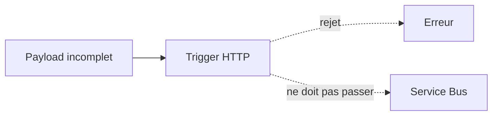

Une mauvaise donnée doit être arrêtée le plus tôt possible.

---

# 72. Debug - Le trigger accepte quand même un payload incomplet

Vérifiez d’abord le **JSON Schema** :

```text
schema
required
additionalProperties
```

Puis ouvrez le trigger **When a HTTP request is received** et vérifiez explicitement :

```text
Settings
Data Handling
Schema Validation : On
```

Sauvegardez à nouveau le workflow, puis rejouez le test.

*Si le payload invalide est encore accepté, vérifiez que vous modifiez bien la bonne Logic App et le bon abonnement Azure.*

---

# 73. Debug - Impossible de créer le namespace Service Bus

Causes fréquentes :

```text
nom déjà utilisé
région non autorisée
quota de l’abonnement école
policy Azure de l’établissement
```

Essayez un nom plus unique.

Exemple :

```text
sb-tp1-jd-73951
```

---

# 74. Debug - Service Bus Basic indisponible

Certaines politiques d’école peuvent imposer un SKU.

Si Basic n’est pas autorisé mais Standard est fourni par l’école, utilisez la ressource mise à disposition.

Ne créez pas Premium pour un TP1 sauf consigne explicite.

---

# 75. Debug - Add role assignment grisé

Cause :

```text
permissions IAM insuffisantes
```

Solution :

```text
**enseignant** ou **administrateur**
```

---

# 76. Debug - Managed Identity absente dans le connecteur

Vérifiez :

**Navigation :** **Logic App**, puis **Identity**. Vérifiez que **System assigned** est sur **On**.

Puis rechargez le Designer.

---

# 77. Debug - 401 / 403 avec Service Bus

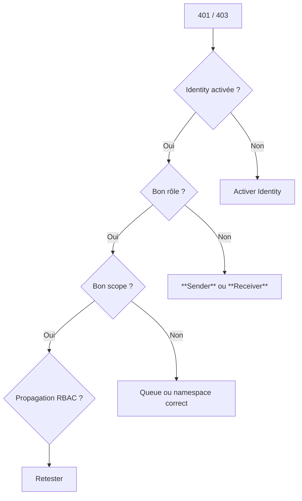

Vérifiez :

Producteur :

```text
Azure Service Bus Data Sender
```

Consommateur :

```text
Azure Service Bus Data Receiver
```

---

# 78. Debug - La queue reste vide

Vérifiez :

1. Le POST retourne-t-il `202` ?
2. `Send message` est-il en succès dans le run ?
3. La queue choisie est-elle `demandes-inscription` ?
4. Le consumer n’est-il pas déjà en train de la vider ?

---

# 79. Debug - Le consumer ne démarre pas

Vérifiez :

```text
Logic App enabled
connexion Service Bus valide
queue sélectionnée
rôle Data Receiver
```

Puis attendez le prochain cycle de polling.

---

# 80. Debug - Aucun message visible dans Compose

Cliquez sur :

Dans le *run* concerné, ouvrez le **Trigger**, puis consultez **Outputs**.

Regardez la structure exacte du message retourné par le connecteur.

Le connecteur peut exposer notamment :

```text
ContentData
Properties
MessageId
```

Utilisez ensuite le contenu dynamique correspondant.

---

# 81. Observer l’architecture dans Azure

À ce stade, votre Resource Group doit contenir au minimum :

```text
Service Bus namespace
Logic App productrice
Logic App consommatrice
API connection(s) créées par le connecteur Service Bus
```

---

# 82. Important - API Connections

Avec une Logic App Consumption et un connecteur managé, Azure peut créer une ressource `Microsoft.Web/connections`.

Elle correspond à la connexion entre Logic Apps et Service Bus.

Ne la supprimez pas pendant le TP.

---

# 83. Plan de gestion vs plan de données

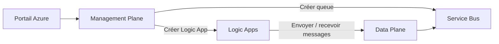

Créer une queue : Management Plane.

Envoyer un message : Data Plane.

---

# 84. Azure CLI : à quoi sert-il dans ce TP ?

Azure CLI n’est pas la méthode principale.

Il sert seulement à montrer qu’une action graphique possède souvent un équivalent automatisable.

---

# 85. Tableau Portail et CLI

| Portail Azure | Équivalent CLI indicatif |
|---|---|
| Create Resource Group | `az group create` |
| Create Service Bus Namespace | `az servicebus namespace create` |
| Create Queue | `az servicebus queue create` |
| Voir Queue | `az servicebus queue show` |
| IAM Role Assignment | `az role assignment create` |
| Créer Logic App | `az logic workflow create` + JSON |
| Mettre à jour Logic App | `az logic workflow update` |
| Lister ressources | `az resource list` |

---

# 86. Pourquoi ne pas tout faire en CLI dès le TP1 ?

Parce que le but de ce TP est d’abord de comprendre :

```text
les composants
les rôles
le flux
le designer
le message
le backlog
```

Automatiser une architecture que l’on ne comprend pas encore peut masquer les concepts.

---

# 87. Exercice guidé 1 - Produire 5 messages

Depuis Postman, envoyez cinq demandes différentes.

Exemple :

```text
ETU-101
ETU-102
ETU-103
ETU-104
ETU-105
```

Avant de lancer le consumer, observez `Active message count`.

---

# 88. Exercice guidé 2 - Couper le consumer

Dans la Logic App consommatrice :

Dans **Overview**, cliquez sur **Disable**.

Envoyez trois nouveaux messages.

Vous devez observer :

```text
backlog augmente
```

Puis :

```text
Enable
```

Observez :

```text
backlog diminue
```

---

# 89. Diagramme de l’expérience

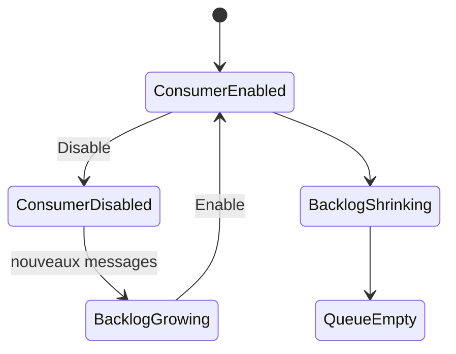

---

# 90. Exercice guidé 3 - Changer la priorité

Envoyez :

```json
{
  "studentId": "ETU-URGENT",
  "firstName": "Sonia",
  "lastName": "Test",
  "formation": "Formation EPSI",
  "campus": "EPSI",
  "priority": "urgent"
}
```

Dans le run consumer, vérifiez que `priority = urgent` est toujours présente.

---

# 91. Question 6

La queue modifie-t-elle le JSON métier ?

**Réponse :**

Non. Elle transporte le message. La transformation est réalisée dans `Build_Event`.

---

# 92. Question 7

Pourquoi avoir deux Managed Identities différentes ?

**Réponse :**

Parce que les deux Logic Apps sont deux ressources Azure différentes avec des responsabilités différentes.

Cela permet des permissions et un audit séparés.

---

# 93. Question 8

Pourquoi le producteur n’a-t-il pas besoin de `Data Receiver` ?

**Réponse :**

Il ne lit pas la queue. Il ne fait que `Send`.

---

# 94. Question 9

Pourquoi le consommateur n’a-t-il pas besoin de `Data Sender` ?

**Réponse :**

Il ne publie aucun message dans le TP1. Il ne fait que `Receive`.

---

# 95. Question 10

Pourquoi le statut `202 Accepted` est-il adapté ?

**Réponse :**

Parce que la demande a été acceptée, mais le traitement asynchrone n’est pas nécessairement terminé.

---

# 96. Différence entre 200, 201 et 202

- **`200 OK`** : l’opération a été traitée normalement.
- **`201 Created`** : une ressource a été créée.
- **`202 Accepted`** : la demande a été acceptée, mais le traitement peut être différé.

Dans notre scénario, `202` est particulièrement adapté au producteur.

---

# 97. Limite du TP1

Nous utilisons un trigger `auto-complete` pour simplifier.

En production, les systèmes robustes peuvent avoir besoin de :

```text
Peek-Lock
Complete
Abandon
Dead-letter
retry
idempotence
```

---

# 98. Aperçu du TP suivant

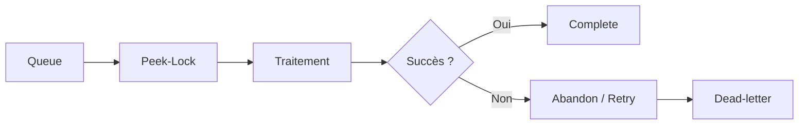

---

# 99. Nettoyage - important pour les comptes étudiants

À la fin du TP, supprimez le Resource Group si l’enseignant vous l’autorise.

Pourquoi ?

Parce qu’il contient :

```text
Service Bus
Logic Apps
API Connections
```

---

# 100. Nettoyage manuel - Portail

1. Ouvrez `Resource groups`.
2. Sélectionnez `rg-tp1-flux-si`.
3. Vérifiez qu’il contient uniquement les ressources du TP.
4. Cliquez `Delete resource group`.
5. Confirmez le nom demandé.

## Équivalent CLI - optionnel

```bash
az group delete \
  --name rg-tp1-flux-si \
  --yes
```

---

# 100.1 Tips de fin de TP

Avant de quitter la séance, retenez ces cinq réflexes :

1. **Toujours identifier le producteur, le canal d’échange et le consommateur.**
2. **Toujours valider les données à l’entrée du SI.**
3. **Toujours distinguer identité et autorisation.**
4. **Toujours vérifier l’état du broker, pas seulement la réponse HTTP.**
5. **Toujours nettoyer les ressources cloud créées pour un TP.**

> **Tip soutenance :** si on vous demande pourquoi Service Bus est utile, ne répondez pas seulement *« pour envoyer des messages »*. Expliquez qu’il apporte surtout du **découplage temporel**, du **stockage temporaire** et de la **résilience** entre composants.

# 101. Checklist finale

- [ ] Resource Group créé.
- [ ] Service Bus Basic créé.
- [ ] Queue `demandes-inscription` créée.
- [ ] Logic App Consumption productrice créée.
- [ ] Managed Identity productrice activée.
- [ ] `Data Sender` attribué.
- [ ] Trigger HTTP créé.
- [ ] JSON Schema défini.
- [ ] `Build_Event` créé.
- [ ] Action `Send message` créée.
- [ ] Réponse `202` ajoutée.
- [ ] Messages envoyés depuis Postman.
- [ ] Backlog observé.
- [ ] Logic App consommatrice créée.
- [ ] Managed Identity consommatrice activée.
- [ ] `Data Receiver` attribué.
- [ ] Trigger Service Bus auto-complete configuré.
- [ ] Messages observés dans les runs.
- [ ] Consumer désactivé/réactivé.
- [ ] Sender vs Receiver compris.
- [ ] `202 Accepted` compris.
- [ ] Découplage Service Bus compris.
- [ ] Ressources nettoyées à la fin.

---

# 102. Résumé final

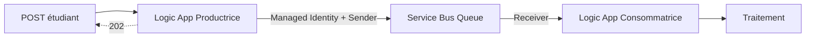

Le point essentiel :

> Service Bus permet à deux composants du SI d’échanger sans être obligés d’être disponibles et rapides au même moment.

La productrice :

```text
reçoit
valide
transforme
publie
```

La queue :

```text
stocke temporairement
découple
absorbe le backlog
```

La consommatrice :

```text
récupère
traite
```

La Managed Identity et RBAC permettent d’éviter de stocker directement un secret Service Bus dans les workflows.

---

# 103. Références Microsoft

- Logic Apps Consumption dans le portail :
  `https://learn.microsoft.com/azure/logic-apps/quickstart-create-first-logic-app-workflow`

- Request trigger :
  `https://learn.microsoft.com/azure/connectors/connectors-native-reqres`

- Managed Identity Logic Apps :
  `https://learn.microsoft.com/azure/logic-apps/authenticate-with-managed-identity`

- Service Bus avec Logic Apps :
  `https://learn.microsoft.com/azure/connectors/connectors-create-api-servicebus`

- Créer Service Bus + Queue dans le portail :
  `https://learn.microsoft.com/azure/service-bus-messaging/service-bus-quickstart-portal`

- Azure for Students :
  `https://learn.microsoft.com/azure/education-hub/about-azure-for-students`

- Tarification Service Bus :
  `https://azure.microsoft.com/pricing/details/service-bus/`

- Tarification Logic Apps :
  `https://azure.microsoft.com/pricing/details/logic-apps/`
