# TP 2 - Routage et transformation de flux avec Azure Logic Apps et Azure Service Bus - EPSI

**Niveau :** *intermédiaire*  

**Durée indicative :** *3 h à 4 h* 

**Mode principal :** **Portail Azure**  

**Mode secondaire :** *Azure CLI, uniquement en option et à titre de comparaison*  

**Architecture :** **Logic Apps Consumption**, **Azure Service Bus Basic**, **Managed Identity**, **Data Operations** et **Switch**  

**Public visé :** *étudiants EPSI disposant d’un compte Azure personnel, Azure for Students ou d’un abonnement Azure fourni par l’établissement.*

---

# 1. Objectifs du TP

À la fin de ce TP, vous devez être capables de :

- créer plusieurs **queues Azure Service Bus** ;
- recevoir un payload JSON plus riche ;
- distinguer **validation technique** et **validation fonctionnelle** ;
- utiliser **Compose** pour transformer un message ;
- utiliser des expressions Logic Apps comme :
  - `trim()` ;
  - `toLower()` ;
  - `utcNow()` ;
  - `guid()` ;
- utiliser une action **Switch** ;
- router un message vers plusieurs queues selon une règle métier ;
- gérer une branche **Default** ;
- distinguer un message :
  - **urgent** ;
  - **standard** ;
  - **rejeté** ;
- utiliser **Message Id** et **Correlation Id** ;
- créer deux consommateurs spécialisés ;
- observer plusieurs **backlogs** ;
- diagnostiquer une erreur de routage ;
- comprendre pourquoi une transformation doit être réalisée avant la publication ;
- appliquer **Managed Identity** et **RBAC** ;
- utiliser Azure CLI uniquement comme *équivalent optionnel*.

---

# 2. Position du TP2 dans la progression

Le TP1 a montré :

```text
Producteur
Service Bus Queue
Consommateur
```

Le TP2 ajoute :

```text
Transformation
Normalisation
Routage
Plusieurs files
Plusieurs consommateurs
Rejet fonctionnel
```

---

# 3. Contexte métier

EPSI souhaite centraliser les demandes de maintenance de ses locaux et équipements.

Un portail interne permet de déclarer un incident.

Exemples :

- panne réseau dans une salle ;
- vidéoprojecteur indisponible ;
- problème électrique ;
- accès à une salle impossible ;
- équipement défectueux.

Tous les incidents ne doivent pas suivre le même traitement.

Nous voulons distinguer :

```text
urgent
standard
rejeté
```

---

# 4. Exemple de demande

```json
{
  "ticketId": "INC-001",
  "campus": "EPSI",
  "building": "Batiment A",
  "room": "A204",
  "category": "network",
  "priority": "URGENT",
  "description": "Plus de réseau dans la salle.",
  "reportedBy": {
    "email": "etudiant@example.com",
    "role": "student"
  }
}
```

---

# 5. Problème à résoudre

Le portail peut envoyer :

```text
URGENT
urgent
 Urgent
NORMAL
normal
Standard
```

Le SI interne ne doit pas dépendre de la manière dont le client écrit ces valeurs.

Nous allons donc :

1. **valider** le JSON ;
2. **normaliser** certaines valeurs ;
3. **construire** un événement interne ;
4. **router** l’événement ;
5. **publier** dans la bonne queue.

---

# 6. Architecture générale

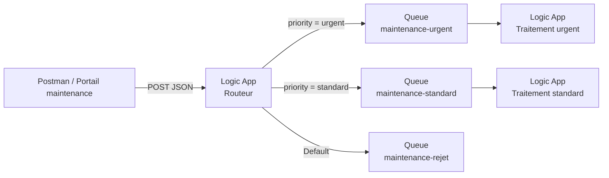

> **À retenir :** la **Logic App routeur** ne traite pas directement l’incident. Elle décide **où** l’envoyer.

---

# 7. Ce que nous allons apprendre

Le TP introduit un pattern fréquent dans les SI :

```text
Receive
Validate
Normalize
Route
Process
```

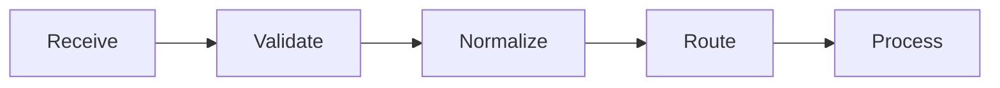

---

# 8. Pourquoi transformer avant de router ?

Si vous routez directement sur :

```text
priority
```

vous risquez d’avoir :

```text
URGENT
urgent
Urgent
 urgent
```

comme quatre valeurs différentes.

La normalisation permet d’obtenir :

```text
urgent
```

dans tous ces cas.

---

# 9. Validation technique et validation fonctionnelle

Nous allons volontairement distinguer deux erreurs.

## Erreur technique

Exemple :

```json
{
  "ticketId": "INC-002",
  "priority": "urgent"
}
```

Il manque plusieurs champs obligatoires.

Le contrat JSON n’est pas respecté.

Résultat attendu :

```text
400 Bad Request
```

---

# 10. Erreur fonctionnelle

Exemple :

```json
{
  "ticketId": "INC-003",
  "campus": "EPSI",
  "building": "Batiment B",
  "room": "B102",
  "category": "network",
  "priority": "low",
  "description": "Signal faible.",
  "reportedBy": {
    "email": "test@example.com",
    "role": "student"
  }
}
```

Le JSON est techniquement correct.

Mais :

```text
low
```

n’est pas une priorité métier supportée dans ce TP.

Le message sera donc envoyé dans :

```text
maintenance-rejet
```

---

# 11. Diagramme des deux niveaux de validation

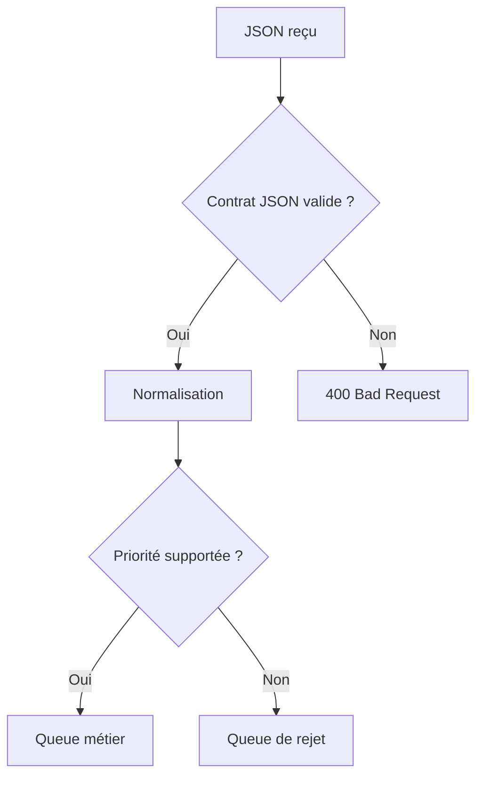

---

# 12. Comptes Azure étudiants et abonnements école

Comme dans le TP1, le TP doit rester peu coûteux.

Nous utiliserons :

- **Logic Apps Consumption** ;
- **Service Bus Basic** ;
- trois **queues** ;
- trois Logic Apps au maximum ;
- quelques dizaines de messages.

---

# 13. Azure for Students

L’offre **Azure for Students** fournit actuellement **100 USD de crédit Azure**, valable pendant **un an**, aux étudiants éligibles, *sans carte bancaire requise*.

> **Attention :** *Azure for Students Starter* est une offre différente et plus limitée. Elle ne donne pas nécessairement accès à tous les services nécessaires.

*Les offres Microsoft peuvent évoluer.*

---

# 14. Pourquoi Service Bus Basic suffit encore ?

Le TP2 utilise :

```text
queues
```

et non :

```text
topics
subscriptions
```

Le niveau **Basic** est donc suffisant.

> **À retenir :** les **topics et subscriptions** nécessitent **Standard** ou **Premium** et seront introduits dans un TP ultérieur.

---

# 15. Attention aux coûts

**Service Bus Basic** n’est pas synonyme de gratuit.

De plus, les triggers Service Bus d’une Logic App Consumption utilisent du *polling*.

Pendant le TP :

- n’envoyez pas des centaines de messages ;
- désactivez les consommateurs quand vous n’en avez plus besoin ;
- supprimez le Resource Group à la fin.

---

# 16. Cas des abonnements EPSI restreints

Certains comptes école permettent de créer :

- Logic Apps ;
- Service Bus ;
- queues ;

mais bloquent :

- `Add role assignment` ;
- certaines connexions ;
- certains SKU.

Si **IAM** ou **RBAC** est bloqué :

**ne contournez pas la sécurité.**

L’enseignant doit fournir les permissions ou effectuer l’attribution.

---

# 17. Ressources du TP

Nous utiliserons :

```text
Resource Group
rg-tp2-routage-si

Service Bus Namespace
sb-tp2-<initiales>-<nombre>

Queues
maintenance-urgent
maintenance-standard
maintenance-rejet

Logic Apps
la-tp2-routeur
la-tp2-urgent
la-tp2-standard
```

---

# 18. Étape 1 - Créer le Resource Group

## Méthode principale - Portail Azure

Dans :

```text
Resource groups
```

cliquez sur :

```text
Create
```

Renseignez :

| Paramètre | Valeur |
|---|---|
| Subscription | votre abonnement |
| Resource group | `rg-tp2-routage-si` |
| Region | *West Europe* ou région autorisée |

Puis :

**Review + create**, puis **Create**.

> **Pourquoi cette étape ?** Le **Resource Group** permet d’isoler toutes les ressources du TP2 et de les supprimer proprement en fin de séance.

---

## Équivalent Azure CLI - optionnel

```bash
az group create \
  --name rg-tp2-routage-si \
  --location westeurope
```

---

# 19. Étape 2 - Créer le namespace Service Bus

Dans le portail, recherchez :

```text
Service Bus
```

Cliquez sur :

```text
Create
```

---

# 20. Paramètres du namespace

Utilisez :

| Paramètre | Valeur |
|---|---|
| Resource Group | `rg-tp2-routage-si` |
| Namespace | `sb-tp2-...` |
| Region | même région |
| Pricing tier | **Basic** |

Puis créez la ressource.

> **Erreur fréquente :** le nom du namespace Service Bus doit être unique dans Azure.

---

## Équivalent Azure CLI - optionnel

```bash
az servicebus namespace create \
  --resource-group rg-tp2-routage-si \
  --name sb-tp2-xx-12345 \
  --location westeurope \
  --sku Basic
```

---

# 21. Étape 3 - Créer les trois queues

Ouvrez le namespace.

**Navigation :** **Entities**, puis **Queues**.

Créez :

```text
maintenance-urgent
maintenance-standard
maintenance-rejet
```

Conservez des paramètres simples pour ce TP.

---

# 22. Pourquoi trois queues ?

Nous voulons matérialiser trois flux distincts :

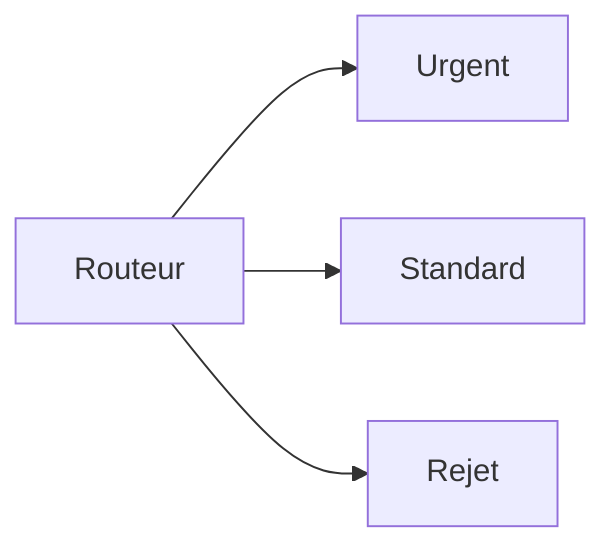

Chaque queue peut ensuite avoir :

- son propre consommateur ;
- son propre rythme ;
- son propre backlog.

---

# 23. Queue de rejet et DLQ : différence

La queue :

```text
maintenance-rejet
```

est une **queue métier créée volontairement**.

Elle contient des messages techniquement valides mais non reconnus par la règle de routage.

Une **Dead-Letter Queue** est différente.

Elle sert plutôt aux messages qui ne peuvent plus être traités normalement après certaines erreurs.

> **À retenir :** **queue de rejet fonctionnel** et **DLQ technique** ne sont pas la même chose.

---

## Équivalent Azure CLI - optionnel

```bash
az servicebus queue create \
  --resource-group rg-tp2-routage-si \
  --namespace-name sb-tp2-xx-12345 \
  --name maintenance-urgent

az servicebus queue create \
  --resource-group rg-tp2-routage-si \
  --namespace-name sb-tp2-xx-12345 \
  --name maintenance-standard

az servicebus queue create \
  --resource-group rg-tp2-routage-si \
  --namespace-name sb-tp2-xx-12345 \
  --name maintenance-rejet
```

---

# 24. Étape 4 - Créer la Logic App routeur

Dans :

```text
Logic Apps
```

créez :

```text
la-tp2-routeur
```

Plan :

```text
Consumption
```

Resource Group :

```text
rg-tp2-routage-si
```

Même région.

---

# 25. Pourquoi Consumption ?

Le workflow :

- reçoit quelques requêtes ;
- exécute quelques actions ;
- ne nécessite pas de capacité dédiée.

**Logic Apps Consumption** convient donc bien au TP.

---

# 26. Étape 5 - Activer la Managed Identity du routeur

Ouvrez :

**Settings**, puis **Identity**.

Activez :

```text
System assigned
```

Sauvegardez.

---

# 27. Étape 6 - Autoriser le routeur à publier

La Logic App doit envoyer dans :

- `maintenance-urgent` ;
- `maintenance-standard` ;
- `maintenance-rejet`.

Nous allons lui donner :

```text
Azure Service Bus Data Sender
```

---

# 28. Option pédagogique recommandée - scope namespace

Pour éviter trois attributions RBAC identiques dans ce TP, vous pouvez attribuer :

```text
Azure Service Bus Data Sender
```

à la Managed Identity du routeur au niveau du :

```text
namespace Service Bus
```

Cela autorise le routeur à envoyer dans les queues du namespace.

> **À retenir :** ce scope est plus large qu’une queue unique. Dans un environnement de production, vous devez choisir le scope le plus fin compatible avec le besoin.

---

# 29. Attribution manuelle

Ouvrez le namespace Service Bus.

Puis :

```text
Access control (IAM)
```

Cliquez sur :

**Add**, puis **Add role assignment**.

Rôle :

```text
Azure Service Bus Data Sender
```

Membre :

```text
Managed identity
```

Sélectionnez :

```text
la-tp2-routeur
```

Validez.

---

## Équivalent Azure CLI - optionnel

Récupérez le principal ID :

```bash
ROUTER_ID=$(az resource show \
  --resource-group rg-tp2-routage-si \
  --name la-tp2-routeur \
  --resource-type Microsoft.Logic/workflows \
  --query identity.principalId \
  --output tsv)
```

Récupérez le namespace ID :

```bash
NS_ID=$(az servicebus namespace show \
  --resource-group rg-tp2-routage-si \
  --name sb-tp2-xx-12345 \
  --query id \
  --output tsv)
```

Attribuez :

```bash
az role assignment create \
  --assignee-object-id "$ROUTER_ID" \
  --assignee-principal-type ServicePrincipal \
  --role "Azure Service Bus Data Sender" \
  --scope "$NS_ID"
```

---

# 30. Étape 7 - Créer le trigger HTTP

Dans le **Logic app designer**, ajoutez :

```text
When a HTTP request is received
```

Method :

```text
POST
```

---

# 31. JSON Schema du TP2

Collez :

```json
{
  "type": "object",
  "properties": {
    "ticketId": {
      "type": "string",
      "minLength": 1
    },
    "campus": {
      "type": "string",
      "minLength": 1
    },
    "building": {
      "type": "string",
      "minLength": 1
    },
    "room": {
      "type": "string",
      "minLength": 1
    },
    "category": {
      "type": "string",
      "minLength": 1
    },
    "priority": {
      "type": "string",
      "minLength": 1
    },
    "description": {
      "type": "string",
      "minLength": 1
    },
    "reportedBy": {
      "type": "object",
      "properties": {
        "email": {
          "type": "string",
          "minLength": 1
        },
        "role": {
          "type": "string",
          "minLength": 1
        }
      },
      "required": [
        "email",
        "role"
      ],
      "additionalProperties": false
    }
  },
  "required": [
    "ticketId",
    "campus",
    "building",
    "room",
    "category",
    "priority",
    "description",
    "reportedBy"
  ],
  "additionalProperties": false
}
```

---

# 32. Activer Schema Validation

Dans les paramètres du trigger :

```text
Settings
Data Handling
Schema Validation : On
```

Sauvegardez.

---

# 33. Pourquoi priority n’a pas d’enum ?

Dans le TP1, une valeur inconnue pouvait être rejetée dès le schéma.

Ici, nous voulons étudier :

```text
Switch
Default
queue de rejet
```

Donc :

```text
priority
```

doit être une chaîne techniquement valide, même si sa valeur métier est inconnue.

---

# 34. Validation technique

Un payload incomplet doit être rejeté :

```text
400 Bad Request
```

avant le routage.

---

# 35. Exemple valide techniquement

```json
{
  "ticketId": "INC-010",
  "campus": "EPSI",
  "building": "Batiment A",
  "room": "A204",
  "category": "network",
  "priority": "low",
  "description": "Signal reseau faible.",
  "reportedBy": {
    "email": "test@example.com",
    "role": "student"
  }
}
```

Ce JSON est techniquement valide.

Mais :

```text
low
```

sera rejeté fonctionnellement.

---

# 36. Étape 8 - Ajouter Parse JSON

Ajoutez une action :

**Data Operations**, puis **Parse JSON**.

Renommez-la :

```text
Parse_Request
```

Dans **Content**, utilisez :

```text
Body
```

du trigger.

---

# 37. Pourquoi utiliser Parse JSON alors que le trigger a déjà un schéma ?

Le trigger valide le contrat.

**Parse JSON** permet de travailler explicitement sur une structure JSON et d’obtenir des tokens faciles à utiliser dans les étapes suivantes.

C’est aussi une action très fréquente lorsque le JSON vient :

- d’une API HTTP ;
- d’un message ;
- d’un autre connecteur.

> **Tip :** dans ce TP, l’action est volontairement redondante sur la validation afin d’apprendre l’outil **Parse JSON**.

---

# 38. Générer le schéma Parse JSON

Vous pouvez utiliser :

```text
Use sample payload to generate schema
```

avec :

```json
{
  "ticketId": "INC-001",
  "campus": "EPSI",
  "building": "Batiment A",
  "room": "A204",
  "category": "network",
  "priority": "URGENT",
  "description": "Plus de reseau.",
  "reportedBy": {
    "email": "etudiant@example.com",
    "role": "student"
  }
}
```

---

# 39. À retenir sur Parse JSON

**Parse JSON** ne transforme pas automatiquement les valeurs.

Il rend surtout la structure exploitable.

La transformation arrive ensuite.

---

# 40. Étape 9 - Normaliser la priorité

Ajoutez une action :

```text
Compose
```

Renommez-la :

```text
Normalize_Priority
```

Dans **Inputs**, utilisez l’expression :

```text
toLower(trim(body('Parse_Request')?['priority']))
```

---

# 41. Que fait trim() ?

```text
trim()
```

supprime les espaces inutiles au début et à la fin.

Exemple :

```text
" urgent "
```

devient :

```text
"urgent"
```

---

# 42. Que fait toLower() ?

```text
toLower()
```

met la chaîne en minuscules.

Exemple :

```text
"URGENT"
```

devient :

```text
"urgent"
```

---

# 43. Combinaison

```text
toLower(trim(...))
```

transforme :

```text
" UrGeNt "
```

en :

```text
"urgent"
```

---

# 44. Diagramme de normalisation

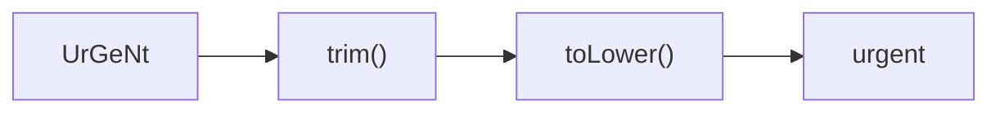

---

# 45. Étape 10 - Normaliser la catégorie

Ajoutez un second **Compose**.

Nom :

```text
Normalize_Category
```

Expression :

```text
toLower(trim(body('Parse_Request')?['category']))
```

---

# 46. Pourquoi normaliser aussi category ?

Aujourd’hui, le routage est basé sur :

```text
priority
```

Mais dans un TP futur, nous pourrions router selon :

```text
priority
category
campus
building
```

Il est donc utile d’apprendre à préparer des valeurs cohérentes.

---

# 47. Étape 11 - Construire l’événement interne

Ajoutez :

```text
Compose
```

Nom :

```text
Build_Event
```

Construisez un objet proche de :

```json
{
  "eventType": "MaintenanceIncidentReceived",
  "schemaVersion": 1,
  "messageId": "@{guid()}",
  "correlationId": "@{guid()}",
  "receivedAt": "@{utcNow()}",
  "source": "epsi-maintenance-portal",
  "data": {
    "ticketId": "@{body('Parse_Request')?['ticketId']}",
    "campus": "@{body('Parse_Request')?['campus']}",
    "building": "@{body('Parse_Request')?['building']}",
    "room": "@{body('Parse_Request')?['room']}",
    "category": "@{outputs('Normalize_Category')}",
    "priority": "@{outputs('Normalize_Priority')}",
    "description": "@{body('Parse_Request')?['description']}",
    "reportedBy": "@{body('Parse_Request')?['reportedBy']}"
  }
}
```

---

# 48. Message Id

```text
messageId
```

identifie l’événement.

Nous utilisons :

```text
guid()
```

---

# 49. Correlation Id

```text
correlationId
```

permet de relier plusieurs traces appartenant au même flux.

Dans un vrai SI, cet identifiant pourrait être :

- généré à l’entrée ;
- propagé entre plusieurs systèmes ;
- écrit dans les logs.

---

# 50. Message Id et Correlation Id

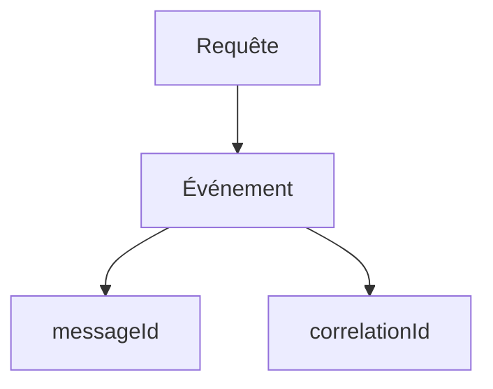

Le **Message Id** identifie le message.

Le **Correlation Id** identifie le contexte du flux.

---

# 51. Étape 12 - Ajouter le Switch

Ajoutez une action :

```text
Control
Switch
```

Dans **On**, utilisez la sortie :

```text
Normalize_Priority
```

---

# 52. Cases du Switch

Ajoutez :

```text
Case urgent
```

Valeur :

```text
urgent
```

Puis :

```text
Case standard
```

Valeur :

```text
standard
```

La branche :

```text
Default
```

sera utilisée pour les autres valeurs.

---

# 53. Diagramme du Switch

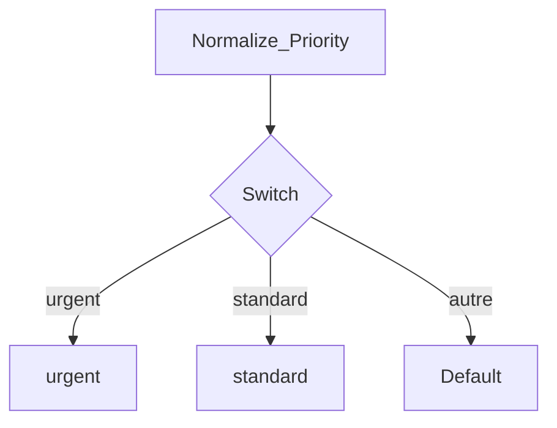

---

# 54. Pourquoi Switch ?

Nous pourrions créer plusieurs **Conditions** imbriquées.

Mais avec plusieurs valeurs possibles :

```text
Switch
```

est plus lisible.

---

# 55. Étape 13 - Branch urgent

Dans :

```text
Case urgent
```

ajoutez :

```text
Service Bus
Send message
```

---

# 56. Connexion Service Bus

Choisissez :

```text
Managed Identity
```

Namespace :

```text
<namespace>.servicebus.windows.net
```

Identity :

```text
System-assigned managed identity
```

Créez une connexion claire, par exemple :

```text
conn-sb-tp2-urgent
```

---

# 57. Queue urgent

Queue :

```text
maintenance-urgent
```

Message :

```text
Outputs de Build_Event
```

Content Type :

```text
application/json
```

---

# 58. Message Id et Correlation Id dans Service Bus

Si les paramètres avancés du connecteur sont disponibles, renseignez :

```text
Message Id
Correlation Id
```

avec les valeurs de :

```text
Build_Event
```

> **Tip :** selon la version du Designer, les noms exacts des champs avancés peuvent varier légèrement.

---

# 59. Étape 14 - Branch standard

Dans :

```text
Case standard
```

ajoutez :

```text
Service Bus
Send message
```

Queue :

```text
maintenance-standard
```

Message :

```text
Outputs de Build_Event
```

---

# 60. Connexion Service Bus standard

Avec une Managed Identity et plusieurs entités Service Bus, le Designer peut vous demander une nouvelle connexion.

Utilisez un nom clair :

```text
conn-sb-tp2-standard
```

---

# 61. Étape 15 - Branch Default

Dans :

```text
Default
```

ajoutez :

```text
Service Bus
Send message
```

Queue :

```text
maintenance-rejet
```

Message :

```text
Outputs de Build_Event
```

---

# 62. Pourquoi conserver le message rejeté ?

Nous voulons pouvoir répondre à des questions comme :

```text
Quelle valeur inconnue a été envoyée ?
Quel ticket a été rejeté ?
Qui a produit la demande ?
```

Une queue de rejet permet de conserver cette information pour analyse.

---

# 63. Ajouter une information de rejet

Vous pouvez améliorer la branche Default avec un **Compose** :

```text
Build_Rejection
```

Exemple :

```json
{
  "reason": "UNSUPPORTED_PRIORITY",
  "receivedPriority": "@{outputs('Normalize_Priority')}",
  "originalEvent": "@{outputs('Build_Event')}"
}
```

Puis envoyez :

```text
Build_Rejection
```

dans :

```text
maintenance-rejet
```

---

# 64. Pourquoi enrichir le rejet ?

Un message rejeté doit expliquer :

```text
pourquoi
```

il a été rejeté.

Cela facilite :

- le debug ;
- l’audit ;
- la correction.

---

# 65. Étape 16 - Ajouter les réponses HTTP

Nous voulons trois comportements.

## Urgent

Après l’envoi :

```text
202 Accepted
```

Body :

```json
{
  "status": "ROUTED",
  "queue": "maintenance-urgent"
}
```

---

# 66. Réponse standard

Après l’envoi standard :

```text
202 Accepted
```

Body :

```json
{
  "status": "ROUTED",
  "queue": "maintenance-standard"
}
```

---

# 67. Réponse rejet

Après l’envoi dans la queue de rejet :

```text
422 Unprocessable Entity
```

Body :

```json
{
  "status": "REJECTED",
  "reason": "UNSUPPORTED_PRIORITY"
}
```

---

# 68. Pourquoi 422 ?

Le JSON est :

```text
syntaxiquement et structurellement valide
```

mais sa valeur métier :

```text
priority
```

n’est pas supportée.

**`422 Unprocessable Entity`** est adapté à cette situation pédagogique.

---

# 69. Workflow du routeur

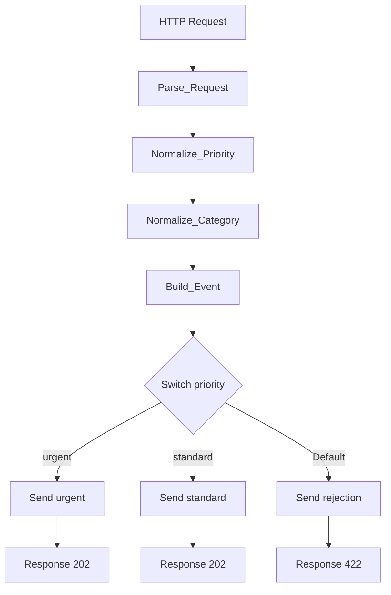

---

# 70. Sauvegarder le workflow

Cliquez sur :

```text
Save
```

Récupérez l’URL du trigger HTTP.

**Ne publiez pas cette URL dans Git ou dans un document public.**

---

# 71. Étape 17 - Test urgent

Dans Postman :

Method :

```text
POST
```

Body :

```json
{
  "ticketId": "INC-101",
  "campus": "EPSI",
  "building": "Batiment A",
  "room": "A204",
  "category": "NETWORK",
  "priority": " UrGeNt ",
  "description": "Plus de reseau dans la salle.",
  "reportedBy": {
    "email": "etudiant@example.com",
    "role": "student"
  }
}
```

---

# 72. Résultat urgent attendu

Réponse :

```text
202 Accepted
```

Queue :

```text
maintenance-urgent
```

doit recevoir un message.

Et dans le message transformé :

```text
priority = urgent
category = network
```

---

# 73. Ce test prouve trois choses

1. le payload est accepté ;
2. la priorité est normalisée ;
3. le Switch route vers la bonne queue.

---

# 74. Vérifier le backlog urgent

Dans Service Bus :

**Queues**, puis **maintenance-urgent**.

Observez :

```text
Active message count
```

---

# 75. Étape 18 - Test standard

Envoyez :

```json
{
  "ticketId": "INC-102",
  "campus": "EPSI",
  "building": "Batiment B",
  "room": "B101",
  "category": "projector",
  "priority": "STANDARD",
  "description": "Videoprojecteur indisponible.",
  "reportedBy": {
    "email": "enseignant@example.com",
    "role": "teacher"
  }
}
```

---

# 76. Résultat standard attendu

```text
202 Accepted
```

Queue :

```text
maintenance-standard
```

reçoit le message.

---

# 77. Étape 19 - Test fonctionnel rejeté

Envoyez :

```json
{
  "ticketId": "INC-103",
  "campus": "EPSI",
  "building": "Batiment C",
  "room": "C010",
  "category": "furniture",
  "priority": "LOW",
  "description": "Chaise endommagee.",
  "reportedBy": {
    "email": "test@example.com",
    "role": "student"
  }
}
```

---

# 78. Résultat rejet attendu

Réponse :

```text
422 Unprocessable Entity
```

Le message doit être envoyé dans :

```text
maintenance-rejet
```

---

# 79. Matrice de routage

| Priority reçue | Après normalisation | Destination | Réponse |
|---|---|---|---:|
| `URGENT` | `urgent` | `maintenance-urgent` | `202` |
| ` UrGeNt ` | `urgent` | `maintenance-urgent` | `202` |
| `STANDARD` | `standard` | `maintenance-standard` | `202` |
| `standard` | `standard` | `maintenance-standard` | `202` |
| `LOW` | `low` | `maintenance-rejet` | `422` |

---

# 80. Étape 20 - Test techniquement invalide

Envoyez :

```json
{
  "ticketId": "INC-104",
  "priority": "urgent"
}
```

---

# 81. Résultat attendu

Avec **Schema Validation** activé :

```text
400 Bad Request
```

Et aucun message ne doit être ajouté dans les trois queues.

---

# 82. Trois résultats différents

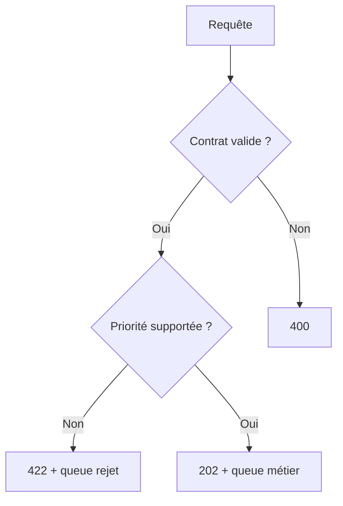

---

# 83. À retenir

Nous avons maintenant trois niveaux :

```text
400
erreur de contrat

422
contrat valide mais valeur métier non supportée

202
message accepté et routé
```

---

# 84. Étape 21 - Observer le Run History

Ouvrez :

```text
la-tp2-routeur
```

puis :

```text
Runs history
```

Testez les trois cas :

- urgent ;
- standard ;
- rejet.

---

# 85. Run urgent attendu

Vous devez voir :

```text
Trigger
Parse_Request
Normalize_Priority
Normalize_Category
Build_Event
Switch
Send urgent
Response 202
```

Les actions des autres branches seront :

```text
Skipped
```

---

# 86. Pourquoi des actions Skipped ?

Le **Switch** n’exécute qu’une branche.

Les autres actions ne sont pas en erreur.

Elles sont simplement :

```text
non sélectionnées
```

---

# 87. Tip debug

Ne confondez pas :

```text
Failed
```

et :

```text
Skipped
```

**Failed** indique une erreur.

**Skipped** indique généralement qu’une branche n’avait pas à être exécutée.

---

# 88. Étape 22 - Créer le consommateur urgent

Créez une nouvelle Logic App Consumption :

```text
la-tp2-urgent
```

Même Resource Group.

---

# 89. Activer son identité

**Settings**, puis **Identity**.

Activez :

```text
System assigned
```

---

# 90. Donner Data Receiver

Sur la queue :

```text
maintenance-urgent
```

attribuez :

```text
Azure Service Bus Data Receiver
```

à :

```text
la-tp2-urgent
```

---

# 91. Créer le trigger urgent

Dans le Designer :

```text
Service Bus
When a message is received in a queue (auto-complete)
```

Queue :

```text
maintenance-urgent
```

Connexion :

```text
Managed Identity
```

---

# 92. Ajouter Compose urgent

Ajoutez :

```text
Compose
```

Nom :

```text
Traitement_Urgent
```

Utilisez le contenu du message.

---

# 93. Simuler un traitement prioritaire

Dans le Compose, vous pouvez construire :

```json
{
  "worker": "urgent",
  "status": "PRISE_EN_CHARGE_PRIORITAIRE",
  "processedAt": "@{utcNow()}",
  "message": "@{triggerBody()}"
}
```

---

# 94. Étape 23 - Créer le consommateur standard

Créez :

```text
la-tp2-standard
```

Activez sa **Managed Identity**.

Attribuez :

```text
Azure Service Bus Data Receiver
```

sur :

```text
maintenance-standard
```

---

# 95. Trigger standard

Utilisez :

```text
When a message is received in a queue (auto-complete)
```

Queue :

```text
maintenance-standard
```

---

# 96. Compose standard

Nom :

```text
Traitement_Standard
```

Exemple :

```json
{
  "worker": "standard",
  "status": "PRISE_EN_CHARGE_STANDARD",
  "processedAt": "@{utcNow()}",
  "message": "@{triggerBody()}"
}
```

---

# 97. Architecture finale

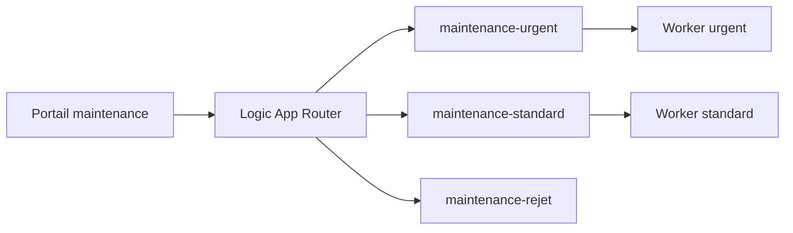

---

# 98. Pourquoi pas de consommateur de rejet ?

Dans le TP2, nous voulons que les messages rejetés restent visibles pour analyse.

Nous les traiterons manuellement.

Dans un vrai SI, un consommateur pourrait :

- notifier une équipe ;
- corriger automatiquement certaines valeurs ;
- créer un incident de qualité ;
- stocker le rejet dans une base.

---

# 99. Étape 24 - Créer un backlog différencié

Désactivez temporairement :

```text
la-tp2-urgent
la-tp2-standard
```

Envoyez :

- trois messages urgents ;
- deux messages standard ;
- un message avec priorité `low`.

---

# 100. Résultat attendu

Vous devez observer :

```text
maintenance-urgent
3 messages environ

maintenance-standard
2 messages environ

maintenance-rejet
1 message environ
```

---

# 101. Diagramme du backlog

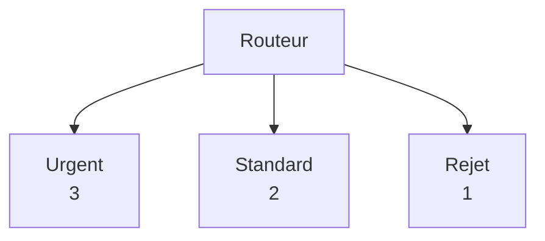

---

# 102. Question 1

Pourquoi créer plusieurs queues plutôt qu’une seule ?

**Réponse :**

Parce que cela permet de séparer physiquement plusieurs flux et de donner à chaque flux :

- un consommateur différent ;
- un rythme différent ;
- des permissions différentes ;
- un backlog différent.

---

# 103. Question 2

Quel est l’avantage de normaliser avant le Switch ?

**Réponse :**

Le routage devient indépendant de la casse et des espaces inutiles.

Ainsi :

```text
URGENT
 urgent
UrGeNt
```

produisent tous :

```text
urgent
```

---

# 104. Question 3

Pourquoi conserver les messages rejetés ?

**Réponse :**

Pour permettre :

- l’analyse ;
- le debug ;
- l’audit ;
- une éventuelle correction.

Supprimer silencieusement une donnée invalide rend le diagnostic beaucoup plus difficile.

---

# 105. Question 4

Pourquoi `422` pour une priorité non supportée ?

**Réponse :**

Parce que le JSON respecte le contrat technique, mais la valeur ne peut pas être traitée selon la règle métier du TP.

---

# 106. Question 5

Quelle différence entre queue de rejet et DLQ ?

**Réponse :**

La **queue de rejet** est une décision métier explicite du routeur.

La **DLQ** est un mécanisme Service Bus destiné aux messages qui ne peuvent pas être remis ou traités normalement.

---

# 107. Étape 25 - Réactiver le consommateur urgent seulement

Activez :

```text
la-tp2-urgent
```

Laissez :

```text
la-tp2-standard
```

désactivée.

---

# 108. Observer la panne partielle simulée

Vous devez observer :

```text
urgent diminue
standard reste en attente
rejet reste en attente
```

---

# 109. Pourquoi cette expérience est importante ?

Elle montre qu’une architecture découplée peut continuer partiellement.

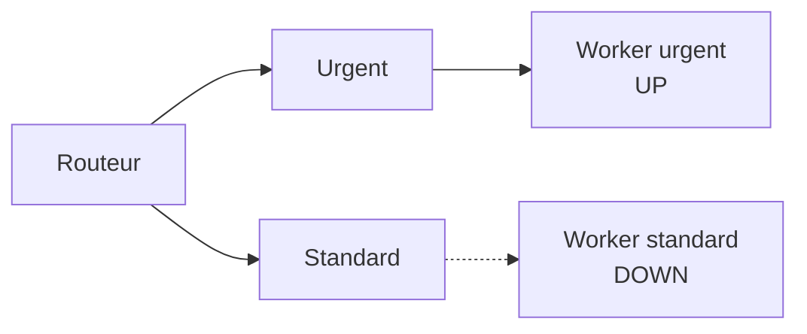

Le flux urgent fonctionne même si le traitement standard est arrêté.

---

# 110. Question 6

Le producteur doit-il savoir si le consommateur standard est arrêté ?

**Réponse :**

Non.

C’est précisément l’intérêt du **découplage temporel**.

---

# 111. Réactiver standard

Activez :

```text
la-tp2-standard
```

Observez le backlog diminuer.

---

# 112. Debug - aucun message dans urgent

Vérifiez :

1. réponse HTTP du routeur ;
2. `Normalize_Priority` ;
3. branche du Switch ;
4. action **Send message** ;
5. queue configurée ;
6. rôle **Data Sender**.

---

# 113. Debug - mauvais routage

Ouvrez le Run History.

Regardez la sortie de :

```text
Normalize_Priority
```

Si vous voyez :

```text
URGENT
```

au lieu de :

```text
urgent
```

vérifiez l’expression :

```text
toLower(trim(...))
```

---

# 114. Debug - Parse JSON échoue

Causes possibles :

- mauvais contenu passé à Parse JSON ;
- schéma Parse JSON incorrect ;
- payload différent de l’exemple ;
- propriété imbriquée incorrecte.

---

# 115. Debug - action Service Bus 401 ou 403

Vérifiez :

- **Managed Identity** activée ;
- rôle **Azure Service Bus Data Sender** ;
- scope du rôle ;
- propagation RBAC ;
- connexion Service Bus utilisée.

---

# 116. Debug - une connexion fonctionne pour une queue mais pas une autre

Avec le connecteur Service Bus et une Managed Identity, plusieurs entités peuvent nécessiter des connexions correctement configurées.

Vérifiez :

- la queue sélectionnée ;
- la connexion utilisée par l’action ;
- les permissions de l’identité.

---

# 117. Debug - réponse 202 mais compteur à zéro

Le consommateur peut déjà avoir traité le message.

Pour isoler le routeur :

**désactivez temporairement les consommateurs**.

Puis refaites le test.

---

# 118. Debug - la branche Default ne s’exécute jamais

Vérifiez que le JSON Schema ne limite pas déjà :

```text
priority
```

avec un `enum`.

Dans ce TP, `priority` doit rester une chaîne libre pour permettre au Switch d’utiliser sa branche Default.

---

# 119. Debug - 400 au lieu de 422

Un `400` signifie probablement que le payload ne respecte pas le **contrat technique**.

Vérifiez les champs obligatoires.

Un `422` n’est attendu que lorsque :

- le JSON est techniquement valide ;
- la priorité est inconnue.

---

# 120. Data Operations à retenir

Logic Apps fournit notamment :

- **Compose** ;
- **Parse JSON** ;
- **Select** ;
- **Filter array** ;
- **Join** ;
- création de tables CSV ou HTML.

Dans ce TP, nous avons utilisé :

```text
Compose
Parse JSON
```

---

# 121. Exercice bonus - Select

Ajoutez au payload :

```json
"assets": [
  {
    "id": "AP-204",
    "type": "wifi"
  },
  {
    "id": "SW-02",
    "type": "switch"
  }
]
```

Utilisez **Select** pour transformer :

```json
[
  {
    "id": "AP-204",
    "type": "wifi"
  }
]
```

en :

```json
[
  {
    "assetId": "AP-204",
    "assetType": "wifi"
  }
]
```

---

# 122. Pourquoi Select ?

**Select** permet de :

- renommer des propriétés ;
- reconstruire des objets ;
- produire un nouvel array à partir d’un array source.

---

# 123. Exercice bonus - Filter array

Avec :

```json
"assets": [
  {
    "id": "AP-204",
    "type": "wifi"
  },
  {
    "id": "SW-02",
    "type": "switch"
  },
  {
    "id": "AP-205",
    "type": "wifi"
  }
]
```

utilisez **Filter array** pour conserver uniquement :

```text
type = wifi
```

---

# 124. Résultat attendu Filter array

```json
[
  {
    "id": "AP-204",
    "type": "wifi"
  },
  {
    "id": "AP-205",
    "type": "wifi"
  }
]
```

---

# 125. Pourquoi ces actions sont utiles dans un SI ?

Un système A peut produire :

```json
{
  "first_name": "Alice"
}
```

alors que le système B attend :

```json
{
  "firstName": "Alice"
}
```

L’intégration doit parfois :

- renommer ;
- filtrer ;
- normaliser ;
- enrichir ;
- convertir.

---

# 126. Transformer ne signifie pas modifier le système source

La Logic App peut adapter le message sans demander au portail de changer son propre modèle.

C’est une responsabilité fréquente d’une couche d’intégration.

---

# 127. Message enrichi

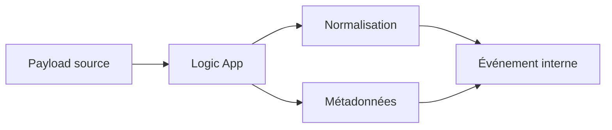

---

# 128. Correlation Id et observabilité

Dans un SI composé de plusieurs composants :

```text
Portail
Routeur
Queue
Worker
API métier
```

un **Correlation Id** permet de suivre une même demande.

---

# 129. Exemple

```text
correlationId = CORR-123
```

devrait idéalement être présent dans :

- le message ;
- les logs ;
- les appels aval ;
- les erreurs.

---

# 130. Exercice bonus - réutiliser un Correlation Id du client

Ajoutez un header HTTP :

```text
X-Correlation-ID
```

Si le client le fournit :

```text
réutilisez-le
```

sinon :

```text
générez guid()
```

*Cet exercice est facultatif.*

---

# 131. Attention à Message Id sur Basic

Vous pouvez renseigner un **Message Id** pour la traçabilité.

Mais le tier **Basic** ne prend pas en charge la **Duplicate Detection**.

Le Message Id reste donc utile pour :

- logs ;
- corrélation ;
- analyse ;

mais il ne provoque pas automatiquement une déduplication par Service Bus Basic.

---

# 132. Routage avec queues et routage avec topics

Dans ce TP :

```text
Logic App choisit la queue
```

Le routage est réalisé dans le workflow.

Avec un **topic Service Bus** :

```text
publisher publie sur un topic
subscriptions reçoivent selon les règles
```

Ce modèle sera étudié plus tard.

---

# 133. Comparaison

| TP2 | TP futur |
|---|---|
| plusieurs queues | topic + subscriptions |
| Switch dans Logic Apps | filtres Service Bus |
| routeur décide | broker participe au routage |
| Basic possible | Standard ou Premium requis |

---

# 134. Pourquoi ne pas utiliser Standard dès maintenant ?

Parce que le TP2 peut atteindre ses objectifs avec :

```text
queues
```

Cela permet de limiter le coût et de conserver une progression pédagogique claire.

---

# 135. Azure CLI - rôle dans le TP2

Comme dans le TP1, Azure CLI est **optionnel**.

Il sert surtout à :

- vérifier les ressources ;
- automatiser certaines créations ;
- comparer GUI et CLI.

---

# 136. Tableau Portail et CLI

| Portail Azure | CLI indicatif |
|---|---|
| Create Resource Group | `az group create` |
| Create namespace | `az servicebus namespace create` |
| Create queue | `az servicebus queue create` |
| Show queue | `az servicebus queue show` |
| Add IAM role | `az role assignment create` |
| List Logic Apps | `az logic workflow list` |
| Enable / Disable Logic App | `az logic workflow update` |
| List resources | `az resource list` |

---

# 137. Vérifier les trois queues en CLI - optionnel

```bash
az servicebus queue list \
  --resource-group rg-tp2-routage-si \
  --namespace-name sb-tp2-xx-12345 \
  --query '[].{name:name,active:countDetails.activeMessageCount}' \
  --output table
```

---

# 138. Désactiver un consommateur en CLI - optionnel

```bash
az logic workflow update \
  --resource-group rg-tp2-routage-si \
  --name la-tp2-standard \
  --state Disabled
```

---

# 139. Réactiver en CLI - optionnel

```bash
az logic workflow update \
  --resource-group rg-tp2-routage-si \
  --name la-tp2-standard \
  --state Enabled
```

---

# 140. Exercice guidé 1 - Variantes de priorité

Testez :

```text
URGENT
Urgent
 urgent
 UrGeNt
```

Toutes doivent être routées vers :

```text
maintenance-urgent
```

---

# 141. Exercice guidé 2 - Valeurs standard

Testez :

```text
STANDARD
standard
 Standard
```

Toutes doivent aller vers :

```text
maintenance-standard
```

---

# 142. Exercice guidé 3 - Valeur inconnue

Testez :

```text
critical
```

Résultat attendu :

```text
422
maintenance-rejet
```

---

# 143. Exercice guidé 4 - Champ absent

Supprimez :

```text
description
```

Résultat attendu :

```text
400
aucune queue ne reçoit
```

---

# 144. Exercice guidé 5 - Consumer urgent indisponible

Désactivez :

```text
la-tp2-urgent
```

Laissez :

```text
la-tp2-standard
```

actif.

Envoyez :

- deux urgents ;
- deux standards.

---

# 145. Résultat attendu

Queue urgent :

```text
backlog augmente
```

Queue standard :

```text
messages traités
```

---

# 146. Ce que démontre l’exercice

Une panne partielle n’empêche pas nécessairement tout le système de continuer.

C’est un avantage important du découplage par queues.

---

# 147. Exercice guidé 6 - Analyse Run History

Pour un message rejeté, trouvez dans le Run History :

- `Parse_Request` ;
- `Normalize_Priority` ;
- `Build_Event` ;
- branche `Default` ;
- action d’envoi vers rejet ;
- réponse `422`.

---

# 148. Debug méthodique

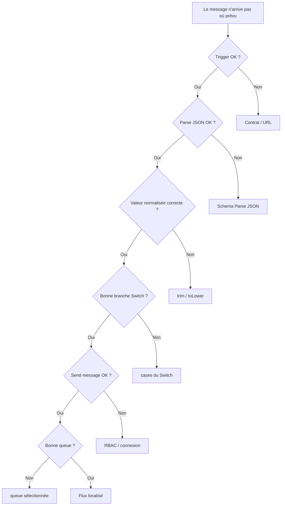

---

# 149. Tip debug

Ne modifiez pas :

```text
le Switch
la connexion
le schema
le RBAC
```

en même temps.

Changez une seule chose puis retestez.

---

# 150. Codes HTTP du TP2

| Code | Signification |
|---|---|
| **`202`** | incident valide et routé |
| **`400`** | contrat HTTP invalide |
| **`422`** | payload valide mais priorité non supportée |
| **`401/403`** | problème d’identité ou d’autorisation vers Service Bus |
| **`500/502`** | erreur technique selon le workflow et la gestion choisie |

---

# 151. À retenir sur 202

**`202 Accepted`** signifie :

```text
le message a été accepté pour traitement asynchrone
```

Cela ne veut pas dire :

```text
l’incident est déjà résolu
```

---

# 152. À retenir sur le routeur

Le routeur doit idéalement rester :

- simple ;
- déterministe ;
- facile à tester.

Une règle de routage trop complexe peut devenir difficile à maintenir.

---

# 153. À retenir sur la transformation

La transformation sert à créer un contrat plus stable entre les composants.

Exemples :

```text
Urgent
URGENT
 urgent
```

deviennent :

```text
urgent
```

---

# 154. À retenir sur le rejet

Ne perdez pas silencieusement une donnée que le SI ne comprend pas.

Le rejet doit être :

- visible ;
- explicable ;
- traçable.

---

# 155. Aperçu du TP suivant

Le TP2 utilise plusieurs queues.

Une évolution naturelle est :

```text
Topic
Subscriptions
Filters
```

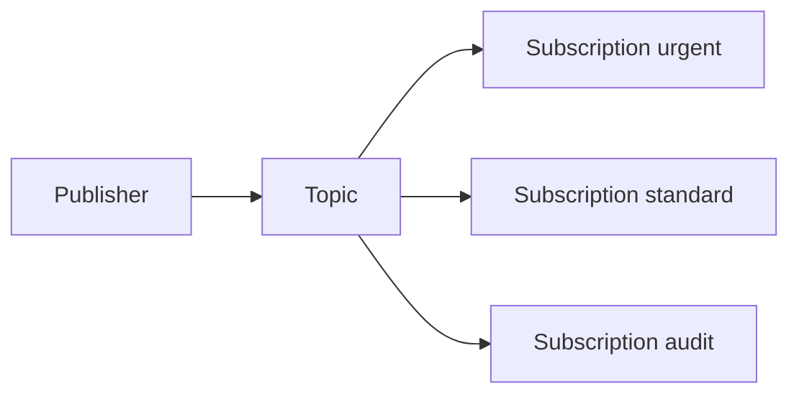

---

# 156. Pourquoi un topic change le modèle ?

Avec plusieurs queues :

```text
le producteur / routeur choisit la destination
```

Avec un topic et des subscriptions :

```text
le producteur publie
le broker distribue
```

---

# 157. Nettoyage - comptes étudiants

À la fin du TP :

1. désactivez les consommateurs ;
2. vérifiez le Resource Group ;
3. supprimez le Resource Group si l’enseignant l’autorise.

---

# 158. Vérifier avant suppression

Dans :

```text
Resource groups
rg-tp2-routage-si
```

vérifiez que le groupe contient uniquement les ressources du TP2.

---

# 159. Supprimer le Resource Group

Cliquez sur :

```text
Delete resource group
```

Confirmez.

---

## Équivalent CLI - optionnel

```bash
az group delete \
  --name rg-tp2-routage-si \
  --yes
```

---

# 160. Tips de fin de TP

Retenez ces réflexes :

1. **Valider avant de transformer.**
2. **Normaliser avant de comparer.**
3. **Séparer erreur technique et rejet fonctionnel.**
4. **Conserver une trace des messages rejetés.**
5. **Utiliser un Correlation Id.**
6. **Observer chaque backlog séparément.**
7. **Ne pas confondre Failed et Skipped.**
8. **Toujours vérifier RBAC lors d’un 401/403.**
9. **Désactiver les consommateurs inutiles.**
10. **Nettoyer les ressources cloud de TP.**

---

# 161. Tip soutenance

Si on vous demande :

*« Pourquoi mettre une Logic App routeur ? »*

ne répondez pas seulement :

*« pour envoyer vers plusieurs queues ».*

Expliquez qu’elle assure :

- la **validation** ;
- la **normalisation** ;
- la **transformation** ;
- le **routage** ;
- la création d’un **contrat interne**.

---

# 162. Checklist finale

- [ ] J’ai créé un Resource Group dédié.
- [ ] J’ai créé un namespace Service Bus Basic.
- [ ] J’ai créé `maintenance-urgent`.
- [ ] J’ai créé `maintenance-standard`.
- [ ] J’ai créé `maintenance-rejet`.
- [ ] J’ai créé `la-tp2-routeur`.
- [ ] J’ai activé sa Managed Identity.
- [ ] J’ai attribué `Data Sender`.
- [ ] J’ai créé un trigger HTTP.
- [ ] J’ai activé **Schema Validation**.
- [ ] J’ai utilisé **Parse JSON**.
- [ ] J’ai utilisé `trim()`.
- [ ] J’ai utilisé `toLower()`.
- [ ] J’ai construit un événement interne.
- [ ] J’ai utilisé `guid()`.
- [ ] J’ai utilisé `utcNow()`.
- [ ] J’ai ajouté un **Message Id**.
- [ ] J’ai ajouté un **Correlation Id**.
- [ ] J’ai créé un **Switch**.
- [ ] J’ai créé une branche urgent.
- [ ] J’ai créé une branche standard.
- [ ] J’ai utilisé la branche Default.
- [ ] J’ai envoyé les rejets dans une queue dédiée.
- [ ] J’ai testé un `202`.
- [ ] J’ai testé un `400`.
- [ ] J’ai testé un `422`.
- [ ] J’ai créé le consommateur urgent.
- [ ] J’ai créé le consommateur standard.
- [ ] J’ai observé deux backlogs différents.
- [ ] J’ai simulé une panne partielle.
- [ ] Je sais expliquer **Failed** et **Skipped**.
- [ ] Je sais expliquer la différence entre rejet fonctionnel et DLQ.
- [ ] J’ai supprimé les ressources à la fin.

---

# 163. Résumé final

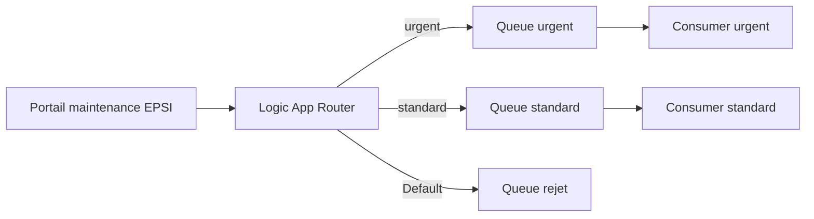

Le point essentiel du TP2 est :

> **Une couche d’intégration ne sert pas uniquement à transporter des données. Elle peut aussi valider, normaliser, transformer et router les messages avant leur traitement.**

---

# 164. Références Microsoft

Documentation utile :

- **Data Operations dans Logic Apps** :  
  `https://learn.microsoft.com/azure/logic-apps/logic-apps-perform-data-operations`

- **Exemples Data Operations** :  
  `https://learn.microsoft.com/azure/logic-apps/logic-apps-data-operations-code-samples`

- **Connecteur Azure Service Bus pour Logic Apps** :  
  `https://learn.microsoft.com/azure/connectors/connectors-create-api-servicebus`

- **Référence du connecteur Service Bus** :  
  `https://learn.microsoft.com/connectors/servicebus/`

- **Queues, Topics et Subscriptions Service Bus** :  
  `https://learn.microsoft.com/azure/service-bus-messaging/service-bus-queues-topics-subscriptions`

- **Azure for Students** :  
  `https://learn.microsoft.com/azure/education-hub/about-azure-for-students`

- **Tarification Service Bus** :  
  `https://azure.microsoft.com/pricing/details/service-bus/`

- **Tarification Logic Apps** :  
  `https://azure.microsoft.com/pricing/details/logic-apps/`
