# TP 3 - Publish/Subscribe avec Azure Service Bus Topics, Subscriptions et Filters - EPSI

**Niveau :** *intermédiaire à avancé*  

**Durée indicative :** *3 h à 4 h*  

**Mode principal :** **Portail Azure**  

**Mode secondaire :** *Azure CLI, uniquement en option et à titre de comparaison*  

**Architecture :** **Logic Apps Consumption**, **Azure Service Bus Standard**, **Topic**, **Subscriptions**, **SQL Filters**, **Managed Identity** et **RBAC**  

**Public visé :** *étudiants EPSI disposant d’un compte Azure personnel, Azure for Students ou d’un abonnement Azure fourni par l’établissement.*

---

# 1. Objectifs du TP

À la fin de ce TP, vous devez être capables de :

- comprendre le modèle **publish/subscribe** ;
- distinguer une **queue** d’un **topic** ;
- créer un **Service Bus Topic** ;
- créer plusieurs **Subscriptions** ;
- comprendre qu’une subscription ressemble à une *file virtuelle indépendante* ;
- comprendre qu’un même message peut être copié vers plusieurs subscriptions ;
- créer des **SQL Filters** ;
- utiliser des **propriétés personnalisées** de message pour filtrer ;
- comprendre la règle **`$Default`** ;
- supprimer la règle `$Default` lorsqu’une subscription doit être filtrée ;
- créer une Logic App productrice ;
- publier un seul message sur un topic ;
- utiliser **Message Id** ;
- utiliser **Correlation Id** ;
- utiliser **Properties** personnalisées ;
- créer plusieurs Logic Apps consommatrices ;
- déclencher un workflow depuis une **topic subscription** ;
- observer plusieurs backlogs indépendants ;
- simuler une panne partielle ;
- comprendre la différence entre :
  - **point-to-point** ;
  - **publish/subscribe** ;
  - **routage dans le producteur** ;
  - **routage dans le broker** ;
- comprendre les implications de coût du niveau **Standard** ;
- utiliser Azure CLI uniquement comme *équivalent optionnel*.

---

# 2. Position du TP3 dans la progression

Le TP1 a introduit :

```text
une queue
un producteur
un consommateur
```

Le TP2 a ajouté :

```text
plusieurs queues
transformation
normalisation
routage dans Logic Apps
```

Le TP3 déplace maintenant une partie du routage dans :

```text
Azure Service Bus
```

avec :

```text
Topic
Subscriptions
Filters
```

---

# 3. Idée principale du TP3

Dans le TP2 :

```text
la Logic App choisissait une queue
```

Dans le TP3 :

```text
la Logic App publie une seule fois sur un topic
```

puis :

```text
Service Bus décide quelles subscriptions reçoivent une copie
```

---

# 4. Architecture générale

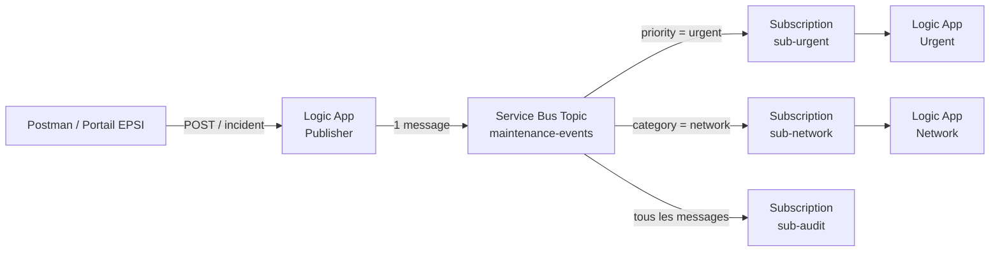

> **À retenir :** le producteur publie **une seule fois**. Chaque subscription peut recevoir sa **propre copie** du message.

---

# 5. Scénario métier

EPSI continue d’utiliser son portail de maintenance.

Un incident peut intéresser plusieurs équipes en même temps.

Exemple :

```json
{
  "ticketId": "INC-301",
  "campus": "EPSI",
  "building": "Batiment A",
  "room": "A204",
  "category": "network",
  "priority": "urgent",
  "description": "Plus de reseau.",
  "reportedBy": {
    "email": "etudiant@example.com",
    "role": "student"
  }
}
```

Cet incident doit intéresser :

- l’équipe **urgent** ;
- l’équipe **network** ;
- le flux **audit**.

---

# 6. Résultat attendu pour INC-301

Le producteur envoie :

```text
1 message
```

au topic :

```text
maintenance-events
```

Service Bus crée ensuite une copie dans :

```text
sub-urgent
sub-network
sub-audit
```

---

# 7. Publish/Subscribe

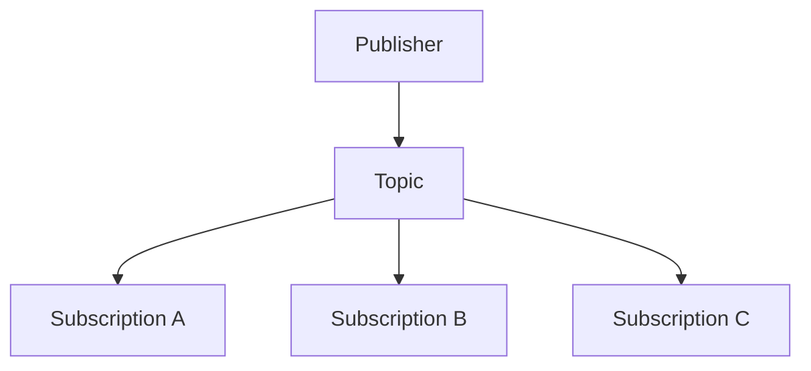

Une subscription peut ensuite avoir son propre consumer.

---

# 8. Queue et Topic : différence

## Queue

```text
Producteur
Queue
Consommateur
```

Le message est destiné à un flux principal de consommation.

## Topic

```text
Publisher
Topic
plusieurs Subscriptions
plusieurs Consumers
```

Le topic permet le **fan-out**.

---

# 9. Comparaison visuelle

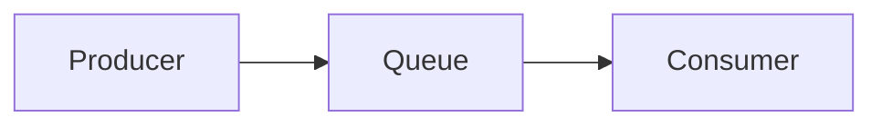

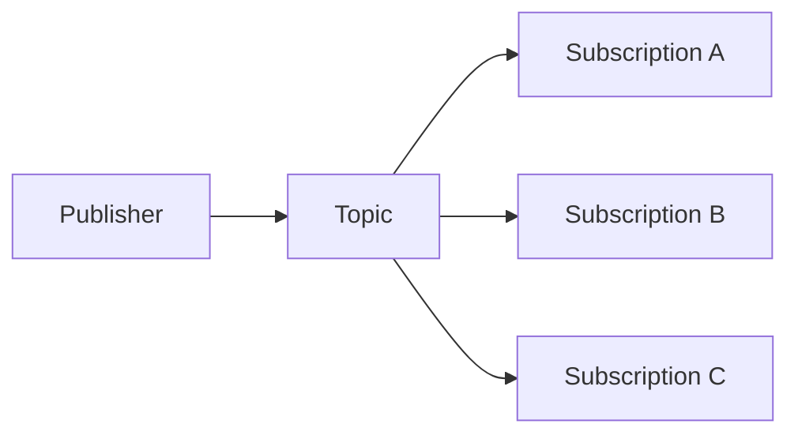

---

# 10. Qu’est-ce qu’une Subscription ?

Une **subscription Service Bus** est une entité durable associée à un topic.

Du point de vue du consommateur, elle se comporte comme une file indépendante.

Elle conserve les copies des messages qui lui correspondent.

---

# 11. Un même message peut être copié plusieurs fois

Supposons :

```text
priority = urgent
category = network
```

Le message correspond :

- au filtre urgent ;
- au filtre network ;
- au filtre audit.

Résultat :

```text
3 subscriptions reçoivent chacune une copie
```

---

# 12. Diagramme de fan-out

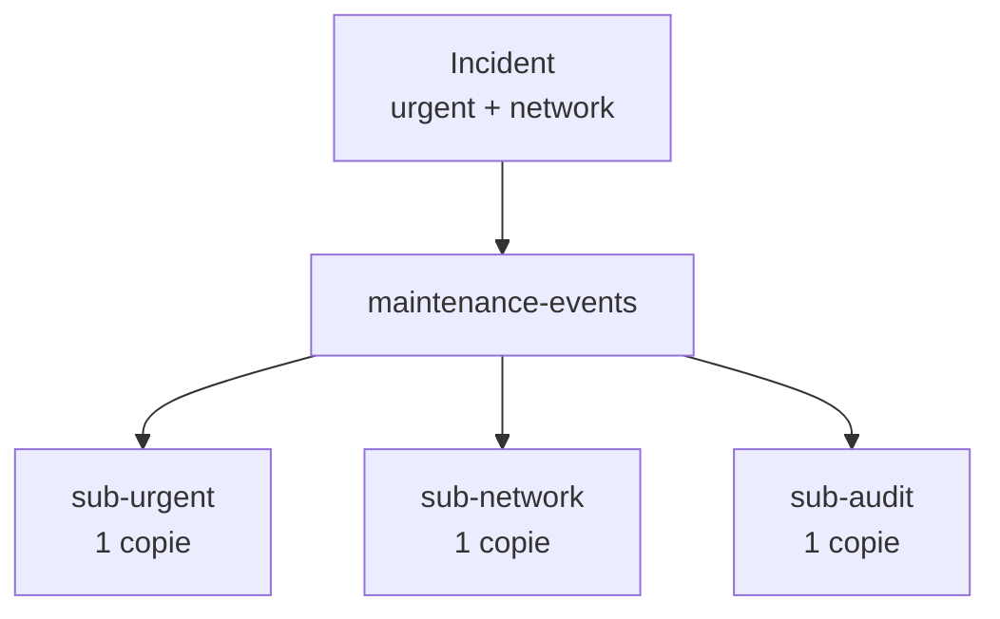

---

# 13. Pourquoi ce modèle est utile ?

Une seule publication peut alimenter :

- une équipe de support ;
- une équipe sécurité ;
- un système d’audit ;
- un système de reporting ;
- une notification ;
- une intégration externe.

Le producteur n’a pas besoin de connaître tous ces consommateurs.

---

# 14. Découplage supplémentaire

Dans le TP2, le routeur connaissait :

```text
maintenance-urgent
maintenance-standard
maintenance-rejet
```

Dans le TP3, le publisher connaît seulement :

```text
maintenance-events
```

---

# 15. Le broker participe au routage

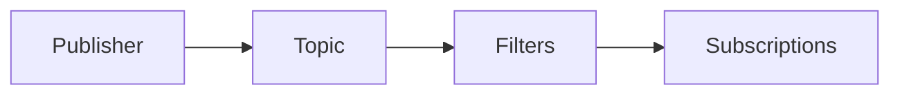

**Service Bus** devient une partie active du routage.

---

# 16. Niveau Service Bus obligatoire

Pour utiliser :

```text
Topics
Subscriptions
```

vous devez utiliser :

```text
Service Bus Standard
```

ou :

```text
Premium
```

Le niveau **Basic** ne prend pas en charge Topics/Subscriptions.

---

# 17. Attention au coût du niveau Standard

Contrairement aux TP1 et TP2, nous ne pouvons plus utiliser **Basic**.

Le niveau **Standard** peut comporter une **charge de base**, en plus des opérations facturées selon la tarification en vigueur.

> **Recommandation EPSI :** si possible, l’enseignant fournit un namespace **Standard** partagé ou dédié à la séance.

> **Important :** si chaque étudiant crée son propre namespace Standard avec un crédit personnel, **supprimez-le immédiatement après le TP**.

---

# 18. Azure for Students

L’offre **Azure for Students** fournit actuellement **100 USD de crédit Azure**, valable pendant **un an**, aux étudiants éligibles, *sans carte bancaire requise*.

*Les offres Microsoft peuvent évoluer.*

---

# 19. Azure for Students Starter

**Azure for Students Starter** est une offre différente et plus limitée.

Elle peut ne pas permettre la création des ressources Service Bus nécessaires.

Si le service n’est pas disponible :

- vérifiez votre type d’abonnement ;
- utilisez l’environnement fourni par EPSI ;
- ne concluez pas immédiatement à une erreur du TP.

---

# 20. Comptes école et permissions RBAC

Certains abonnements EPSI peuvent bloquer :

```text
Add role assignment
```

Si c’est le cas :

- l’enseignant attribue les rôles ;
- ou fournit des ressources préconfigurées.

**Ne contournez pas la politique de sécurité de l’établissement.**

---

# 21. Ressources du TP

Nous utiliserons :

```text
Resource Group
rg-tp3-pubsub-si

Service Bus Namespace Standard
sb-tp3-<initiales>-<nombre>

Topic
maintenance-events

Subscriptions
sub-urgent
sub-network
sub-audit

Logic Apps
la-tp3-publisher
la-tp3-urgent
la-tp3-network
```

---

# 22. Filtres du TP

Nous voulons :

```text
sub-urgent
priority = 'urgent'

sub-network
category = 'network'

sub-audit
tous les messages
```

---

# 23. Pourquoi sub-audit reçoit tout ?

La subscription audit sert à montrer :

```text
fan-out complet
```

Elle conserve la règle par défaut :

```text
TrueFilter
```

qui laisse passer tous les messages.

---

# 24. Étape 1 - Créer le Resource Group

## Méthode principale - Portail Azure

Dans :

```text
Resource groups
```

cliquez sur **Create**.

Renseignez :

| Paramètre | Valeur |
|---|---|
| Resource group | `rg-tp3-pubsub-si` |
| Region | région autorisée |
| Subscription | abonnement étudiant ou école |

Cliquez sur **Review + create**, puis **Create**.

---

## Équivalent Azure CLI - optionnel

```bash
az group create \
  --name rg-tp3-pubsub-si \
  --location westeurope
```

---

# 25. Étape 2 - Créer le namespace Service Bus Standard

Dans le portail, recherchez :

```text
Service Bus
```

Cliquez sur **Create**.

---

# 26. Paramètres du namespace

| Paramètre | Valeur |
|---|---|
| Resource Group | `rg-tp3-pubsub-si` |
| Namespace | `sb-tp3-...` |
| Region | même région |
| Pricing tier | **Standard** |

> **Attention :** ne choisissez pas **Basic** pour ce TP.

---

# 27. Pourquoi Standard ?

Parce que le TP nécessite :

- **Topics** ;
- **Subscriptions** ;
- **Filters**.

Ces fonctions ne sont pas disponibles en Basic.

---

## Équivalent Azure CLI - optionnel

```bash
az servicebus namespace create \
  --resource-group rg-tp3-pubsub-si \
  --name sb-tp3-xx-12345 \
  --location westeurope \
  --sku Standard
```

---

# 28. Étape 3 - Créer le Topic

Ouvrez votre namespace Service Bus.

Dans :

```text
Entities
```

choisissez :

```text
Topics
```

Cliquez sur :

```text
+ Topic
```

Nom :

```text
maintenance-events
```

Créez le topic.

---

# 29. Pourquoi un seul Topic ?

Nous voulons un point de publication unique.

Le publisher ne choisira plus :

```text
quelle queue
```

Il publiera toujours dans :

```text
maintenance-events
```

---

## Équivalent Azure CLI - optionnel

```bash
az servicebus topic create \
  --resource-group rg-tp3-pubsub-si \
  --namespace-name sb-tp3-xx-12345 \
  --name maintenance-events
```

---

# 30. Étape 4 - Créer sub-urgent

Ouvrez :

```text
maintenance-events
```

Puis :

```text
Subscriptions
```

Cliquez sur :

```text
+ Subscription
```

Nom :

```text
sub-urgent
```

Conservez des paramètres simples pour le TP.

Créez la subscription.

---

# 31. Étape 5 - Créer sub-network

Créez :

```text
sub-network
```

---

# 32. Étape 6 - Créer sub-audit

Créez :

```text
sub-audit
```

---

# 33. Équivalent CLI - créer les subscriptions

```bash
az servicebus topic subscription create \
  --resource-group rg-tp3-pubsub-si \
  --namespace-name sb-tp3-xx-12345 \
  --topic-name maintenance-events \
  --name sub-urgent

az servicebus topic subscription create \
  --resource-group rg-tp3-pubsub-si \
  --namespace-name sb-tp3-xx-12345 \
  --topic-name maintenance-events \
  --name sub-network

az servicebus topic subscription create \
  --resource-group rg-tp3-pubsub-si \
  --namespace-name sb-tp3-xx-12345 \
  --topic-name maintenance-events \
  --name sub-audit
```

---

# 34. Étape critique - comprendre `$Default`

Lorsqu’une subscription est créée, Service Bus ajoute généralement une règle par défaut :

```text
$Default
```

Cette règle est un :

```text
TrueFilter
```

Elle accepte :

```text
tous les messages
```

---

# 35. Pourquoi `$Default` est dangereux pour notre exercice ?

Si `sub-urgent` conserve :

```text
$Default = True
```

et que vous ajoutez aussi :

```text
priority = 'urgent'
```

la subscription continuera à recevoir :

```text
tous les messages
```

Le filtre urgent ne semblera donc pas fonctionner.

---

# 36. À retenir sur les règles

Dans une subscription, plusieurs règles peuvent faire correspondre un message.

Une règle `TrueFilter` correspond toujours.

Il faut donc la supprimer dans les subscriptions que nous voulons filtrer.

---

# 37. Étape 7 - Configurer le filtre urgent

Ouvrez :

```text
maintenance-events
sub-urgent
```

Puis la section :

```text
Filters
```

ou :

```text
Rules / Filters
```

*Le libellé exact peut varier légèrement selon l’évolution du portail.*

---

# 38. Supprimer `$Default` de sub-urgent

Sélectionnez la règle :

```text
$Default
```

Supprimez-la.

> **Vérification rapide :** `sub-urgent` ne doit plus avoir de règle qui accepte tout.

---

# 39. Ajouter le filtre SQL urgent

Créez une nouvelle règle.

Nom :

```text
UrgentOnly
```

Type :

```text
SQL Filter
```

Expression :

```sql
priority = 'urgent'
```

Enregistrez.

---

# 40. Étape 8 - Configurer le filtre network

Ouvrez :

```text
sub-network
```

Supprimez :

```text
$Default
```

Créez :

```text
NetworkOnly
```

Expression :

```sql
category = 'network'
```

---

# 41. Étape 9 - Conserver `$Default` pour audit

Dans :

```text
sub-audit
```

ne supprimez pas la règle par défaut.

Nous voulons :

```text
tous les messages
```

---

# 42. Résultat des règles

| Subscription | Règle |
|---|---|
| `sub-urgent` | `priority = 'urgent'` |
| `sub-network` | `category = 'network'` |
| `sub-audit` | `TrueFilter` |

---

# 43. Diagramme de filtrage

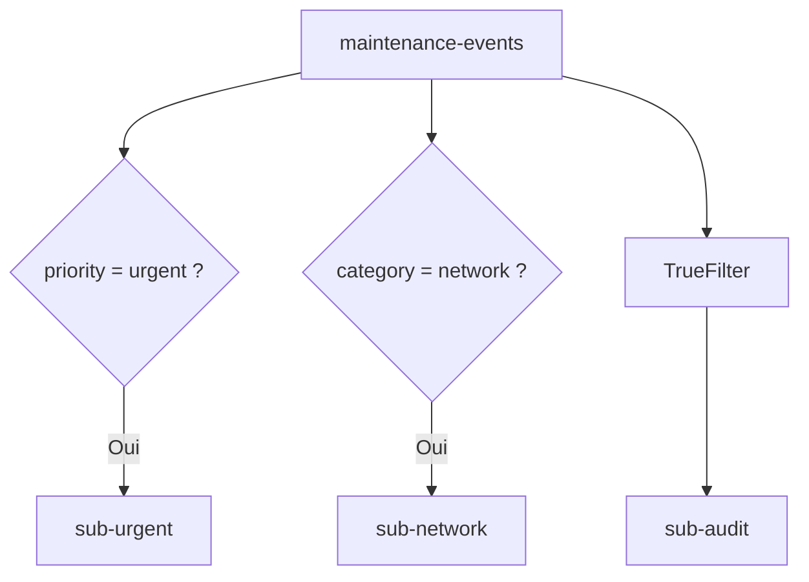

---

# 44. Les filtres analysent quoi ?

Les filtres Service Bus peuvent utiliser :

- des **propriétés système** ;
- des **propriétés personnalisées** du message.

Dans ce TP, nous utiliserons des propriétés personnalisées :

```text
priority
category
eventType
campus
```

---

# 45. Les filtres ne doivent pas dépendre du body JSON

Le body peut contenir :

```json
{
  "data": {
    "priority": "urgent"
  }
}
```

mais le filtre Service Bus du TP utilise :

```text
priority
```

comme **propriété du message**.

---

# 46. Pourquoi ajouter des propriétés séparées ?

Parce que le broker peut filtrer efficacement sur les propriétés du message sans devoir comprendre notre JSON métier.

---

# 47. Body et Properties

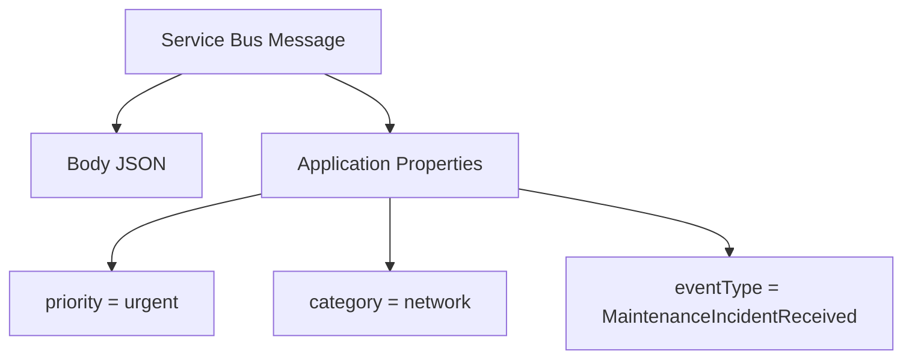

---

# 48. Équivalent CLI - vérifier les règles

```bash
az servicebus topic subscription rule list \
  --resource-group rg-tp3-pubsub-si \
  --namespace-name sb-tp3-xx-12345 \
  --topic-name maintenance-events \
  --subscription-name sub-urgent \
  --output table
```

---

# 49. Équivalent CLI - supprimer `$Default`

Sous Bash :

```bash
az servicebus topic subscription rule delete \
  --resource-group rg-tp3-pubsub-si \
  --namespace-name sb-tp3-xx-12345 \
  --topic-name maintenance-events \
  --subscription-name sub-urgent \
  --name '$Default'
```

Même principe pour :

```text
sub-network
```

> **Tip :** utilisez des guillemets simples autour de `$Default` sous Bash pour empêcher l’expansion de `$`.

---

# 50. CLI - créer UrgentOnly

```bash
az servicebus topic subscription rule create \
  --resource-group rg-tp3-pubsub-si \
  --namespace-name sb-tp3-xx-12345 \
  --topic-name maintenance-events \
  --subscription-name sub-urgent \
  --name UrgentOnly \
  --filter-type SqlFilter \
  --filter-sql-expression "priority = 'urgent'"
```

---

# 51. CLI - créer NetworkOnly

```bash
az servicebus topic subscription rule create \
  --resource-group rg-tp3-pubsub-si \
  --namespace-name sb-tp3-xx-12345 \
  --topic-name maintenance-events \
  --subscription-name sub-network \
  --name NetworkOnly \
  --filter-type SqlFilter \
  --filter-sql-expression "category = 'network'"
```

---

# 52. Étape 10 - Créer la Logic App Publisher

Dans :

```text
Logic Apps
```

créez :

```text
la-tp3-publisher
```

Plan :

```text
Consumption
```

Resource Group :

```text
rg-tp3-pubsub-si
```

---

# 53. Étape 11 - Activer la Managed Identity

Ouvrez :

**Settings**, puis **Identity**.

Activez :

```text
System assigned
```

Sauvegardez.

---

# 54. Étape 12 - Donner Data Sender

Ouvrez le topic :

```text
maintenance-events
```

Puis :

```text
Access control (IAM)
```

Ajoutez :

```text
Azure Service Bus Data Sender
```

à :

```text
la-tp3-publisher
```

---

# 55. Pourquoi scope topic ?

Le publisher n’a besoin que de publier dans :

```text
maintenance-events
```

Il n’a pas besoin d’accéder à toutes les autres entités du namespace.

---

## Équivalent Azure CLI - optionnel

Récupérez le principal ID :

```bash
PUB_ID=$(az resource show \
  --resource-group rg-tp3-pubsub-si \
  --name la-tp3-publisher \
  --resource-type Microsoft.Logic/workflows \
  --query identity.principalId \
  --output tsv)
```

Récupérez l’ID du topic :

```bash
TOPIC_ID=$(az servicebus topic show \
  --resource-group rg-tp3-pubsub-si \
  --namespace-name sb-tp3-xx-12345 \
  --name maintenance-events \
  --query id \
  --output tsv)
```

Attribuez :

```bash
az role assignment create \
  --assignee-object-id "$PUB_ID" \
  --assignee-principal-type ServicePrincipal \
  --role "Azure Service Bus Data Sender" \
  --scope "$TOPIC_ID"
```

---

# 56. Étape 13 - Créer le trigger HTTP

Dans le Designer, choisissez :

```text
When a HTTP request is received
```

Method :

```text
POST
```

---

# 57. JSON Schema

Utilisez :

```json
{
  "type": "object",
  "properties": {
    "ticketId": {
      "type": "string",
      "minLength": 1
    },
    "campus": {
      "type": "string",
      "minLength": 1
    },
    "building": {
      "type": "string",
      "minLength": 1
    },
    "room": {
      "type": "string",
      "minLength": 1
    },
    "category": {
      "type": "string",
      "minLength": 1
    },
    "priority": {
      "type": "string",
      "minLength": 1
    },
    "description": {
      "type": "string",
      "minLength": 1
    },
    "reportedBy": {
      "type": "object",
      "properties": {
        "email": {
          "type": "string",
          "minLength": 1
        },
        "role": {
          "type": "string",
          "minLength": 1
        }
      },
      "required": [
        "email",
        "role"
      ],
      "additionalProperties": false
    }
  },
  "required": [
    "ticketId",
    "campus",
    "building",
    "room",
    "category",
    "priority",
    "description",
    "reportedBy"
  ],
  "additionalProperties": false
}
```

---

# 58. Activer Schema Validation

Dans le trigger :

```text
Settings
Data Handling
Schema Validation : On
```

Sauvegardez.

---

# 59. Étape 14 - Ajouter Compose

Ajoutez :

**Compose**.

Nom :

```text
Parse_Request
```

Content :

```text
Body du trigger
```

---

# 60. Pourquoi Compose ?

Comme dans le TP2, nous l’utilisons pour :

- visualiser la structure ;
- obtenir des tokens ;
- préparer la transformation.

---

# 61. Étape 15 - Normalize_Priority

Ajoutez **Compose**.

Nom :

```text
Normalize_Priority
```

Expression :

```text
toLower(trim(outputs('Parse_Request')?['priority']))
```

---

# 62. Étape 16 - Normalize_Category

Ajoutez un second **Compose**.

Nom :

```text
Normalize_Category
```

Expression :

```text
toLower(trim(outputs('Parse_Request')?['category']))
```

---

# 63. Pourquoi normaliser ?

Nos filtres sont :

```sql
priority = 'urgent'
```

et :

```sql
category = 'network'
```

Les propriétés envoyées au broker doivent donc être cohérentes.

---

# 64. Exemple

Entrée :

```text
priority = " UrGeNt "
category = " NETWORK "
```

Après normalisation :

```text
priority = "urgent"
category = "network"
```

---

# 65. Étape 17 - Build_Event

Ajoutez **Compose**.

Nom :

```text
Build_Event
```

Exemple :

```json
{
  "eventType": "MaintenanceIncidentReceived",
  "schemaVersion": 1,
  "messageId": "@{guid()}",
  "correlationId": "@{guid()}",
  "receivedAt": "@{utcNow()}",
  "source": "epsi-maintenance-portal",
  "data": {
    "ticketId": "@{outputs('Parse_Request')?['ticketId']}",
    "campus": "@{outputs('Parse_Request')?['campus']}",
    "building": "@{outputs('Parse_Request')?['building']}",
    "room": "@{outputs('Parse_Request')?['room']}",
    "category": "@{outputs('Normalize_Category')}",
    "priority": "@{outputs('Normalize_Priority')}",
    "description": "@{outputs('Parse_Request')?['description']}",
    "reportedBy": "@{outputs('Parse_Request')?['reportedBy']}"
  }
}
```

---

# 66. Message Id et Correlation Id

**Message Id** :

identifie le message.

**Correlation Id** :

permet de relier plusieurs traitements appartenant au même flux.

---

# 67. Étape 18 - Ajouter Send message

Ajoutez :

```text
Service Bus
Send message
```

Créez la connexion avec :

```text
Managed Identity
```

Namespace :

```text
<namespace>.servicebus.windows.net
```

---

# 68. Destination

Dans :

```text
Queue/Topic name
```

sélectionnez :

```text
maintenance-events
```

> **À retenir :** le publisher ne sélectionne aucune subscription.

---

# 69. Body du message

Dans :

```text
Content
```

ou le champ équivalent :

utilisez :

```text
Outputs de Build_Event
```

Content Type :

```text
application/json
```

---

# 70. Ajouter les Properties personnalisées

Dans les paramètres avancés de l’action **Send message**, ajoutez :

```text
Properties
```

Nous voulons transmettre des paires clé-valeur proches de :

```json
{
  "priority": "urgent",
  "category": "network",
  "eventType": "MaintenanceIncidentReceived",
  "campus": "EPSI"
}
```

---

# 71. Valeurs dynamiques des Properties

Utilisez :

```text
priority
Outputs de Normalize_Priority
```

```text
category
Outputs de Normalize_Category
```

```text
eventType
MaintenanceIncidentReceived
```

```text
campus
valeur campus du Parse_Request
```

> **Tip :** selon la version du Designer, **Properties** peut apparaître comme un objet ou comme un paramètre avancé permettant de renseigner des paires clé-valeur.

---

# 72. Pourquoi ces Properties sont critiques ?

Les filtres :

```sql
priority = 'urgent'
```

et :

```sql
category = 'network'
```

travaillent sur les **propriétés du message**.

Sans elles :

```text
les subscriptions filtrées ne recevront pas les messages attendus
```

---

# 73. Message Service Bus complet

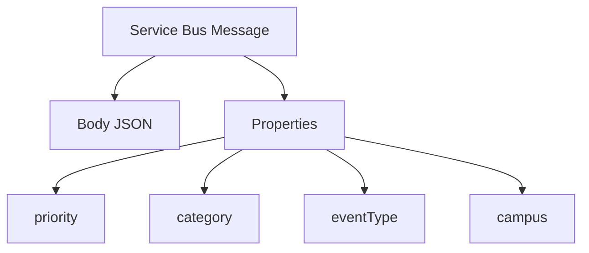

---

# 74. Ajouter Message Id

Dans les paramètres avancés :

```text
Message Id
```

utilisez la valeur :

```text
messageId
```

du `Build_Event`.

---

# 75. Ajouter Correlation Id

Dans :

```text
Correlation Id
```

utilisez :

```text
correlationId
```

du `Build_Event`.

---

# 76. Attention à la Duplicate Detection

Un **Message Id** est utile pour la traçabilité.

Service Bus peut aussi utiliser Message Id pour la détection des doublons **si cette fonctionnalité est activée sur l’entité concernée**.

Dans ce TP3 :

```text
nous n’activons pas la Duplicate Detection
```

Le Message Id sert donc principalement au suivi.

---

# 77. Étape 19 - Ajouter Response 202

Ajoutez :

```text
Response
```

Status Code :

```text
202
```

Body :

```json
{
  "status": "PUBLISHED",
  "topic": "maintenance-events"
}
```

---

# 78. Workflow publisher

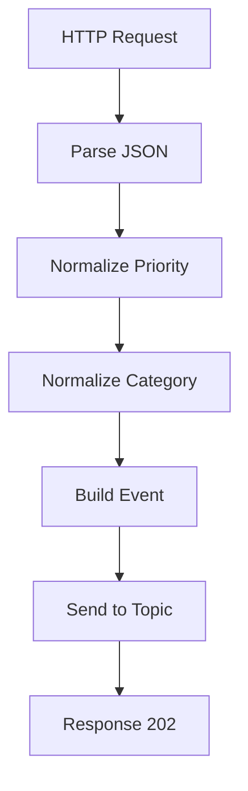

---

# 79. Ce qui a disparu par rapport au TP2

Il n’y a plus :

```text
Switch urgent
Switch standard
Default rejet
```

Le publisher ne contient plus la logique de distribution.

---

# 80. Où est le routage maintenant ?

Dans :

```text
Service Bus Subscription Rules
```

---

# 81. Étape 20 - Tester sans consommateurs

Avant de créer les Logic Apps consommatrices :

- vérifiez que les subscriptions existent ;
- vérifiez les filtres ;
- envoyez les messages ;
- observez les compteurs.

Cela facilite énormément le debug.

---

# 82. Test 1 - urgent + network

Dans Postman :

```json
{
  "ticketId": "INC-301",
  "campus": "EPSI",
  "building": "Batiment A",
  "room": "A204",
  "category": " NETWORK ",
  "priority": " UrGeNt ",
  "description": "Plus de reseau.",
  "reportedBy": {
    "email": "etudiant@example.com",
    "role": "student"
  }
}
```

---

# 83. Réponse attendue

```text
202 Accepted
```

---

# 84. Subscriptions attendues

Le message doit apparaître dans :

```text
sub-urgent
sub-network
sub-audit
```

---

# 85. Pourquoi trois copies ?

Après normalisation :

```text
priority = urgent
category = network
```

Le message correspond :

```text
UrgentOnly
NetworkOnly
TrueFilter
```

---

# 86. Test 2 - standard + network

```json
{
  "ticketId": "INC-302",
  "campus": "EPSI",
  "building": "Batiment A",
  "room": "A205",
  "category": "network",
  "priority": "standard",
  "description": "Debit reseau faible.",
  "reportedBy": {
    "email": "enseignant@example.com",
    "role": "teacher"
  }
}
```

---

# 87. Résultat attendu

Copies :

```text
sub-network
sub-audit
```

Pas de copie dans :

```text
sub-urgent
```

---

# 88. Test 3 - urgent + projector

```json
{
  "ticketId": "INC-303",
  "campus": "EPSI",
  "building": "Batiment B",
  "room": "B101",
  "category": "projector",
  "priority": "urgent",
  "description": "Videoprojecteur HS avant une soutenance.",
  "reportedBy": {
    "email": "enseignant@example.com",
    "role": "teacher"
  }
}
```

---

# 89. Résultat attendu

Copies :

```text
sub-urgent
sub-audit
```

Pas de copie dans :

```text
sub-network
```

---

# 90. Test 4 - standard + projector

```json
{
  "ticketId": "INC-304",
  "campus": "EPSI",
  "building": "Batiment B",
  "room": "B102",
  "category": "projector",
  "priority": "standard",
  "description": "Cable HDMI a remplacer.",
  "reportedBy": {
    "email": "test@example.com",
    "role": "student"
  }
}
```

---

# 91. Résultat attendu

Copie uniquement dans :

```text
sub-audit
```

---

# 92. Matrice de filtrage

| Incident | Priority | Category | sub-urgent | sub-network | sub-audit |
|---|---|---|---|---|---|
| INC-301 | urgent | network | Oui | Oui | Oui |
| INC-302 | standard | network | Non | Oui | Oui |
| INC-303 | urgent | projector | Oui | Non | Oui |
| INC-304 | standard | projector | Non | Non | Oui |

---

# 93. La matrice démontre le fan-out

Un message :

```text
peut correspondre à 0, 1 ou plusieurs subscriptions filtrées
```

et audit reçoit toujours une copie.

---

# 94. Important - la publication n’est pas multipliée

Le publisher fait :

```text
1 Send message
```

même si trois subscriptions reçoivent le message.

---

# 95. Vérifier les compteurs

Ouvrez chaque subscription.

Observez :

```text
Active message count
```

Avant la création des consommateurs, les messages doivent rester visibles.

---

# 96. Tip observation

Les compteurs du portail Azure peuvent avoir un léger délai d’actualisation.

Rechargez après quelques instants.

---

# 97. Debug - sub-urgent reçoit tout

Cause la plus probable :

```text
$Default existe encore
```

Ouvrez :

```text
sub-urgent
Filters
```

---

# 98. Debug - sub-network reçoit tout

Même diagnostic :

```text
$Default TrueFilter
```

doit être supprimé.

---

# 99. Debug - sub-audit ne reçoit rien

Vérifiez que :

```text
$Default
```

existe toujours.

---

# 100. Debug - aucune subscription ne reçoit

Vérifiez d’abord :

1. l’action **Send message** ;
2. le topic sélectionné ;
3. les Properties ;
4. le rôle Data Sender ;
5. la connexion Managed Identity.

---

# 101. Debug - audit reçoit mais pas urgent/network

C’est un diagnostic très utile.

Cela signifie souvent :

```text
publication Topic fonctionne
```

mais :

```text
les propriétés ou filtres sont incorrects
```

---

# 102. Vérifier les Properties

Dans le Run History du publisher, ouvrez l’action :

```text
Send message
```

Vérifiez que les propriétés envoyées contiennent réellement :

```text
priority = urgent
category = network
```

---

# 103. Attention à la casse

Notre filtre SQL utilise :

```sql
priority = 'urgent'
```

Nous normalisons donc avant l’envoi.

---

# 104. SQL Filter et propriétés utilisateur

Les filtres SQL Service Bus utilisent une syntaxe proche d’un sous-ensemble SQL.

Exemple :

```sql
priority = 'urgent'
```

Les propriétés personnalisées peuvent être référencées directement par leur nom.

---

# 105. Scope user explicite

On peut aussi rencontrer une syntaxe proche de :

```sql
user.priority = 'urgent'
```

Le scope utilisateur est celui de nos propriétés personnalisées.

Pour le TP, nous gardons :

```sql
priority = 'urgent'
```

plus simple.

---

# 106. Filtres composés

Un filtre peut utiliser :

```text
AND
OR
IN
NOT IN
LIKE
```

selon la syntaxe supportée par Service Bus.

---

# 107. Exemple de filtre composé

```sql
priority = 'urgent' AND category = 'network'
```

Ce filtre sélectionnerait uniquement :

```text
les incidents réseau urgents
```

---

# 108. Exercice bonus - sub-network-urgent

Créez une nouvelle subscription :

```text
sub-network-urgent
```

Supprimez `$Default`.

Ajoutez :

```sql
priority = 'urgent' AND category = 'network'
```

---

# 109. Test du filtre composé

INC-301 :

```text
urgent + network
```

doit arriver dans :

```text
sub-network-urgent
```

INC-302 :

```text
standard + network
```

ne doit pas y arriver.

---

# 110. Étape 21 - Créer la Logic App urgent

Créez :

```text
la-tp3-urgent
```

Plan :

```text
Consumption
```

---

# 111. Activer sa Managed Identity

**Settings**, puis **Identity**.

Activez :

```text
System assigned
```

---

# 112. Étape 22 - Donner Data Receiver

Idéalement, le rôle :

```text
Azure Service Bus Data Receiver
```

peut être scoped au niveau de :

```text
sub-urgent
```

Mais le **Portail Azure ne propose pas actuellement l’attribution des rôles Service Bus directement au niveau d’une topic subscription**.

Pour la méthode manuelle du TP :

attribuez le rôle au niveau du :

```text
topic maintenance-events
```

à :

```text
la-tp3-urgent
```

---

# 113. Conséquence du scope topic

La Managed Identity possède alors un droit Receive effectif sur les subscriptions du topic.

Le workflow reste cependant configuré pour lire :

```text
sub-urgent
```

> **À retenir :** c’est plus large que le privilège minimal idéal.

---

# 114. Option CLI - scope exact sub-urgent

Avec Azure CLI, vous pouvez viser la subscription exacte.

Récupérez son ID :

```bash
URGENT_SUB_ID=$(az servicebus topic subscription show \
  --resource-group rg-tp3-pubsub-si \
  --namespace-name sb-tp3-xx-12345 \
  --topic-name maintenance-events \
  --name sub-urgent \
  --query id \
  --output tsv)
```

Puis :

```bash
URGENT_MI=$(az resource show \
  --resource-group rg-tp3-pubsub-si \
  --name la-tp3-urgent \
  --resource-type Microsoft.Logic/workflows \
  --query identity.principalId \
  --output tsv)
```

Attribuez :

```bash
az role assignment create \
  --assignee-object-id "$URGENT_MI" \
  --assignee-principal-type ServicePrincipal \
  --role "Azure Service Bus Data Receiver" \
  --scope "$URGENT_SUB_ID"
```

---

# 115. Étape 23 - Trigger urgent

Dans le Designer, recherchez :

```text
Service Bus
```

Choisissez un trigger pour :

```text
topic subscription
```

par exemple :

```text
When a message is received in a topic subscription
```

ou la variante **auto-complete** proposée par le connecteur.

---

# 116. Configurer le trigger urgent

Topic :

```text
maintenance-events
```

Subscription :

```text
sub-urgent
```

Connexion :

```text
Managed Identity
```

---

# 117. Ajouter Compose urgent

Ajoutez :

```text
Compose
```

Nom :

```text
Traitement_Urgent
```

Exemple :

```json
{
  "worker": "urgent",
  "status": "PRISE_EN_CHARGE_PRIORITAIRE",
  "processedAt": "@{utcNow()}",
  "message": "@{triggerBody()}"
}
```

---

# 118. Étape 24 - Créer la Logic App network

Créez :

```text
la-tp3-network
```

Activez sa **Managed Identity**.

---

# 119. Donner Data Receiver à network

Méthode manuelle :

attribuez :

```text
Azure Service Bus Data Receiver
```

au niveau du :

```text
topic maintenance-events
```

à :

```text
la-tp3-network
```

---

# 120. Option CLI - scope exact sub-network

```bash
NETWORK_SUB_ID=$(az servicebus topic subscription show \
  --resource-group rg-tp3-pubsub-si \
  --namespace-name sb-tp3-xx-12345 \
  --topic-name maintenance-events \
  --name sub-network \
  --query id \
  --output tsv)
```

Puis assignez Data Receiver à cet ID.

---

# 121. Trigger network

Configurez :

```text
Topic
maintenance-events

Subscription
sub-network
```

Connexion :

```text
Managed Identity
```

---

# 122. Compose network

Nom :

```text
Traitement_Network
```

Exemple :

```json
{
  "worker": "network",
  "status": "PRISE_EN_CHARGE_RESEAU",
  "processedAt": "@{utcNow()}",
  "message": "@{triggerBody()}"
}
```

---

# 123. Architecture avec consommateurs

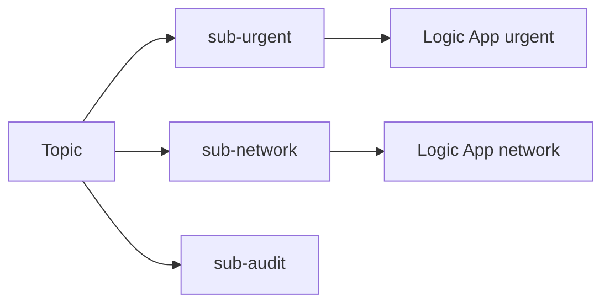

---

# 124. Pourquoi ne pas créer un consumer audit obligatoire ?

Nous voulons conserver :

```text
sub-audit
```

comme backlog visible.

Cela facilite l’observation du fait que :

```text
audit reçoit tous les messages
```

---

# 125. Bonus - Logic App audit

Si vous avez le temps :

créez :

```text
la-tp3-audit
```

et consommez :

```text
sub-audit
```

---

# 126. Étape 25 - Tester avec consumers actifs

Envoyez à nouveau :

```text
INC-301 urgent + network
```

---

# 127. Résultat attendu

La Logic App urgent traite une copie.

La Logic App network traite une copie.

`sub-audit` conserve une copie si aucun consumer audit n’est actif.

---

# 128. Le même message est traité par deux workflows

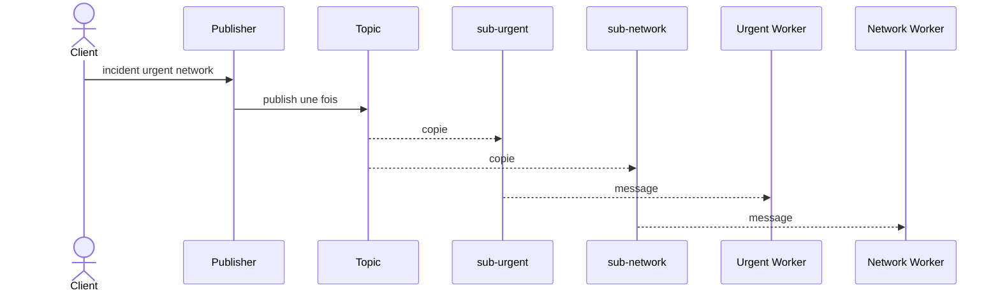

---

# 129. Question 1

Le publisher a-t-il envoyé deux messages ?

**Réponse :**

Non.

Il a envoyé **un seul message au topic**.

Service Bus a créé des copies pour les subscriptions correspondantes.

---

# 130. Question 2

Pourquoi ce modèle découple davantage le producteur ?

**Réponse :**

Parce que le publisher ne connaît pas les consommateurs ni leurs subscriptions.

Il connaît seulement :

```text
maintenance-events
```

---

# 131. Question 3

Que se passe-t-il si une nouvelle équipe veut tous les incidents urgents ?

**Réponse :**

On peut ajouter une nouvelle subscription avec son propre filtre et son propre consumer.

Le publisher n’a pas besoin d’être modifié.

---

# 132. C’est l’un des intérêts principaux du Pub/Sub

```text
ajouter un subscriber
```

ne nécessite pas forcément :

```text
modifier le publisher
```

---

# 133. Étape 26 - Simuler une panne du consumer network

Désactivez :

```text
la-tp3-network
```

Laissez :

```text
la-tp3-urgent
```

active.

---

# 134. Envoyer un incident urgent network

Envoyez :

```text
priority = urgent
category = network
```

---

# 135. Résultat attendu

`sub-urgent` :

```text
consommée par la-tp3-urgent
```

`sub-network` :

```text
message reste en attente
```

`sub-audit` :

```text
message reste en attente
```

---

# 136. Panne partielle


---

# 137. Question 4

La panne network bloque-t-elle urgent ?

**Réponse :**

Non.

Chaque subscription possède son propre état et son propre backlog.

---

# 138. Question 5

La panne network empêche-t-elle l’audit de recevoir sa copie ?

**Réponse :**

Non.

Les subscriptions sont indépendantes.

---

# 139. Réactiver network

Réactivez :

```text
la-tp3-network
```

Le backlog de `sub-network` doit diminuer.

---

# 140. Étape 27 - Observer les Run Histories

Ouvrez :

```text
la-tp3-publisher
```

puis le dernier run.

Vérifiez :

- normalisation ;
- Build_Event ;
- Send message ;
- Response.

---

# 141. Observer le consumer urgent

Ouvrez :

```text
la-tp3-urgent
```

Vérifiez le run correspondant.

---

# 142. Observer le consumer network

Ouvrez :

```text
la-tp3-network
```

Vérifiez le run correspondant.

---

# 143. Utiliser Correlation Id pour relier les traces

Si vous avez propagé le Correlation Id :

vous pouvez identifier le même incident dans plusieurs workflows.

---

# 144. Pourquoi c’est important ?

Avec Pub/Sub, un même événement peut être traité par :

```text
2
3
10
20
```

consommateurs.

Un identifiant commun facilite énormément le diagnostic.

---

# 145. Debug - publisher 202 mais aucune subscription

Commencez par vérifier :

```text
Send message
```

dans le Run History.

Puis vérifiez :

```text
Topic name
```

---

# 146. Debug - audit fonctionne mais filtres non

Cela indique généralement que :

```text
le topic reçoit bien
```

mais que :

```text
Properties ou Rules sont incorrectes
```

---

# 147. Debug - `$Default` oublié

Symptôme :

```text
sub-urgent reçoit standard
```

ou :

```text
sub-network reçoit projector
```

Vérifiez les Filters.

---

# 148. Debug - règle supprimée sans remplacement

Symptôme :

```text
subscription ne reçoit plus rien
```

Vérifiez qu’une règle comme :

```text
UrgentOnly
```

existe réellement.

---

# 149. Debug - typo dans Property

Supposons que le message contient :

```text
priority
```

mais le filtre teste :

```text
Priority
```

Le filtre peut ne pas correspondre.

Gardez les noms cohérents.

---

# 150. Debug - propriété uniquement dans le body

Symptôme :

```text
body contient urgent
mais sub-urgent reste vide
```

Vérifiez que `priority` est aussi présente dans :

```text
Properties
```

du message Service Bus.

---

# 151. Debug - 401 ou 403 publisher

Vérifiez :

- Managed Identity ;
- **Data Sender** ;
- scope topic ;
- connexion Service Bus ;
- propagation RBAC.

---

# 152. Debug - 401 ou 403 consumer

Vérifiez :

- Managed Identity du consumer ;
- **Data Receiver** ;
- scope effectif sur la subscription ;
- connexion ;
- propagation RBAC.

---

# 153. Important - scope Receiver

Microsoft recommande le scope le plus étroit possible.

Un rôle Receiver peut être scoped :

- queue ;
- topic ;
- topic subscription ;
- namespace.

---

# 154. Limite du Portail Azure

Pour une **topic subscription**, le Portail Azure ne propose pas actuellement toujours ce niveau comme scope d’attribution Service Bus.

C’est pourquoi le TP manuel utilise le scope :

```text
topic
```

et la CLI est montrée pour le scope exact.

---

# 155. Debug - la subscription n’apparaît pas dans le connecteur

Vérifiez :

- topic correct ;
- identité et droits ;
- connexion Service Bus ;
- région ;
- actualisez le Designer.

---

# 156. Debug - Message Id vide

Vérifiez le paramètre avancé :

```text
Message Id
```

dans l’action Send message.

---

# 157. Debug - Correlation Id non visible

Vérifiez :

```text
Correlation Id
```

dans les propriétés avancées du message.

---

# 158. Exercice guidé 1 - vérifier la matrice

Envoyez les quatre incidents :

```text
INC-301
INC-302
INC-303
INC-304
```

Comparez les compteurs des trois subscriptions.

---

# 159. Exercice guidé 2 - filtre electrical

Créez :

```text
sub-electrical
```

Filtre :

```sql
category = 'electricity'
```

---

# 160. Pourquoi cet exercice est important ?

Vous ajoutez un nouveau subscriber sans modifier :

```text
la-tp3-publisher
```

C’est exactement le découplage recherché.

---

# 161. Exercice guidé 3 - filtre OR

Créez :

```text
sub-infrastructure
```

Expression :

```sql
category = 'network' OR category = 'electricity'
```

---

# 162. Résultat attendu

Cette subscription reçoit les incidents :

```text
network
```

et :

```text
electricity
```

---

# 163. Exercice guidé 4 - filtre IN

Si votre syntaxe est acceptée par votre environnement, testez :

```sql
category IN ('network', 'electricity', 'projector')
```

---

# 164. Exercice guidé 5 - filtre avec priorité

Créez :

```text
sub-high-impact
```

Expression :

```sql
priority = 'urgent' AND category IN ('network', 'electricity')
```

---

# 165. Exercice guidé 6 - Correlation filter

Service Bus propose aussi des **Correlation Filters**.

Ils sont utiles pour des correspondances d’égalité sur :

- `CorrelationId` ;
- `MessageId` ;
- `Subject` ;
- certaines propriétés personnalisées.

---

# 166. SQL Filter et Correlation Filter

**SQL Filter** :

plus expressif.

**Correlation Filter** :

adapté à des correspondances d’égalité et généralement plus efficace pour ces scénarios.

---

# 167. Exemple pédagogique CorrelationId

Vous pourriez créer une règle qui ne reçoit que :

```text
CorrelationId = "EPSI-DEMO"
```

pour isoler un flux de démonstration.

*Exercice facultatif.*

---

# 168. Exercice guidé 7 - observer audit

Ne consommez pas `sub-audit`.

Envoyez dix incidents variés.

Vérifiez :

```text
sub-audit contient dix copies environ
```

---

# 169. Pourquoi environ ?

Les compteurs du portail peuvent avoir un léger délai.

De plus, si un consumer audit existe par erreur, il peut vider la subscription.

---

# 170. Exercice guidé 8 - consumer audit bonus

Créez :

```text
la-tp3-audit
```

avec :

```text
sub-audit
```

Puis affichez simplement chaque message dans un Compose.

---

# 171. Le fan-out complet

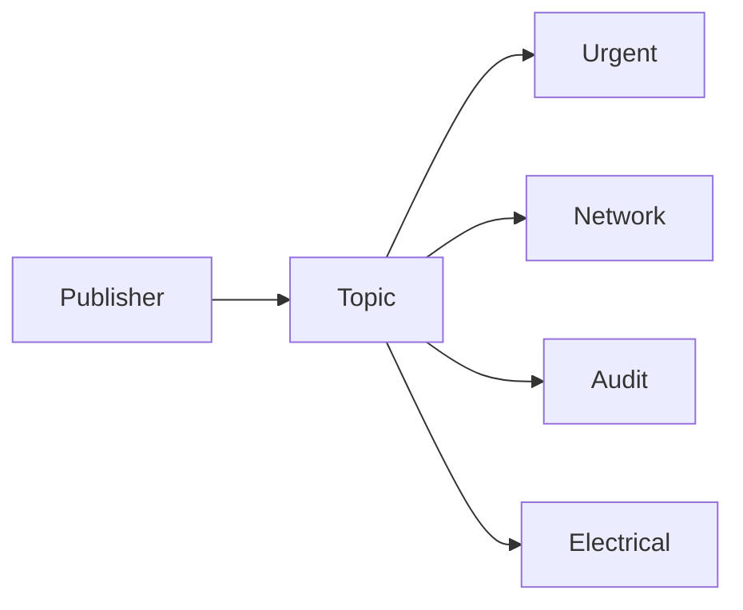

---

# 172. Question 6

Pourquoi le topic est-il plus extensible que le Switch du TP2 ?

**Réponse :**

Parce qu’on peut ajouter ou modifier des subscriptions sans modifier le workflow publisher.

---

# 173. Question 7

Une subscription est-elle seulement un filtre temporaire ?

**Réponse :**

Non.

C’est une entité durable qui conserve les messages qui lui sont destinés jusqu’à leur consommation ou expiration.

---

# 174. Question 8

Pourquoi faut-il des Properties séparées du body ?

**Réponse :**

Parce que les règles du broker peuvent utiliser ces métadonnées pour sélectionner les messages.

---

# 175. Question 9

Pourquoi garder le body JSON complet ?

**Réponse :**

Les Properties servent au routage et à la métadonnée.

Le body transporte le contenu métier complet.

---

# 176. Question 10

Pourquoi audit utilise TrueFilter ?

**Réponse :**

Parce que nous voulons conserver une copie de tous les événements publiés.

---

# 177. Publish/Subscribe et évolutivité

Un producteur peut publier sans connaître :

- le nombre d’abonnés ;
- leurs technologies ;
- leur disponibilité ;
- leur fréquence de traitement.

---

# 178. Attention à la multiplication des copies

Chaque subscription correspondante reçoit une copie.

Plus vous avez de subscriptions :

```text
plus vous pouvez multiplier le volume total stocké et traité
```

---

# 179. Exemple

100 messages publiés.

10 subscriptions avec TrueFilter.

Potentiellement :

```text
1000 copies à traiter
```

---

# 180. Le Pub/Sub apporte de la souplesse mais pas gratuitement

Il faut surveiller :

- nombre de subscriptions ;
- règles ;
- consommateurs ;
- coûts ;
- volume ;
- observabilité.

---

# 181. Subscription backlog

Chaque subscription a son propre backlog.

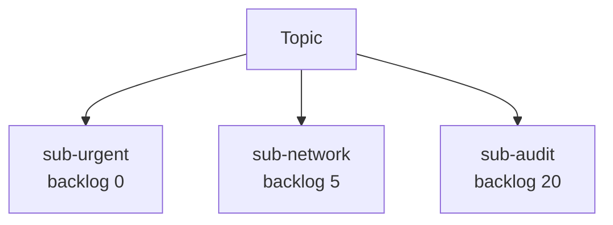

---

# 182. Panne d’un subscriber

La panne d’un consumer n’empêche pas les autres subscriptions de continuer.

C’est un avantage majeur.

---

# 183. Filtres système

Les règles peuvent également utiliser certaines propriétés système.

Exemples :

```text
MessageId
CorrelationId
Subject / Label
```

---

# 184. Exemple SQL sur une propriété système

Selon la propriété :

```sql
sys.CorrelationId = 'CORR-123'
```

ou une syntaxe adaptée à la propriété Service Bus concernée.

---

# 185. Ne mélangez pas toutes les responsabilités

Évitez de mettre :

- toute la logique métier ;
- tout le routage ;
- toutes les transformations ;

dans une seule règle SQL complexe.

---

# 186. Bon équilibre pédagogique

Dans ce TP :

**Logic Apps** fait :

- validation ;
- normalisation ;
- transformation.

**Service Bus** fait :

- duplication ;
- filtrage ;
- distribution.

---

# 187. Répartition des responsabilités

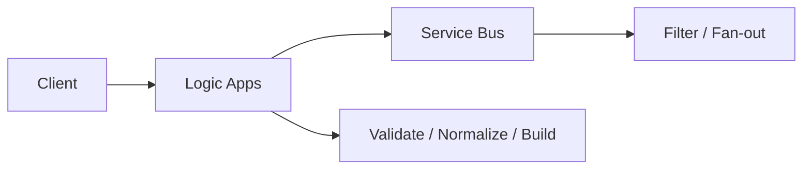

---

# 188. Azure CLI - rôle dans le TP3

Azure CLI reste **optionnel**.

Il devient cependant particulièrement intéressant pour :

- créer les subscriptions ;
- gérer les rules ;
- attribuer un rôle au scope exact d’une subscription ;
- lister les filtres.

---

# 189. CLI - lister les topics

```bash
az servicebus topic list \
  --resource-group rg-tp3-pubsub-si \
  --namespace-name sb-tp3-xx-12345 \
  --output table
```

---

# 190. CLI - lister les subscriptions

```bash
az servicebus topic subscription list \
  --resource-group rg-tp3-pubsub-si \
  --namespace-name sb-tp3-xx-12345 \
  --topic-name maintenance-events \
  --output table
```

---

# 191. CLI - lister les règles urgent

```bash
az servicebus topic subscription rule list \
  --resource-group rg-tp3-pubsub-si \
  --namespace-name sb-tp3-xx-12345 \
  --topic-name maintenance-events \
  --subscription-name sub-urgent \
  --output table
```

---

# 192. CLI - lister les règles network

```bash
az servicebus topic subscription rule list \
  --resource-group rg-tp3-pubsub-si \
  --namespace-name sb-tp3-xx-12345 \
  --topic-name maintenance-events \
  --subscription-name sub-network \
  --output table
```

---

# 193. CLI - debug complet d’une règle

```bash
az servicebus topic subscription rule show \
  --resource-group rg-tp3-pubsub-si \
  --namespace-name sb-tp3-xx-12345 \
  --topic-name maintenance-events \
  --subscription-name sub-urgent \
  --name UrgentOnly \
  --output jsonc
```

---

# 194. CLI - afficher les subscriptions et compteurs

```bash
az servicebus topic subscription list \
  --resource-group rg-tp3-pubsub-si \
  --namespace-name sb-tp3-xx-12345 \
  --topic-name maintenance-events \
  --query '[].{name:name,active:countDetails.activeMessageCount,dead:countDetails.deadLetterMessageCount}' \
  --output table
```

---

# 195. Debug méthodique

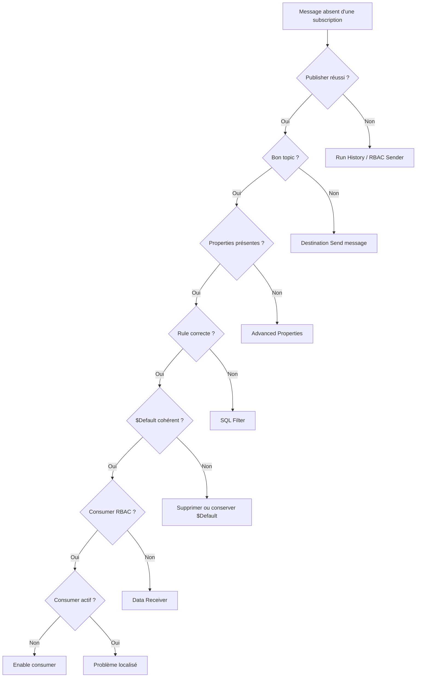

---

# 196. Tip debug

Pour tester les filtres :

**désactivez d’abord les consumers.**

Ainsi :

```text
les messages restent visibles dans les subscriptions
```

---

# 197. Tip filters

Ne commencez pas avec une expression complexe.

Testez d’abord :

```sql
priority = 'urgent'
```

puis augmentez progressivement la complexité.

---

# 198. Tip `$Default`

Le bug le plus classique du TP3 est :

```text
j’ai mis un filtre mais tout arrive quand même
```

Première question :

```text
$Default existe encore ?
```

---

# 199. Tip Properties

Le deuxième bug classique est :

```text
le body a la bonne valeur mais aucun filtre ne matche
```

Première question :

```text
la valeur est-elle dans les Properties du message ?
```

---

# 200. Tip RBAC

Le troisième bug classique est :

```text
la subscription contient des messages mais le consumer ne lit rien
```

Vérifiez :

```text
Data Receiver
```

et le scope effectif.

---

# 201. Tip coût

Le TP3 nécessite **Service Bus Standard**.

Ne laissez pas inutilement le namespace actif après la séance si vous utilisez un abonnement personnel.

---

# 202. Tip EPSI

Pour une classe entière, l’approche la plus simple peut être :

- un namespace Standard fourni par l’école ;
- des topics ou groupes de ressources séparés par groupe ;
- permissions adaptées par l’enseignant.

---

# 203. Codes HTTP du publisher

| Code | Signification |
|---|---|
| **`202`** | message publié dans le topic |
| **`400`** | contrat HTTP invalide |
| **`401/403`** | problème Managed Identity / RBAC vers Service Bus |
| **`500/502`** | erreur technique selon la gestion du workflow |

---

# 204. `202` ne garantit pas tous les traitements

Le publisher sait :

```text
message publié au topic
```

Il ne sait pas nécessairement :

```text
tous les subscribers ont terminé
```

---

# 205. C’est encore plus vrai avec Pub/Sub

Avec dix subscribers :

un `202` côté publisher ne signifie pas que :

```text
10 traitements aval sont terminés
```

---

# 206. Résilience

Une subscription peut accumuler du backlog sans bloquer les autres.

---

# 207. Évolutivité organisationnelle

Vous pouvez ajouter :

```text
sub-security
sub-reporting
sub-notification
sub-datawarehouse
```

sans nécessairement modifier le publisher.

---

# 208. Risque de couplage par propriétés

Si tous vos filtres dépendent de :

```text
priority
category
```

ces propriétés deviennent une partie importante de votre **contrat événementiel**.

---

# 209. Versionner le contrat

Nous avons ajouté :

```text
schemaVersion = 1
```

dans le body.

Dans un système réel, vous devez prévoir l’évolution du schéma.

---

# 210. Bonus - property schemaVersion

Ajoutez aussi :

```text
schemaVersion
```

dans les Properties Service Bus.

Vous pourriez ensuite créer une subscription filtrée sur :

```sql
schemaVersion = 1
```

---

# 211. Attention aux types dans les Properties

Un filtre numérique doit comparer une valeur numérique.

Un filtre chaîne compare une chaîne.

Soyez cohérents avec le type de propriété publié.

---

# 212. Bonus - propriété numeric severity

Ajoutez :

```text
severity = 1
```

pour urgent.

Puis créez :

```sql
severity <= 2
```

*Exercice facultatif.*

---

# 213. SQL Filter : syntaxe partielle

Service Bus supporte un sous-ensemble SQL pour ses règles.

On peut notamment rencontrer :

```text
=
<>
>
>=
<
<=
AND
OR
IN
NOT IN
LIKE
IS NULL
```

---

# 214. Ne traitez pas SQL Filter comme une base SQL

Il ne s’agit pas :

```text
d’un SELECT sur une table
```

Il s’agit :

```text
d’une expression de filtrage sur un message
```

---

# 215. Cleanup - important

À la fin du TP :

- désactivez les consumers ;
- vérifiez le Resource Group ;
- supprimez le Resource Group si autorisé.

---

# 216. Pourquoi le nettoyage est encore plus important au TP3 ?

Parce que nous utilisons :

```text
Service Bus Standard
```

et plusieurs Logic Apps / subscriptions.

---

# 217. Vérifier le contenu du Resource Group

Ouvrez :

```text
rg-tp3-pubsub-si
```

Vérifiez qu’il contient uniquement les ressources du TP3.

---

# 218. Supprimer le Resource Group

Cliquez sur :

```text
Delete resource group
```

Confirmez.

---

## Équivalent CLI - optionnel

```bash
az group delete \
  --name rg-tp3-pubsub-si \
  --yes
```

---

# 219. Tips de fin de TP

Retenez :

1. **Une queue est adaptée au point-to-point.**
2. **Un topic est adapté au publish/subscribe.**
3. **Une subscription est une file virtuelle indépendante.**
4. **Un message peut être copié vers plusieurs subscriptions.**
5. **Les filters travaillent sur les propriétés du message.**
6. **`$Default` accepte tout.**
7. **Supprimez `$Default` lorsque vous voulez un filtrage exclusif.**
8. **Normalisez les propriétés avant publication.**
9. **Utilisez Message Id et Correlation Id.**
10. **Chaque subscription possède son propre backlog.**
11. **Une panne d’un subscriber ne bloque pas les autres.**
12. **Le publisher ne doit pas connaître tous les subscribers.**
13. **Appliquez le Least Privilege.**
14. **Surveillez les coûts du niveau Standard.**
15. **Nettoyez les ressources en fin de TP.**

---

# 220. Tip soutenance

Si on vous demande :

*« Quelle est la différence fondamentale entre le TP2 et le TP3 ? »*

répondez :

> Dans le TP2, la **Logic App routeur choisissait explicitement la destination**. Dans le TP3, le publisher publie une seule fois sur un **Topic** et **Service Bus distribue les copies aux Subscriptions selon leurs Filters**.

---

# 221. Checklist finale

- [ ] J’ai créé un Resource Group dédié.
- [ ] J’ai créé un namespace **Service Bus Standard**.
- [ ] Je sais pourquoi Basic ne suffit pas.
- [ ] J’ai créé le topic `maintenance-events`.
- [ ] J’ai créé `sub-urgent`.
- [ ] J’ai créé `sub-network`.
- [ ] J’ai créé `sub-audit`.
- [ ] Je sais expliquer `$Default`.
- [ ] J’ai supprimé `$Default` de `sub-urgent`.
- [ ] J’ai supprimé `$Default` de `sub-network`.
- [ ] J’ai conservé `$Default` sur `sub-audit`.
- [ ] J’ai créé `UrgentOnly`.
- [ ] J’ai créé `NetworkOnly`.
- [ ] Je sais expliquer un SQL Filter.
- [ ] J’ai créé `la-tp3-publisher`.
- [ ] J’ai activé sa Managed Identity.
- [ ] J’ai attribué Data Sender.
- [ ] J’ai créé le trigger HTTP.
- [ ] J’ai activé Schema Validation.
- [ ] J’ai normalisé priority.
- [ ] J’ai normalisé category.
- [ ] J’ai construit un événement interne.
- [ ] J’ai ajouté Message Id.
- [ ] J’ai ajouté Correlation Id.
- [ ] J’ai ajouté des Properties personnalisées.
- [ ] J’ai publié une seule fois dans le topic.
- [ ] J’ai testé urgent + network.
- [ ] J’ai vérifié les trois copies.
- [ ] J’ai testé standard + network.
- [ ] J’ai testé urgent + projector.
- [ ] J’ai testé standard + projector.
- [ ] J’ai créé le consumer urgent.
- [ ] J’ai créé le consumer network.
- [ ] J’ai attribué Data Receiver.
- [ ] J’ai simulé une panne partielle.
- [ ] J’ai observé des backlogs indépendants.
- [ ] Je sais expliquer Publish/Subscribe.
- [ ] Je sais expliquer queue vs topic.
- [ ] Je sais expliquer body vs Properties.
- [ ] Je sais expliquer pourquoi un subscriber peut être ajouté sans modifier le publisher.
- [ ] J’ai supprimé les ressources à la fin.

---

# 222. Résumé final

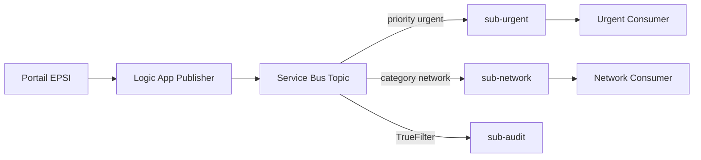

Le point essentiel du TP3 est :

> **Le Publish/Subscribe permet à un producteur de publier un événement une seule fois, puis au broker de créer et distribuer des copies vers plusieurs abonnés indépendants selon leurs règles de filtrage.**

---

# 223. Références Microsoft

Documentation utile :

- **Service Bus Topics et Subscriptions** :  
  `https://learn.microsoft.com/azure/service-bus-messaging/service-bus-queues-topics-subscriptions`

- **Créer Topics et Subscriptions dans le portail** :  
  `https://learn.microsoft.com/azure/service-bus-messaging/service-bus-quickstart-topics-subscriptions-portal`

- **Filtres de subscriptions** :  
  `https://learn.microsoft.com/azure/service-bus-messaging/service-bus-filter-examples`

- **Syntaxe SQL Filter** :  
  `https://learn.microsoft.com/azure/service-bus-messaging/service-bus-messaging-sql-filter`

- **Logic Apps avec Service Bus** :  
  `https://learn.microsoft.com/azure/connectors/connectors-create-api-servicebus`

- **Référence connecteur Service Bus** :  
  `https://learn.microsoft.com/connectors/servicebus/`

- **Managed Identity avec Service Bus** :  
  `https://learn.microsoft.com/azure/service-bus-messaging/service-bus-managed-service-identity`

- **Azure CLI Topics** :  
  `https://learn.microsoft.com/cli/azure/servicebus/topic`

- **Azure CLI Subscriptions** :  
  `https://learn.microsoft.com/cli/azure/servicebus/topic/subscription`

- **Azure CLI Subscription Rules** :  
  `https://learn.microsoft.com/cli/azure/servicebus/topic/subscription/rule`

- **Azure for Students** :  
  `https://learn.microsoft.com/azure/education-hub/about-azure-for-students`

- **Tarification Service Bus** :  
  `https://azure.microsoft.com/pricing/details/service-bus/`

- **Tarification Logic Apps** :  
  `https://azure.microsoft.com/pricing/details/logic-apps/`
