# TP 4 - Fiabilité des traitements avec Azure Service Bus : Peek-Lock, Complete, Abandon et Dead-Letter - EPSI

**Niveau :** *intermédiaire à avancé* 

**Durée indicative :** *3 h à 4 h*  

**Mode principal :** **Portail Azure** 

**Mode secondaire :** *Azure CLI, uniquement en option et à titre de comparaison*  

**Architecture :** **Logic Apps Consumption**, **Azure Service Bus Basic**, **Peek-Lock**, **Complete**, **Abandon**, **Dead-letter**, **Delivery Count**, **DLQ**, **Managed Identity** et **RBAC**  

**Public visé :** *étudiants EPSI disposant d’un compte Azure personnel, Azure for Students ou d’un abonnement Azure fourni par l’établissement.*

---

# 1. Objectifs du TP

À la fin de ce TP, vous devez être capables de :

- comprendre pourquoi **recevoir un message** ne signifie pas qu’il a été correctement traité ;
- comprendre le mode **Peek-Lock** ;
- distinguer :
  - **Complete** ;
  - **Abandon** ;
  - **Dead-letter** ;
- utiliser le **Lock Token** ;
- comprendre le **Lock Duration** ;
- comprendre le **Delivery Count** ;
- configurer un **Max Delivery Count** ;
- observer une **redélivrance** ;
- provoquer un passage automatique en **Dead-Letter Queue** ;
- provoquer un passage explicite en DLQ ;
- inspecter la DLQ avec **Service Bus Explorer** ;
- comprendre pourquoi une DLQ n’est pas une queue métier normale ;
- comprendre la différence entre :
  - erreur temporaire ;
  - erreur permanente ;
  - message traité avec succès ;
- créer une Logic App productrice ;
- créer une Logic App consommatrice en **Peek-Lock** ;
- appliquer **Managed Identity** et **RBAC** ;
- observer le comportement d’un message en échec ;
- simuler une panne du consumer ;
- comprendre le risque de **double traitement** ;
- comprendre pourquoi l’**idempotence** devient nécessaire ;
- réinjecter un message corrigé depuis la DLQ ;
- utiliser Azure CLI uniquement comme *équivalent optionnel*.

---

# 2. Position du TP4 dans la progression

Le TP1 a introduit :

```text
Queue
Producteur
Consommateur
```

Le TP2 a ajouté :

```text
Transformation
Normalisation
Routage
Plusieurs queues
```

Le TP3 a ajouté :

```text
Topic
Subscriptions
Filters
Publish/Subscribe
```

Le TP4 s’intéresse maintenant à une question différente :

```text
Que se passe-t-il quand le traitement d'un message échoue ?
```

---

# 3. Idée principale

Dans les TP précédents, nous avons surtout vérifié :

```text
le message arrive
```

Dans ce TP, nous allons vérifier :

```text
le message a-t-il réellement été traité ?
```

---

# 4. Scénario métier

EPSI dispose d’un flux de maintenance.

Une demande est envoyée dans une queue :

```text
maintenance-processing
```

La Logic App consommatrice doit ensuite simuler trois situations :

```text
success
temporary_error
permanent_error
```

---

# 5. Signification des trois scénarios

## `success`

Le traitement métier réussit.

Action attendue :

```text
Complete
```

Le message est considéré comme terminé.

## `temporary_error`

Le problème est supposé temporaire.

Exemples :

- API externe momentanément indisponible ;
- timeout ;
- erreur réseau ;
- service occupé.

Action attendue :

```text
Abandon
```

Le message pourra être redélivré.

## `permanent_error`

Le message ne pourra pas être traité correctement sans intervention.

Exemples :

- identifiant métier impossible ;
- format fonctionnel non supporté ;
- équipement inconnu ;
- donnée incohérente.

Action attendue :

```text
Dead-letter
```

---

# 6. Architecture générale

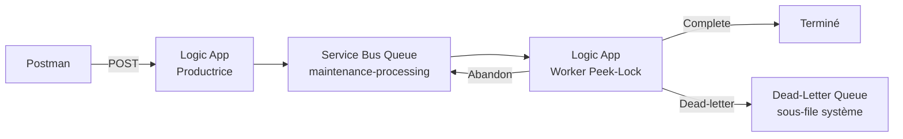

> **À retenir :** le message n’est retiré définitivement de la queue principale qu’après un **settlement** approprié, par exemple **Complete**.

---

# 7. Qu’est-ce que Peek-Lock ?

Avec **Peek-Lock**, le message est :

1. reçu ;
2. verrouillé temporairement ;
3. laissé dans Service Bus pendant le traitement ;
4. supprimé seulement après **Complete**.

---

# 8. Diagramme Peek-Lock

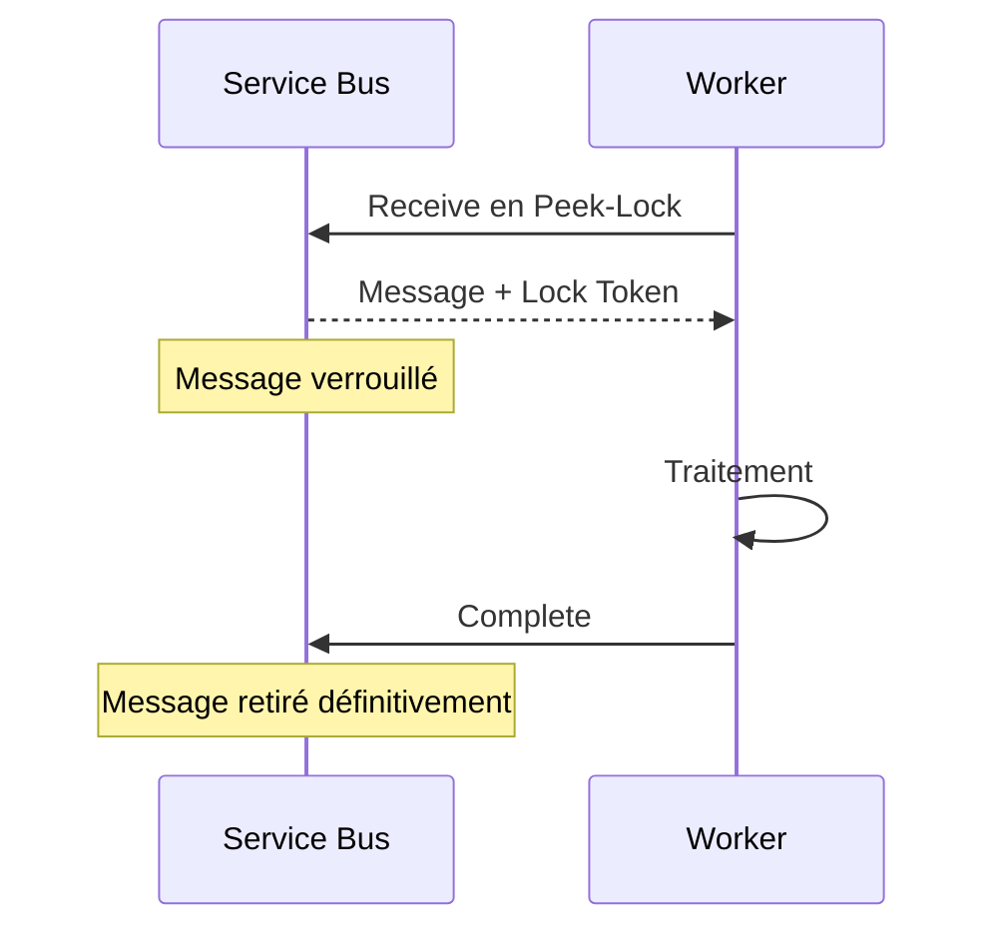

---

# 9. Pourquoi verrouiller le message ?

Pendant le traitement, nous voulons éviter qu’un autre consumer travaille immédiatement sur le même message.

Le **lock** réserve temporairement ce message à un receiver.

---

# 10. Peek-Lock et Receive-and-Delete

Deux philosophies existent.

## Peek-Lock

Le message reste récupérable tant qu’il n’est pas complété.

Avantage :

```text
risque de perte réduit
```

Inconvénient :

```text
redélivrance possible
```

## Receive-and-Delete

Le message est supprimé dès sa réception.

Avantage :

```text
simple et rapide
```

Inconvénient :

```text
si le consumer plante ensuite, le message est perdu
```

---

# 11. Choix du TP

Nous utiliserons :

```text
Peek-Lock
```

car le but est d’étudier la fiabilité.

---

# 12. Les quatre settlements importants

Dans ce TP, retenez :

| Action | Effet |
|---|---|
| **Complete** | traitement terminé, message retiré |
| **Abandon** | traitement non terminé, message redevient disponible |
| **Dead-letter** | message déplacé vers la DLQ |
| **Defer** | message conservé pour traitement différé avec son sequence number |

**Defer** sera seulement présenté en bonus.

---

# 13. Complete

Utilisez **Complete** lorsque :

```text
le traitement métier est réellement terminé
```

Après Complete :

```text
le message ne doit plus être reçu normalement
```

---

# 14. Abandon

Utilisez **Abandon** lorsque :

```text
le traitement n'a pas abouti
mais
une nouvelle tentative est pertinente
```

Service Bus pourra redélivrer le message.

---

# 15. Dead-letter

Utilisez **Dead-letter** lorsque :

```text
continuer à retenter automatiquement n'a pas de sens
```

Le message quitte la file principale et rejoint :

```text
la Dead-Letter Queue
```

---

# 16. Dead-Letter Queue

Chaque queue Service Bus possède une sous-file système :

```text
Dead-Letter Queue
```

Elle n’a pas besoin d’être créée séparément.

---

# 17. La DLQ n’est pas une queue séparée classique

Elle appartient à :

```text
maintenance-processing
```

Conceptuellement :

```text
maintenance-processing
maintenance-processing/$deadletterqueue
```

---

# 18. Pourquoi une DLQ ?

Elle permet de conserver les messages :

- impossibles à traiter ;
- ayant trop échoué ;
- nécessitant une intervention ;
- devant être analysés.

---

# 19. La DLQ n’est pas une poubelle

Une bonne équipe doit :

- surveiller la DLQ ;
- comprendre pourquoi les messages y arrivent ;
- corriger la cause ;
- éventuellement réinjecter les messages.

---

# 20. Aucun nettoyage automatique de la DLQ

Les messages de DLQ ne disparaissent pas simplement parce que du temps passe.

Ils doivent être :

- analysés ;
- complétés ;
- réinjectés ;
- ou supprimés volontairement.

---

# 21. Delivery Count

Service Bus associe un compteur :

```text
Delivery Count
```

au message.

Il indique le nombre de tentatives de livraison.

---

# 22. Quand Delivery Count augmente-t-il ?

Le compteur augmente notamment lorsque :

- le message est abandonné ;
- le lock expire avant settlement.

---

# 23. Max Delivery Count

Une queue possède un paramètre :

```text
Max Delivery Count
```

Lorsque la limite est atteinte, Service Bus peut déplacer automatiquement le message en DLQ.

---

# 24. Valeur du TP

Nous utiliserons :

```text
Max Delivery Count = 3
```

Pourquoi une valeur faible ?

Pour observer le comportement pendant une séance.

---

# 25. Valeur par défaut

La valeur par défaut de Service Bus est généralement :

```text
10
```

Dans un système réel, la bonne valeur dépend :

- du type d’erreur ;
- de la fréquence des pannes ;
- du coût d’un retry ;
- du temps acceptable.

---

# 26. Lock Duration

Une queue possède également :

```text
Lock Duration
```

La valeur par défaut est généralement :

```text
1 minute
```

et la valeur maximale configurable pour un lock Service Bus est de :

```text
5 minutes
```

---

# 27. Que se passe-t-il si le lock expire ?

Si le traitement n’a pas été settled avant expiration :

```text
le message peut être redélivré
```

---

# 28. Pourquoi cela peut produire un doublon ?

Imaginez :

1. le traitement externe a réussi ;
2. le worker n’a pas encore envoyé Complete ;
3. le lock expire ;
4. le message est redélivré.

Le traitement métier peut être exécuté une deuxième fois.

---

# 29. C’est pourquoi l’idempotence devient importante

Un consumer robuste doit idéalement supporter :

```text
même message reçu plusieurs fois
```

sans créer :

```text
plusieurs effets métier indésirables
```

---

# 30. Exemple

Le message demande :

```text
créer une intervention
```

Sans idempotence :

```text
2 livraisons
2 interventions
```

Avec idempotence :

```text
2 livraisons
1 intervention métier
```

---

# 31. Niveau Service Bus utilisé

Nous utiliserons :

```text
Service Bus Basic
```

car le TP utilise :

```text
une queue
Peek-Lock
settlement
DLQ
```

Nous n’avons pas besoin de Topic/Subscriptions dans le scénario principal.

---

# 32. Si EPSI fournit déjà Standard

Vous pouvez utiliser :

```text
Standard
```

sans problème.

Le scénario du TP reste identique.

---

# 33. Coûts étudiants

Pour limiter les coûts :

- une seule queue ;
- quelques dizaines de messages ;
- deux Logic Apps ;
- **Basic** si vous créez votre propre namespace ;
- suppression du Resource Group à la fin.

---

# 34. Azure for Students

L’offre **Azure for Students** fournit actuellement **100 USD de crédit Azure**, valable pendant **un an**, aux étudiants éligibles, *sans carte bancaire requise*.

*Les offres peuvent évoluer.*

---

# 35. Comptes EPSI restreints

Si vous ne pouvez pas effectuer :

```text
Add role assignment
```

l’enseignant doit :

- attribuer les rôles ;
- ou fournir des ressources préconfigurées.

---

# 36. Ressources du TP

Nous allons créer :

```text
Resource Group
rg-tp4-resilience-si

Service Bus Namespace
sb-tp4-<initiales>-<nombre>

Queue
maintenance-processing

Logic Apps
la-tp4-producteur
la-tp4-worker
```

---

# 37. Paramètres principaux de la queue

Nous voulons :

```text
Lock Duration = 1 minute
Max Delivery Count = 3
```

---

# 38. Étape 1 - Créer le Resource Group

Dans le Portail Azure :

```text
Resource groups
```

Cliquez sur **Create**.

Renseignez :

| Paramètre | Valeur |
|---|---|
| Resource Group | `rg-tp4-resilience-si` |
| Region | région autorisée |
| Subscription | abonnement étudiant ou EPSI |

Puis :

**Review + create**, puis **Create**.

---

## Équivalent Azure CLI - optionnel

```bash
az group create \
  --name rg-tp4-resilience-si \
  --location westeurope
```

---

# 39. Étape 2 - Créer le namespace Service Bus

Recherchez :

```text
Service Bus
```

Cliquez sur **Create**.

---

# 40. Paramètres du namespace

| Paramètre | Valeur |
|---|---|
| Resource Group | `rg-tp4-resilience-si` |
| Namespace | `sb-tp4-...` |
| Region | même région |
| Pricing tier | **Basic** |

Créez le namespace.

---

## Équivalent Azure CLI - optionnel

```bash
az servicebus namespace create \
  --resource-group rg-tp4-resilience-si \
  --name sb-tp4-xx-12345 \
  --location westeurope \
  --sku Basic
```

---

# 41. Étape 3 - Créer la queue

Dans le namespace :

**Entities**, puis **Queues**.

Cliquez sur :

```text
+ Queue
```

Nom :

```text
maintenance-processing
```

---

# 42. Configurer Lock Duration

Dans la configuration de la queue :

```text
Lock duration
```

utilisez :

```text
1 minute
```

---

# 43. Configurer Max Delivery Count

Utilisez :

```text
3
```

> **Tip :** si la valeur n’est pas visible pendant la création selon la version du portail, créez la queue puis ouvrez ses **Properties** pour la modifier.

---

# 44. Pourquoi Max Delivery Count = 3 ?

Nous voulons voir rapidement :

```text
tentative 1
tentative 2
tentative 3
DLQ
```

---

## Équivalent Azure CLI - optionnel

```bash
az servicebus queue create \
  --resource-group rg-tp4-resilience-si \
  --namespace-name sb-tp4-xx-12345 \
  --name maintenance-processing \
  --lock-duration PT1M \
  --max-delivery-count 3
```

---

# 45. Vérifier la queue en CLI - optionnel

```bash
az servicebus queue show \
  --resource-group rg-tp4-resilience-si \
  --namespace-name sb-tp4-xx-12345 \
  --name maintenance-processing \
  --query '{
    name:name,
    lockDuration:lockDuration,
    maxDeliveryCount:maxDeliveryCount
  }' \
  --output json
```

---

# 46. Étape 4 - Créer la Logic App productrice

Créez une Logic App :

```text
la-tp4-producteur
```

Plan :

```text
Consumption
```

Resource Group :

```text
rg-tp4-resilience-si
```

---

# 47. Activer Managed Identity producteur

**Settings**, puis **Identity**.

Activez :

```text
System assigned
```

Sauvegardez.

---

# 48. Attribuer Data Sender

Sur la queue :

```text
maintenance-processing
```

ouvrez :

```text
Access control (IAM)
```

Attribuez :

```text
Azure Service Bus Data Sender
```

à :

```text
la-tp4-producteur
```

---

# 49. Étape 5 - Trigger HTTP producteur

Dans le Designer, ajoutez :

```text
When a HTTP request is received
```

Method :

```text
POST
```

---

# 50. Payload pédagogique

Le client enverra :

```json
{
  "incidentId": "INC-401",
  "campus": "EPSI",
  "category": "network",
  "description": "Point d'acces indisponible.",
  "simulateResult": "success"
}
```

---

# 51. simulateResult

Cette propriété est uniquement utilisée pour le TP.

Valeurs :

```text
success
temporary_error
permanent_error
```

Elle nous permet de provoquer volontairement chaque comportement.

---

# 52. JSON Schema producteur

```json
{
  "type": "object",
  "properties": {
    "incidentId": {
      "type": "string",
      "minLength": 1
    },
    "campus": {
      "type": "string",
      "minLength": 1
    },
    "category": {
      "type": "string",
      "minLength": 1
    },
    "description": {
      "type": "string",
      "minLength": 1
    },
    "simulateResult": {
      "type": "string",
      "enum": [
        "success",
        "temporary_error",
        "permanent_error"
      ]
    }
  },
  "required": [
    "incidentId",
    "campus",
    "category",
    "description",
    "simulateResult"
  ],
  "additionalProperties": false
}
```

---

# 53. Activer Schema Validation

Dans les paramètres du trigger :

```text
Settings
Data Handling
Schema Validation : On
```

---

# 54. Étape 6 - Build_Event

Ajoutez un **Compose**.

Nom :

```text
Build_Event
```

Exemple :

```json
{
  "eventType": "MaintenanceProcessingRequested",
  "schemaVersion": 1,
  "messageId": "@{guid()}",
  "correlationId": "@{guid()}",
  "requestedAt": "@{utcNow()}",
  "data": {
    "incidentId": "@{triggerBody()?['incidentId']}",
    "campus": "@{triggerBody()?['campus']}",
    "category": "@{triggerBody()?['category']}",
    "description": "@{triggerBody()?['description']}",
    "simulateResult": "@{triggerBody()?['simulateResult']}"
  }
}
```

---

# 55. Étape 7 - Send message

Ajoutez :

```text
Service Bus
Send message
```

Connexion :

```text
Managed Identity
```

Queue :

```text
maintenance-processing
```

Message :

```text
Outputs de Build_Event
```

Content Type :

```text
application/json
```

---

# 56. Ajouter Message Id

Dans les paramètres avancés :

```text
Message Id
```

utilisez le `messageId` de `Build_Event`.

---

# 57. Ajouter Correlation Id

Dans :

```text
Correlation Id
```

utilisez le `correlationId`.

---

# 58. Response 202

Ajoutez :

```text
Response
```

Status :

```text
202
```

Body :

```json
{
  "status": "QUEUED",
  "queue": "maintenance-processing"
}
```

---

# 59. Workflow producteur

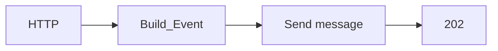

---

# 60. Étape 8 - Tester le producteur seul

Ne créez pas encore le worker.

Envoyez :

```json
{
  "incidentId": "INC-401",
  "campus": "EPSI",
  "category": "network",
  "description": "Point d'acces indisponible.",
  "simulateResult": "success"
}
```

---

# 61. Résultat attendu

Postman :

```text
202 Accepted
```

Service Bus :

```text
Active message count = 1 environ
```

---

# 62. Étape 9 - Créer la Logic App worker

Créez :

```text
la-tp4-worker
```

Plan :

```text
Consumption
```

---

# 63. Activer Managed Identity worker

**Settings**, puis **Identity**.

Activez :

```text
System assigned
```

---

# 64. Attribuer Data Receiver

Sur :

```text
maintenance-processing
```

attribuez :

```text
Azure Service Bus Data Receiver
```

à :

```text
la-tp4-worker
```

---

# 65. Pourquoi Data Receiver suffit ?

Le worker doit :

- recevoir ;
- Complete ;
- Abandon ;
- Dead-letter.

Toutes ces opérations font partie du traitement de réception.

---

# 66. Étape 10 - Ajouter le trigger Peek-Lock

Dans le Designer, recherchez :

```text
Service Bus
```

Choisissez le trigger proche de :

```text
When a message is received in a queue (peek-lock)
```

*Le libellé peut varier légèrement selon la version du connecteur.*

---

# 67. Ne choisissez pas Auto-complete

Pour ce TP, **Auto-complete** masquerait précisément le mécanisme que nous voulons apprendre.

Nous avons besoin du :

```text
Lock Token
```

pour choisir manuellement :

- Complete ;
- Abandon ;
- Dead-letter.

---

# 68. Configurer le trigger

Queue :

```text
maintenance-processing
```

Connexion :

```text
Managed Identity
```

---

# 69. Métadonnées importantes du trigger

Repérez dans le contenu dynamique :

- **Lock Token** ;
- **Delivery Count** ;
- **Message Id** ;
- **Correlation Id** ;
- **Content** ou body du message ;
- éventuellement **Locked Until UTC**.

---

# 70. Lock Token

Le **Lock Token** identifie le verrou du message reçu.

Les actions de settlement doivent utiliser ce token.

---

# 71. Pourquoi le Lock Token est critique ?

Vous ne dites pas seulement :

```text
Complete un message
```

Vous dites en pratique :

```text
Complete le message correspondant à ce lock
```

---

# 72. Étape 11 - Parse JSON

Ajoutez :

```text
Data Operations
Parse JSON
```

Nom :

```text
Parse_Message
```

---

# 73. Content de Parse JSON

Utilisez le contenu du message fourni par le trigger Service Bus.

Selon la version du connecteur, le contenu dynamique peut être nommé :

```text
Content
ContentData
Body
```

> **Tip :** ouvrez le premier Run History si nécessaire pour observer exactement la structure de sortie du trigger.

---

# 74. Schéma du message

Utilisez un schéma correspondant à :

```json
{
  "eventType": "MaintenanceProcessingRequested",
  "schemaVersion": 1,
  "messageId": "11111111-1111-1111-1111-111111111111",
  "correlationId": "22222222-2222-2222-2222-222222222222",
  "requestedAt": "2026-10-05T10:00:00Z",
  "data": {
    "incidentId": "INC-401",
    "campus": "EPSI",
    "category": "network",
    "description": "Point d'acces indisponible.",
    "simulateResult": "success"
  }
}
```

---

# 75. Étape 12 - Ajouter un Switch

Ajoutez :

```text
Control
Switch
```

Valeur :

```text
simulateResult
```

provenant de :

```text
Parse_Message
data
simulateResult
```

---

# 76. Branches du Switch

Créez :

```text
success
temporary_error
permanent_error
```

---

# 77. Diagramme du worker

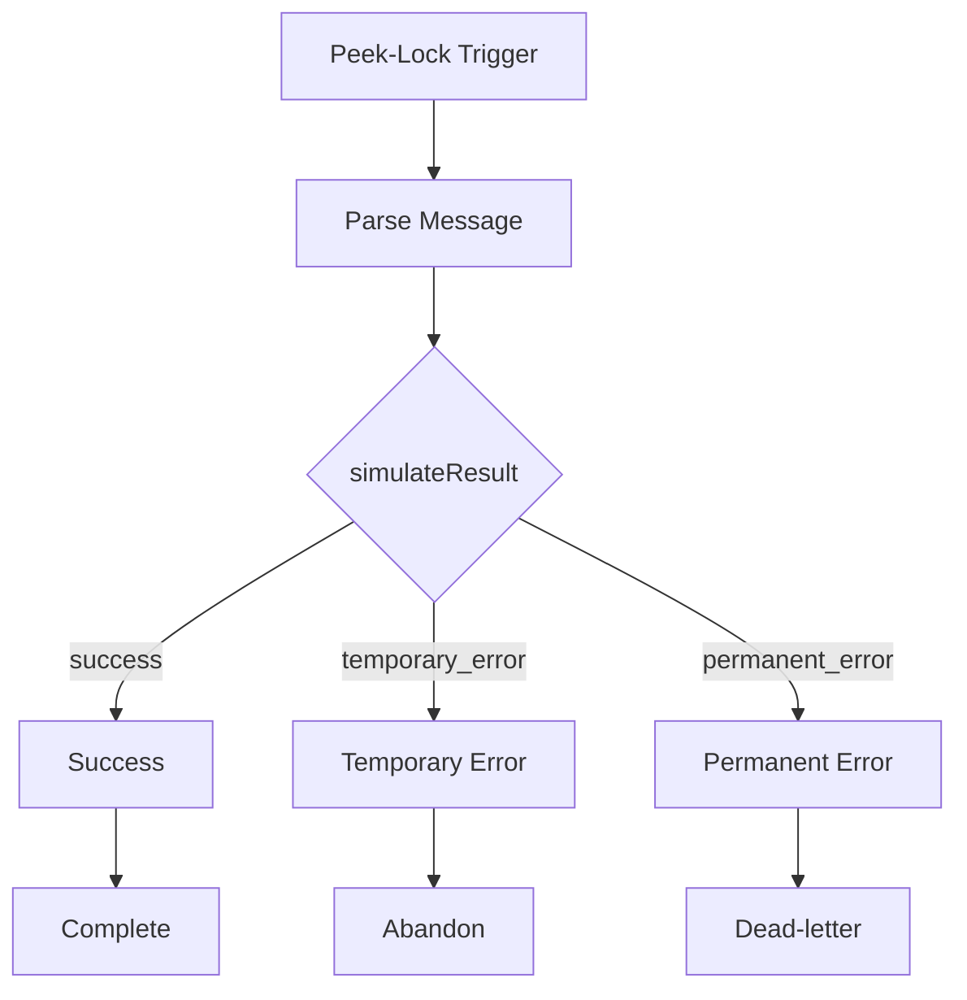

---

# 78. Étape 13 - Branche success

Dans :

```text
success
```

ajoutez un **Compose** :

```text
Traitement_OK
```

Exemple :

```json
{
  "status": "PROCESSED",
  "processedAt": "@{utcNow()}",
  "incidentId": "@{body('Parse_Message')?['data']?['incidentId']}"
}
```

---

# 79. Ajouter Complete

Après `Traitement_OK`, ajoutez :

```text
Service Bus
Complete the message in a queue
```

---

# 80. Paramètres Complete

Queue :

```text
maintenance-processing
```

Lock Token :

```text
Lock Token du trigger
```

---

# 81. Pourquoi Complete arrive en dernier ?

Vous devez d’abord terminer le traitement métier.

Puis :

```text
Complete
```

---

# 82. Mauvais ordre

Évitez :

```text
Complete
puis
traitement métier
```

Si le traitement échoue après Complete :

```text
le message est déjà retiré
```

---

# 83. Bon ordre

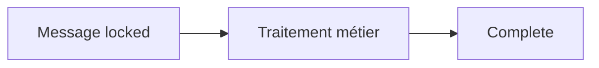

---

# 84. Étape 14 - Branche temporary_error

Dans :

```text
temporary_error
```

ajoutez un **Compose** :

```text
Temporary_Error_Info
```

---

# 85. Contenu temporaire

Exemple :

```json
{
  "status": "TEMPORARY_ERROR",
  "incidentId": "@{body('Parse_Message')?['data']?['incidentId']}",
  "deliveryCount": "utiliser Delivery Count du trigger",
  "decision": "ABANDON"
}
```

---

# 86. Ajouter Abandon

Ajoutez :

```text
Service Bus
Abandon the message in a queue
```

Queue :

```text
maintenance-processing
```

Lock Token :

```text
Lock Token du trigger
```

---

# 87. Que fait Abandon ?

Le message n’est pas considéré comme traité.

Il redevient disponible pour une nouvelle réception.

---

# 88. Redélivrance

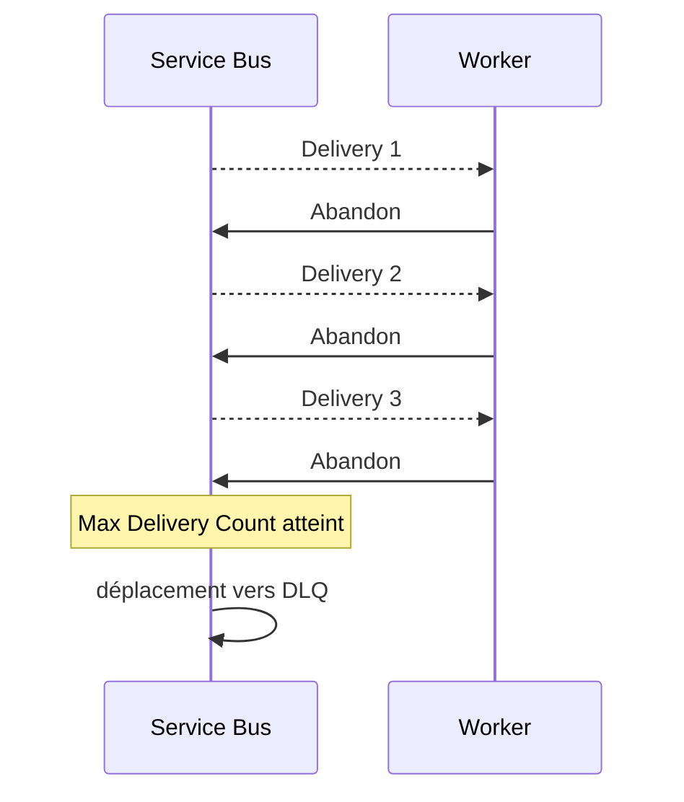

---

# 89. Étape 15 - Branche permanent_error

Ajoutez un **Compose** :

```text
Permanent_Error_Info
```

Exemple :

```json
{
  "status": "PERMANENT_ERROR",
  "incidentId": "@{body('Parse_Message')?['data']?['incidentId']}",
  "decision": "DEAD_LETTER"
}
```

---

# 90. Ajouter Dead-letter

Ajoutez :

```text
Service Bus
Dead-letter the message in a queue
```

---

# 91. Paramètres Dead-letter

Queue :

```text
maintenance-processing
```

Lock Token :

```text
Lock Token du trigger
```

Dead-letter reason :

```text
PERMANENT_BUSINESS_ERROR
```

Dead-letter description :

```text
Le message ne peut pas être traité automatiquement.
```

---

# 92. Pourquoi ajouter Reason et Description ?

La DLQ doit être exploitable.

Un opérateur doit pouvoir comprendre :

```text
pourquoi ce message est ici
```

---

# 93. Dead-letter explicite

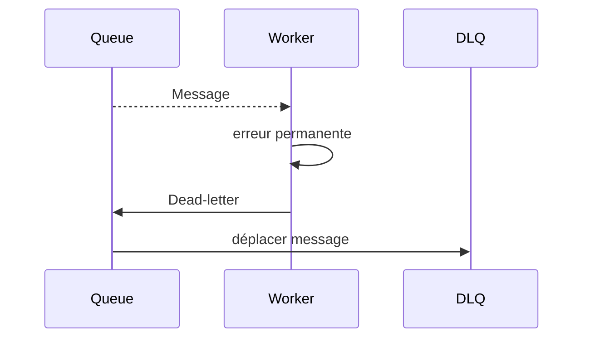

---

# 94. Sauvegarder le worker

Cliquez :

```text
Save
```

---

# 95. Important - le worker va maintenant consommer le message existant

Le message `INC-401` créé précédemment a :

```text
simulateResult = success
```

Le worker doit donc :

1. le recevoir ;
2. exécuter `Traitement_OK` ;
3. Complete.

---

# 96. Vérifier le succès

Dans la queue :

```text
Active messages
```

doit revenir vers :

```text
0
```

DLQ :

```text
0
```

---

# 97. Observer Run History

Dans :

```text
la-tp4-worker
```

ouvrez le run.

Vous devez voir :

```text
Trigger Peek-Lock
Parse_Message
Switch
Traitement_OK
Complete
```

---

# 98. Question 1

Pourquoi le message disparaît-il après Complete ?

**Réponse :**

Parce que le consumer confirme à Service Bus que le traitement est terminé.

---

# 99. Test 1 - Success

Envoyez :

```json
{
  "incidentId": "INC-SUCCESS",
  "campus": "EPSI",
  "category": "network",
  "description": "Test success.",
  "simulateResult": "success"
}
```

---

# 100. Résultat attendu

Publisher :

```text
202
```

Worker :

```text
1 traitement
Complete
```

Queue :

```text
0 message actif après traitement
```

DLQ :

```text
0 nouveau message
```

---

# 101. Test 2 - Temporary Error

Envoyez :

```json
{
  "incidentId": "INC-TEMP",
  "campus": "EPSI",
  "category": "network",
  "description": "Simulation panne temporaire.",
  "simulateResult": "temporary_error"
}
```

---

# 102. Résultat attendu temporaire

Le worker reçoit le message.

Il exécute :

```text
Abandon
```

Le message est redélivré.

---

# 103. Observer plusieurs runs

Dans Run History, vous devez voir plusieurs exécutions pour :

```text
INC-TEMP
```

---

# 104. Observer Delivery Count

Sur chaque réception :

```text
Delivery Count
```

doit évoluer.

---

# 105. Résultat final temporaire

Avec :

```text
Max Delivery Count = 3
```

le message finit par être déplacé automatiquement vers :

```text
DLQ
```

---

# 106. Vérifier les compteurs

Dans la queue, observez :

```text
Active message count
Dead-letter message count
```

---

# 107. Question 2

Pourquoi temporary_error ne fait-il pas directement Dead-letter ?

**Réponse :**

Parce que nous considérons que l’erreur peut disparaître lors d’une nouvelle tentative.

---

# 108. Question 3

Pourquoi faut-il limiter le nombre de retries ?

**Réponse :**

Sinon un message impossible à traiter peut :

- tourner indéfiniment ;
- générer du coût ;
- polluer les logs ;
- occuper les workers ;
- masquer d’autres messages.

---

# 109. Poison Message

Un message qui échoue systématiquement est souvent appelé :

```text
poison message
```

La DLQ permet de l’isoler.

---

# 110. Test 3 - Permanent Error

Envoyez :

```json
{
  "incidentId": "INC-PERM",
  "campus": "EPSI",
  "category": "unknown",
  "description": "Simulation erreur permanente.",
  "simulateResult": "permanent_error"
}
```

---

# 111. Résultat attendu permanent

Le worker reçoit le message une fois.

Il exécute :

```text
Dead-letter
```

Le message passe immédiatement dans la DLQ.

---

# 112. Différence entre temporary et permanent

| Cas | Action | Nombre de tentatives |
|---|---|---:|
| success | Complete | 1 |
| temporary_error | Abandon | plusieurs |
| permanent_error | Dead-letter | 1 |

---

# 113. Deux façons d’arriver en DLQ

## Automatique

```text
Max Delivery Count dépassé
```

## Explicite

```text
Dead-letter action
```

---

# 114. Diagramme global

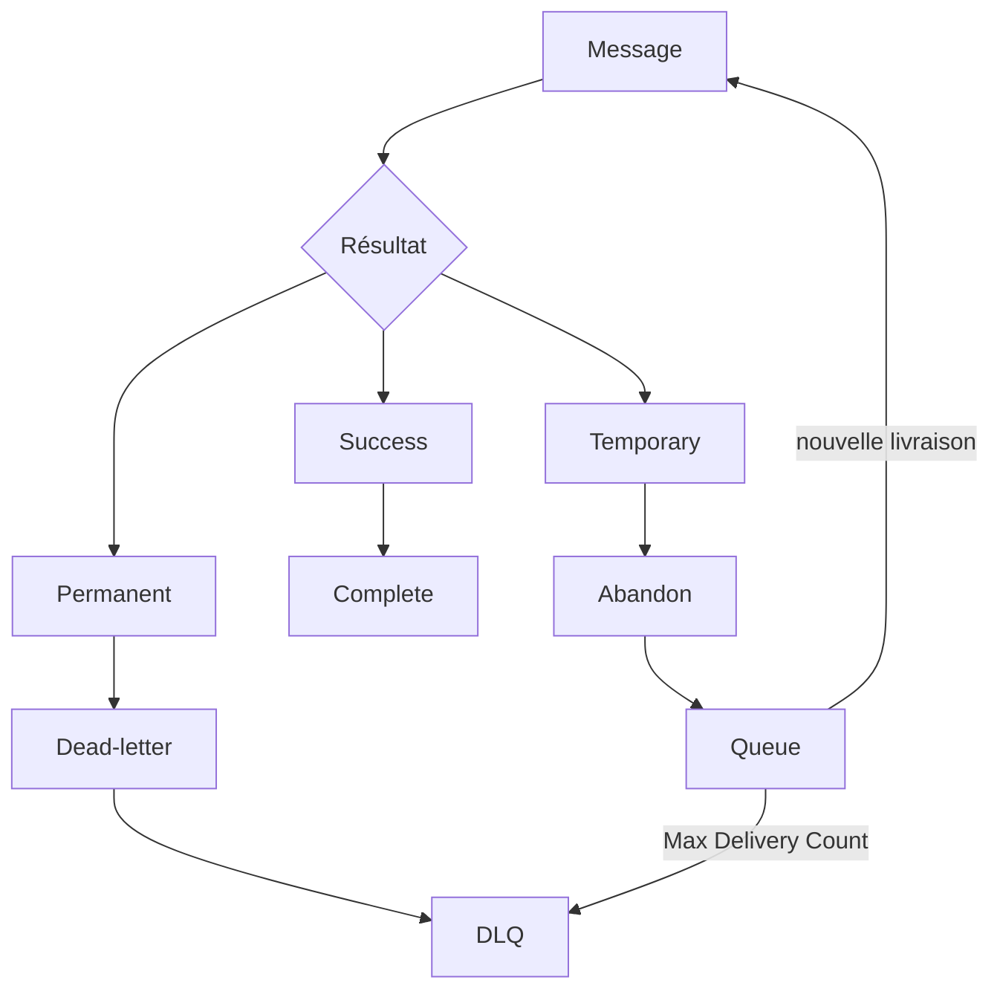

---

# 115. Étape 16 - Ouvrir Service Bus Explorer

Dans le Portail Azure :

1. ouvrez votre namespace ;
2. ouvrez la queue `maintenance-processing` ;
3. ouvrez **Service Bus Explorer**.

---

# 116. Peek Mode

Sélectionnez :

```text
Peek Mode
```

---

# 117. Sélectionner la sous-file DLQ

Choisissez :

```text
DeadLetter
```

ou :

```text
DeadLetter subqueue
```

selon l’interface.

---

# 118. Peek from start

Cliquez :

```text
Peek from start
```

---

# 119. Pourquoi Peek ?

**Peek** permet d’observer un message :

```text
sans le retirer
```

C’est idéal pour le diagnostic.

---

# 120. Inspecter les messages DLQ

Ouvrez :

```text
INC-TEMP
```

et :

```text
INC-PERM
```

si les deux sont présents.

---

# 121. Propriétés importantes en DLQ

Recherchez notamment :

- **Dead-letter reason** ;
- **Dead-letter error description** ;
- **Delivery Count** ;
- **Message Id** ;
- **Correlation Id** ;
- body du message.

---

# 122. Différence attendue entre INC-TEMP et INC-PERM

`INC-TEMP` :

dead-letter automatique lié au nombre de livraisons.

`INC-PERM` :

reason personnalisé :

```text
PERMANENT_BUSINESS_ERROR
```

---

# 123. Pourquoi inspecter le body ?

Le body permet de comprendre :

```text
quelle donnée métier a provoqué l'échec
```

---

# 124. Service Bus Explorer : Receive Mode

Le portail permet également de recevoir des messages.

Attention :

```text
ReceiveAndDelete
```

est destructif.

---

# 125. Recommandation

Pour inspecter :

```text
utilisez Peek
```

tant que vous n’avez pas l’intention de retirer le message.

---

# 126. PeekLock dans Service Bus Explorer

Service Bus Explorer peut aussi recevoir un message en mode PeekLock.

Vous pouvez ensuite :

- Complete ;
- Abandon lock ;
- Dead-letter ;
- Defer.

---

# 127. Exercice manuel Service Bus Explorer

Désactivez temporairement :

```text
la-tp4-worker
```

Envoyez un nouveau message.

Puis utilisez **Service Bus Explorer** en Receive Mode avec PeekLock.

---

# 128. Test manuel Complete

Recevez un message en PeekLock.

Cliquez :

```text
Complete
```

Résultat :

```text
le message disparaît de la queue
```

---

# 129. Test manuel Abandon

Envoyez un autre message.

Recevez-le en PeekLock.

Cliquez :

```text
Abandon lock
```

Résultat :

```text
le message redevient disponible
```

---

# 130. Test manuel Dead-letter

Recevez un autre message en PeekLock.

Cliquez :

```text
Dead-letter
```

Résultat :

```text
le message rejoint la DLQ
```

---

# 131. Pourquoi cet exercice manuel est important ?

Il montre que :

```text
Complete
Abandon
Dead-letter
```

ne sont pas seulement des actions Logic Apps.

Ce sont des opérations fondamentales du broker.

---

# 132. Réactiver le worker

Après l’exercice :

```text
Enable
```

la Logic App worker.

---

# 133. Étape 17 - Simuler une panne du worker

Désactivez :

```text
la-tp4-worker
```

Envoyez trois messages `success`.

---

# 134. Résultat attendu

La queue accumule :

```text
3 messages environ
```

---

# 135. Réactiver le worker

Les messages doivent être traités et complétés.

---

# 136. Ce que démontre cette expérience

Le producteur et le broker ne dépendent pas de la disponibilité immédiate du consumer.

C’est le :

```text
découplage temporel
```

---

# 137. Étape 18 - Observer un lock

Pour un message reçu en PeekLock, Service Bus fournit :

```text
Locked Until UTC
```

Il indique jusqu’à quand le lock reste valide.

---

# 138. Lock expiré

Après expiration :

- Complete peut échouer ;
- le message peut être redélivré ;
- Delivery Count peut augmenter.

---

# 139. Bonus - provoquer un lock expiré

*Exercice à faire uniquement si vous avez du temps.*

Ajoutez temporairement dans la branche success :

```text
Delay
```

avec une durée supérieure à :

```text
Lock Duration
```

Par exemple :

```text
75 secondes
```

si Lock Duration vaut :

```text
1 minute
```

---

# 140. Résultat possible

Quand le workflow essaie ensuite :

```text
Complete
```

le lock peut déjà être expiré.

L’action peut échouer.

---

# 141. Pourquoi ce test est intéressant ?

Il démontre qu’un traitement métier trop long doit :

- terminer avant expiration ;
- ou renouveler le lock ;
- ou être découpé différemment.

---

# 142. Renew Lock

Le connecteur Service Bus fournit également des opérations pour :

```text
Renew lock
```

selon les scénarios supportés.

Ce n’est pas obligatoire dans le TP4.

---

# 143. Attention aux traitements longs

Ne choisissez pas un Lock Duration arbitrairement énorme juste pour cacher un problème d’architecture.

Analysez :

- durée moyenne ;
- durée maximale ;
- besoin de retry ;
- capacité de renouvellement.

---

# 144. Question 4

Que se passe-t-il si le traitement réussit mais que Complete échoue ?

**Réponse :**

Le message peut être redélivré.

Le traitement métier risque donc d’être exécuté à nouveau.

---

# 145. Conséquence

Même avec Peek-Lock :

```text
exactly once métier
```

n’est pas garanti automatiquement.

---

# 146. Idempotence

Un traitement idempotent produit le même état final même s’il est exécuté plusieurs fois avec le même identifiant métier.

---

# 147. Exemple idempotent

Avant de créer une intervention :

```text
incidentId déjà traité ?
```

Si oui :

```text
ne pas recréer
```

---

# 148. Message Id et idempotence

Le `Message Id` peut aider à détecter des répétitions.

Mais dans ce TP :

```text
nous ne mettons pas encore en place un stockage des messages traités
```

---

# 149. Duplicate Detection Service Bus

Service Bus Standard et Premium proposent aussi une fonctionnalité de :

```text
Duplicate Detection
```

qui n’est pas disponible en Basic.

---

# 150. Pourquoi ne pas l’utiliser ici ?

Parce que le but du TP est de comprendre :

- settlement ;
- redélivrance ;
- DLQ.

La Duplicate Detection sera étudiée avec l’idempotence dans un TP suivant.

---

# 151. Erreur temporaire et backoff

Dans un vrai système, il est souvent préférable d’éviter :

```text
Abandon
redelivery immédiate
Abandon
redelivery immédiate
```

sans délai.

---

# 152. Retry avec délai

Un système plus avancé peut appliquer :

```text
retry
backoff
scheduled message
retry queue
```

Ces stratégies seront étudiées plus tard.

---

# 153. Le TP4 reste volontairement simple

Nous utilisons :

```text
Abandon
```

pour rendre la redélivrance très visible.

---

# 154. Étape 19 - Inspecter le Delivery Count dans Run History

Envoyez :

```text
temporary_error
```

Ouvrez chaque run.

Repérez :

```text
Delivery Count
```

---

# 155. Tableau d’observation

Complétez :

| Run | Delivery Count | Action |
|---:|---:|---|
| 1 | ... | Abandon |
| 2 | ... | Abandon |
| 3 | ... | Abandon / DLQ |

---

# 156. Question 5

Pourquoi Delivery Count est-il une métadonnée broker plutôt qu’un champ du body ?

**Réponse :**

Parce qu’il décrit :

```text
l'histoire de livraison du message
```

et non sa donnée métier.

---

# 157. Métadonnée vs donnée métier

Body :

```text
incidentId
category
description
```

Broker metadata :

```text
Delivery Count
Lock Token
Locked Until
Sequence Number
```

---

# 158. Diagramme

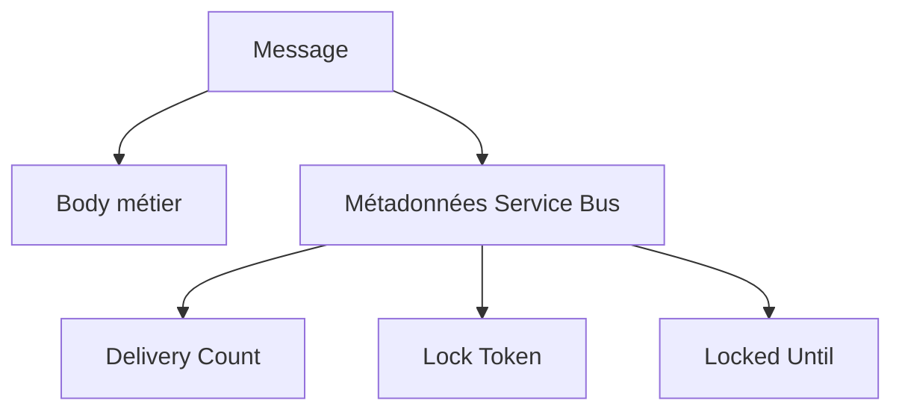

---

# 159. Dead-letter reason

Lors d’un dead-letter explicite, vous pouvez enregistrer :

```text
reason
description
```

---

# 160. Bonne pratique

Utilisez une reason courte et stable :

```text
PERMANENT_BUSINESS_ERROR
UNKNOWN_ASSET
INVALID_REFERENCE
```

et une description plus détaillée.

---

# 161. Mauvaise reason

Évitez :

```text
ça marche pas
```

---

# 162. Exemple exploitable

Reason :

```text
UNKNOWN_ASSET
```

Description :

```text
L'equipement AP-999 n'existe pas dans le référentiel.
```

---

# 163. Étape 20 - Réinjecter un message depuis la DLQ

Après avoir identifié et corrigé la cause d’un message dead-lettered :

ouvrez **Service Bus Explorer**.

Sélectionnez :

```text
DeadLetter
```

---

# 164. Resend

Le portail permet de :

```text
Resend
```

un message dead-lettered vers l’entité principale.

---

# 165. Attention avant Resend

Ne réinjectez pas un message tant que :

```text
la cause de l'échec n'est pas corrigée
```

Sinon :

```text
il reviendra probablement en DLQ
```

---

# 166. Exercice de correction

Prenez un message :

```text
permanent_error
```

dans la DLQ.

Corrigez son contenu si votre interface le permet, ou reproduisez manuellement un nouveau message avec :

```text
simulateResult = success
```

Puis renvoyez-le.

---

# 167. Résultat attendu

Le worker doit :

```text
Complete
```

le message corrigé.

---

# 168. Cycle opérateur DLQ

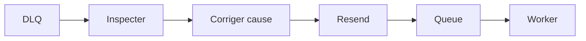

---

# 169. Question 6

Pourquoi ne faut-il pas supprimer tous les messages DLQ sans les regarder ?

**Réponse :**

Parce qu’ils représentent souvent :

- des erreurs réelles ;
- des problèmes de données ;
- des bugs ;
- des dépendances indisponibles ;
- des erreurs de configuration.

---

# 170. Question 7

Pourquoi ne faut-il pas automatiquement réinjecter en boucle toute la DLQ ?

**Réponse :**

Parce que si la cause existe toujours :

```text
on recrée le même problème
```

---

# 171. DLQ et monitoring

Un système en production devrait surveiller :

```text
Dead-letter message count
```

et déclencher une alerte si nécessaire.

---

# 172. Azure Monitor

Dans un système plus avancé, vous pouvez utiliser :

- Azure Monitor ;
- Metrics ;
- Alerts ;
- Log Analytics.

Ce n’est pas obligatoire dans le TP4.

---

# 173. Service Bus Explorer et droits

Pour utiliser certaines opérations de données depuis le portail, votre identité utilisateur doit avoir les droits Service Bus appropriés.

---

# 174. Si Service Bus Explorer renvoie Unauthorized

Vérifiez vos propres droits utilisateur.

Les rôles de la Logic App ne donnent pas automatiquement des droits à votre compte utilisateur.

---

# 175. Différence importante

Logic App Managed Identity :

```text
identité du workflow
```

Compte étudiant :

```text
votre identité dans le portail
```

Ce sont deux principals différents.

---

# 176. Debug - Complete retourne 400 ou lock lost

Causes fréquentes :

- Lock Token incorrect ;
- lock expiré ;
- message déjà settled ;
- action Complete exécutée trop tard.

---

# 177. Debug - Abandon ne provoque pas de retry visible

Vérifiez :

- worker toujours activé ;
- queue correcte ;
- message pas déjà en DLQ ;
- Max Delivery Count ;
- Run History.

---

# 178. Debug - permanent_error reste dans la queue principale

Vérifiez :

- bonne branche du Switch ;
- action Dead-letter réellement exécutée ;
- Lock Token ;
- queue sélectionnée.

---

# 179. Debug - temporary_error tourne trop longtemps

Vérifiez :

```text
Max Delivery Count = 3
```

et non la valeur par défaut.

---

# 180. Debug - Delivery Count ne semble pas augmenter

Vérifiez que vous utilisez réellement :

```text
Peek-Lock
```

et :

```text
Abandon
```

---

# 181. Debug - message disparaît dès réception

Vous avez peut-être utilisé un trigger :

```text
auto-complete
```

au lieu de :

```text
peek-lock
```

---

# 182. Debug - action Complete introuvable

Recherchez dans le connecteur :

```text
Service Bus
```

puis l’action :

```text
Complete the message in a queue
```

Le libellé exact peut légèrement varier.

---

# 183. Debug - action Dead-letter introuvable

Recherchez :

```text
Dead-letter the message in a queue
```

---

# 184. Debug - mauvaise structure du message

Ouvrez :

```text
Trigger
Outputs
```

dans Run History.

Identifiez le champ qui contient réellement le contenu métier.

---

# 185. Debug méthodique

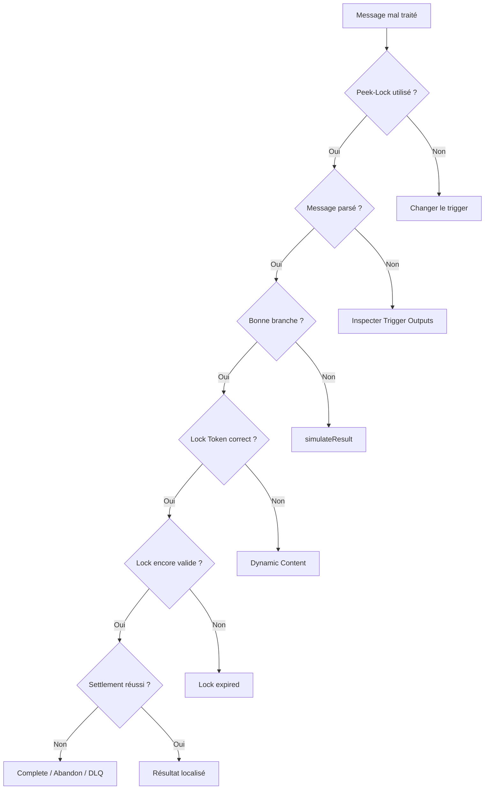

---

# 186. Tip debug

Dans un flux Peek-Lock, vérifiez toujours :

```text
Lock Token
Delivery Count
Locked Until
```

avant de chercher ailleurs.

---

# 187. Tip coûts

Un message `temporary_error` provoque plusieurs runs Logic Apps.

N’envoyez pas :

```text
1000 messages temporaires
```

pendant un TP.

---

# 188. Tip sécurité

Donnez :

```text
Data Sender
```

au producteur.

Donnez :

```text
Data Receiver
```

au worker.

N’attribuez pas inutilement :

```text
Data Owner
```

---

# 189. Tip exploitation

Une DLQ qui contient des messages n’est pas seulement :

```text
un détail technique
```

Elle peut signaler un incident de production.

---

# 190. Tip soutenance

Si on vous demande :

*« Pourquoi utiliser Peek-Lock ? »*

répondez :

> **Peek-Lock permet de recevoir et verrouiller un message sans le supprimer immédiatement. Le consumer le complète seulement après un traitement réussi. En cas d’échec ou d’expiration du lock, le message peut être redélivré.**

---

# 191. Question 8

Quelle est la différence entre Abandon et Dead-letter ?

**Réponse :**

**Abandon** :

```text
nouvelle tentative souhaitée
```

**Dead-letter** :

```text
isolation du message souhaitée
```

---

# 192. Question 9

Quelle est la différence entre lock expiry et Complete ?

**Réponse :**

Complete confirme :

```text
traitement terminé
```

Lock expiry signifie :

```text
aucune confirmation valide avant expiration
```

---

# 193. Question 10

Pourquoi un retry peut-il être dangereux ?

**Réponse :**

Parce qu’une partie du traitement peut déjà avoir réussi avant l’échec.

La redélivrance peut donc répéter cet effet.

---

# 194. Exemple de traitement partiel

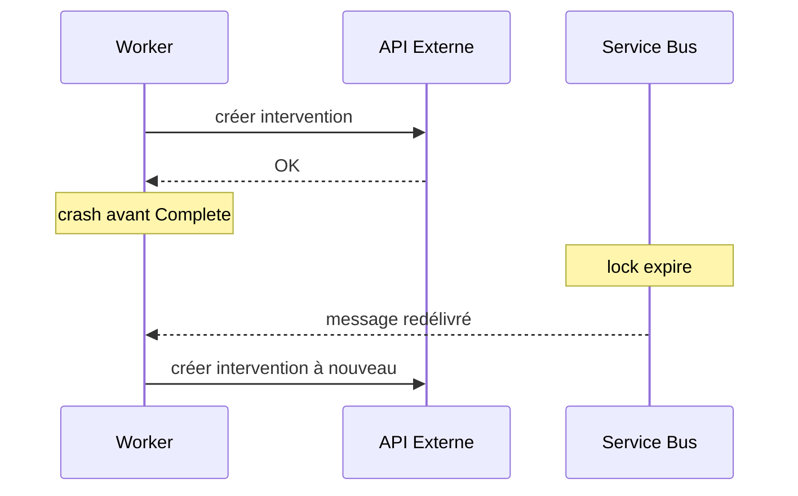

---

# 195. Solution future

Nous introduirons :

```text
idempotency key
processed_message
Message Id
outbox
```

dans des TP plus avancés.

---

# 196. Bonus - Defer

Service Bus permet aussi :

```text
Defer
```

---

# 197. Différence Defer / Abandon

**Abandon** :

le message redevient disponible normalement.

**Defer** :

le message est conservé mais n’est plus récupéré par le flux normal de réception.

---

# 198. Sequence Number

Pour retrouver un message deferred, le consumer doit connaître son :

```text
Sequence Number
```

---

# 199. Quand utiliser Defer ?

Exemple :

```text
attendre qu'une autre information métier soit disponible
```

mais garder le message dans l’entité principale.

---

# 200. Bonus - test Defer

Ajoutez une quatrième valeur facultative :

```text
defer
```

dans le schéma.

Puis utilisez :

```text
Defer the message in a queue
```

---

# 201. Attention

Ce bonus nécessite de comprendre comment récupérer ensuite un message deferred par :

```text
Sequence Number
```

Ne le réalisez que si le TP principal fonctionne.

---

# 202. Bonus - TTL

Chaque message peut avoir un :

```text
Time To Live
```

Après expiration, il n’est plus disponible pour un traitement normal.

---

# 203. Dead-letter on expiration

Service Bus peut être configuré pour déplacer les messages expirés vers la DLQ selon les paramètres de l’entité.

Ce scénario n’est pas obligatoire.

---

# 204. Pourquoi le TTL est utile ?

Il évite de traiter une donnée devenue inutile.

Exemple :

```text
notification à traiter dans les 10 minutes
```

Après plusieurs heures :

```text
elle n'a peut-être plus de sens
```

---

# 205. Bonus - message expiré

Créez une queue de test séparée ou modifiez temporairement la configuration uniquement si l’enseignant l’autorise.

Ne perturbez pas le scénario principal.

---

# 206. CLI - rôle dans le TP4

Azure CLI reste **optionnel**.

Il est utile pour :

- vérifier Lock Duration ;
- vérifier Max Delivery Count ;
- afficher les compteurs ;
- automatiser la création.

---

# 207. CLI - afficher la queue

```bash
az servicebus queue show \
  --resource-group rg-tp4-resilience-si \
  --namespace-name sb-tp4-xx-12345 \
  --name maintenance-processing \
  --output jsonc
```

---

# 208. CLI - afficher les compteurs

```bash
az servicebus queue show \
  --resource-group rg-tp4-resilience-si \
  --namespace-name sb-tp4-xx-12345 \
  --name maintenance-processing \
  --query '{
    active:countDetails.activeMessageCount,
    deadLetter:countDetails.deadLetterMessageCount,
    transferDeadLetter:countDetails.transferDeadLetterMessageCount
  }' \
  --output table
```

---

# 209. CLI - modifier Max Delivery Count

```bash
az servicebus queue update \
  --resource-group rg-tp4-resilience-si \
  --namespace-name sb-tp4-xx-12345 \
  --name maintenance-processing \
  --max-delivery-count 3
```

---

# 210. CLI - modifier Lock Duration

```bash
az servicebus queue update \
  --resource-group rg-tp4-resilience-si \
  --namespace-name sb-tp4-xx-12345 \
  --name maintenance-processing \
  --lock-duration PT1M
```

---

# 211. Pourquoi ISO 8601 PT1M ?

```text
P
```

indique une durée.

```text
T
```

introduit la partie temps.

```text
1M
```

signifie une minute.

Donc :

```text
PT1M
```

signifie :

```text
1 minute
```

---

# 212. Autres exemples

```text
PT30S
30 secondes

PT2M
2 minutes
```

---

# 213. Attention

Service Bus limite Lock Duration à un maximum configurable de :

```text
5 minutes
```

pour ce paramètre.

---

# 214. Exercice guidé 1 - 5 succès

Envoyez cinq messages :

```text
success
```

Attendu :

```text
5 traitements
5 Complete
DLQ inchangée
```

---

# 215. Exercice guidé 2 - 1 temporary_error

Envoyez :

```text
INC-TEMP-02
```

avec :

```text
temporary_error
```

---

# 216. Attendu

Plusieurs runs.

Puis :

```text
DLQ +1
```

---

# 217. Exercice guidé 3 - 1 permanent_error

Envoyez :

```text
INC-PERM-02
```

avec :

```text
permanent_error
```

---

# 218. Attendu

```text
1 run
Dead-letter
DLQ +1
```

---

# 219. Exercice guidé 4 - comparer les raisons DLQ

Inspectez :

```text
INC-TEMP-02
INC-PERM-02
```

Comparez :

- Delivery Count ;
- Reason ;
- Description.

---

# 220. Exercice guidé 5 - désactiver worker

Désactivez le worker.

Envoyez cinq messages success.

---

# 221. Attendu

```text
Active messages +5
```

Puis réactivez.

---

# 222. Exercice guidé 6 - lock expiry bonus

Ajoutez un Delay supérieur au lock.

Observez :

- action Complete ;
- éventuelle erreur ;
- redélivrance.

---

# 223. Exercice guidé 7 - Service Bus Explorer

Utilisez manuellement :

- Peek ;
- PeekLock ;
- Complete ;
- Abandon ;
- Dead-letter.

---

# 224. Exercice guidé 8 - Resend DLQ

Prenez un message dead-lettered.

Corrigez la cause.

Réinjectez-le.

---

# 225. Ce que démontre le TP4

```text
un message fiable
n'est pas seulement
un message stocké
```

Il faut aussi gérer :

```text
traitement
confirmation
retry
échec définitif
diagnostic
reprise
```

---

# 226. Machine à états conceptuelle

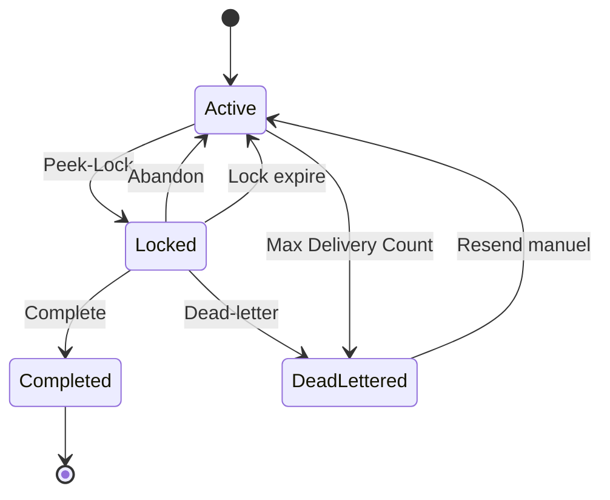

---

# 227. À retenir sur Complete

**Complete** signifie :

```text
je confirme que le traitement est terminé
```

---

# 228. À retenir sur Abandon

**Abandon** signifie :

```text
je n'ai pas terminé
une nouvelle tentative est possible
```

---

# 229. À retenir sur Dead-letter

**Dead-letter** signifie :

```text
ce message doit sortir du flux normal
```

---

# 230. À retenir sur le lock

Le lock est :

```text
temporaire
```

et non :

```text
une réservation éternelle
```

---

# 231. À retenir sur le Delivery Count

Le compteur permet au broker de limiter les redélivrances.

---

# 232. À retenir sur la DLQ

La DLQ doit être :

- surveillée ;
- analysée ;
- vidée de manière maîtrisée.

---

# 233. À retenir sur l’idempotence

Peek-Lock réduit le risque de perte.

Il n’élimine pas :

```text
le risque de double traitement
```

---

# 234. Prochaine étape logique

Un TP suivant pourra introduire :

- **idempotence** ;
- **Duplicate Detection** ;
- **retry avec backoff** ;
- **Circuit Breaker** ;
- **Outbox** ;
- compensation.

---

# 235. Nettoyage - important

À la fin du TP :

1. désactivez les Logic Apps ;
2. vérifiez la DLQ ;
3. ne laissez pas des messages de démonstration inutiles ;
4. supprimez le Resource Group si autorisé.

---

# 236. Vérifier avant suppression

Ouvrez :

```text
rg-tp4-resilience-si
```

Vérifiez qu’il contient uniquement les ressources du TP.

---

# 237. Supprimer le Resource Group

Cliquez sur :

```text
Delete resource group
```

Confirmez.

---

## Équivalent CLI - optionnel

```bash
az group delete \
  --name rg-tp4-resilience-si \
  --yes
```

---

# 238. Tips de fin de TP

Retenez :

1. **Recevoir n’est pas traiter.**
2. **Peek-Lock verrouille sans supprimer immédiatement.**
3. **Complete confirme le succès.**
4. **Abandon autorise une nouvelle tentative.**
5. **Dead-letter isole un message.**
6. **Delivery Count mesure les tentatives.**
7. **Max Delivery Count évite les retries infinis.**
8. **La DLQ est une sous-file système.**
9. **Une DLQ doit être surveillée.**
10. **Lock expiry peut provoquer une redélivrance.**
11. **Une redélivrance peut provoquer un double effet métier.**
12. **L’idempotence est donc essentielle.**
13. **Le Lock Token est nécessaire au settlement.**
14. **Inspectez les métadonnées du broker.**
15. **Nettoyez les ressources de TP.**

---

# 239. Checklist finale

- [ ] J’ai créé un Resource Group dédié.
- [ ] J’ai créé un namespace Service Bus.
- [ ] J’ai créé `maintenance-processing`.
- [ ] J’ai réglé Lock Duration.
- [ ] J’ai réglé Max Delivery Count à `3`.
- [ ] J’ai créé `la-tp4-producteur`.
- [ ] J’ai activé sa Managed Identity.
- [ ] J’ai attribué Data Sender.
- [ ] J’ai créé le trigger HTTP.
- [ ] J’ai activé Schema Validation.
- [ ] J’ai créé `Build_Event`.
- [ ] J’ai envoyé vers Service Bus.
- [ ] J’ai ajouté Message Id.
- [ ] J’ai ajouté Correlation Id.
- [ ] J’ai créé `la-tp4-worker`.
- [ ] J’ai activé sa Managed Identity.
- [ ] J’ai attribué Data Receiver.
- [ ] J’ai utilisé un trigger **Peek-Lock**.
- [ ] J’ai identifié le Lock Token.
- [ ] J’ai identifié Delivery Count.
- [ ] J’ai créé la branche `success`.
- [ ] J’ai utilisé **Complete**.
- [ ] J’ai créé la branche `temporary_error`.
- [ ] J’ai utilisé **Abandon**.
- [ ] J’ai observé plusieurs livraisons.
- [ ] J’ai observé le passage automatique en DLQ.
- [ ] J’ai créé la branche `permanent_error`.
- [ ] J’ai utilisé **Dead-letter**.
- [ ] J’ai défini une reason.
- [ ] J’ai défini une description.
- [ ] J’ai utilisé Service Bus Explorer.
- [ ] J’ai inspecté la DLQ.
- [ ] J’ai comparé les deux causes de DLQ.
- [ ] J’ai simulé une panne du worker.
- [ ] Je sais expliquer Lock Duration.
- [ ] Je sais expliquer Max Delivery Count.
- [ ] Je sais expliquer Peek-Lock.
- [ ] Je sais expliquer Complete.
- [ ] Je sais expliquer Abandon.
- [ ] Je sais expliquer Dead-letter.
- [ ] Je sais expliquer le risque de double traitement.
- [ ] Je sais expliquer pourquoi l’idempotence sera nécessaire.
- [ ] J’ai nettoyé les ressources.

---

# 240. Résumé final

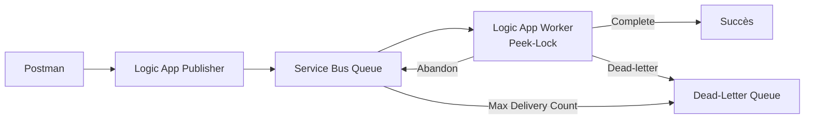

Le point essentiel du TP4 est :

> **Un message n’est pas correctement traité simplement parce qu’il a été reçu. Avec Peek-Lock, le consumer doit explicitement confirmer le succès avec Complete, demander une nouvelle tentative avec Abandon, ou isoler un échec définitif avec Dead-letter.**

---

# 241. Références Microsoft

Documentation utile :

- **Connecter Logic Apps à Service Bus** :  
  `https://learn.microsoft.com/azure/connectors/connectors-create-api-servicebus`

- **Référence du connecteur Service Bus** :  
  `https://learn.microsoft.com/connectors/servicebus/`

- **Service Bus built-in connector reference** :  
  `https://learn.microsoft.com/azure/logic-apps/connectors/built-in/reference/servicebus/`

- **Message locks et settlement** :  
  `https://learn.microsoft.com/azure/service-bus-messaging/message-transfers-locks-settlement`

- **Prévenir perte et doublons** :  
  `https://learn.microsoft.com/azure/service-bus-messaging/service-bus-message-loss-and-duplicates`

- **Dead-Letter Queues** :  
  `https://learn.microsoft.com/azure/service-bus-messaging/service-bus-dead-letter-queues`

- **Service Bus Explorer** :  
  `https://learn.microsoft.com/azure/service-bus-messaging/explorer`

- **Azure CLI Service Bus queues** :  
  `https://learn.microsoft.com/cli/azure/servicebus/queue`

- **Duplicate Detection** :  
  `https://learn.microsoft.com/azure/service-bus-messaging/enable-duplicate-detection`

- **Azure for Students** :  
  `https://learn.microsoft.com/azure/education-hub/about-azure-for-students`

- **Tarification Service Bus** :  
  `https://azure.microsoft.com/pricing/details/service-bus/`

- **Tarification Logic Apps** :  
  `https://azure.microsoft.com/pricing/details/logic-apps/`
